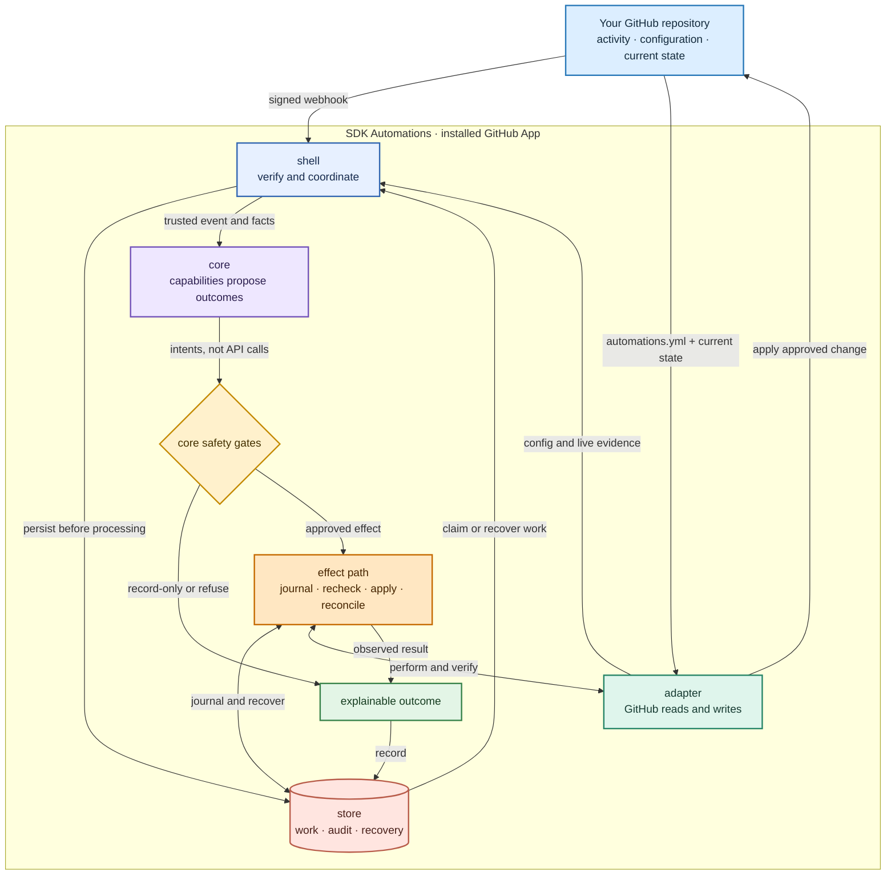

<p align="center">
  
</p>

<p align="center">
  <strong>One GitHub App. Repository-owned configuration. Durable, explainable decisions.</strong>
</p>

<p align="center">
  <a href="https://github.com/hiero-hackers/sdk-automations/actions/workflows/ci.yml"></a>
  <a href="https://github.com/hiero-hackers/sdk-automations/actions/workflows/codeql.yml"></a>
  <a href="LICENSE"></a>
  <a href="https://github.com/hiero-hackers/sdk-automations/blob/main/package.json"></a>
  <a href="https://scorecard.dev/viewer/?uri=github.com/hiero-hackers/sdk-automations"></a>
</p>

<p align="center">
  <a href="docs/quickstart.md">Quickstart</a> ·
  <a href="docs/configuration.md">Configuration</a> ·
  <a href="CONTRIBUTING.md">Contributing</a> ·
  <a href="SECURITY.md">Security</a>
</p>

<br>

<table>
  <tr>
    <td width="33%" align="center">
      <strong>Verified intake</strong><br><br>
      Webhook signatures are checked against the exact bytes received before payload data is trusted.
    </td>
    <td width="33%" align="center">
      <strong>Honest decisions</strong><br><br>
      Observe and dry-run modes explain what the App found without pretending an external change happened.
    </td>
    <td width="33%" align="center">
      <strong>Durable state</strong><br><br>
      Accepted deliveries and canonical reports live in SQLite, with completion committed atomically.
    </td>
  </tr>
</table>

<p align="center">
  <strong>Read-only foundation · live GitHub evidence · no repository writes</strong><br>
  <sub>The sandbox App reads default-branch configuration, installation permissions, and issue and pull-request timelines. It is not a hosted service yet.</sub>
</p>

---

## Why this exists

Hiero SDK repositories repeat the same contributor-facing work: intake, triage, workflow labels,
pull-request checks, and status reporting. Today that logic is scattered across repository-specific
scripts and workflows.

SDK Automations is building one small, hosted GitHub App that lets each repository choose its
automation in a reviewed YAML file. The goal is not a generic workflow platform. It is one clear,
auditable path that maintainers can understand end to end.

## How it works

The intended product flow keeps repository policy, decision-making, GitHub access, and recovery
separate:



The repository owns the policy. The App verifies and stores each event before capabilities evaluate
it, checks every proposed outcome against current GitHub evidence and platform safety rules, and
records what happened. Approved writes use a durable effect path that verifies the result and
reconciles uncertainty instead of retrying blindly.

## The supported path today

```text
signed webhook  →  verify  →  persist  →  read policy and evidence  →  decide  →  store report
```

The runnable sandbox now authenticates as a GitHub App. With credentials, it reads `automations.yml`
from the repository's default branch, obtains the installation's real permission grants, and uses
issue and pull-request timelines to determine whether a newer human change should block a proposed
outcome. It durably accepts each webhook delivery and commits its canonical report and completion
together in SQLite.

The live path also supplies linked-issue and automation-actor resolvers. Credential-free development
and CI deliberately use local configuration and stubbed external facts. The shell supports `disabled`,
`observe`, and `dry-run` — `dry-run` naming each change it would make — and rejects `active` unless the
endpoint was started with the App's identity as well as its credentials, which is not the default.

> [!NOTE]
> This boundary is intentional. Active mode will be enabled only with a narrow GitHub write
> operation, explicit permissions, durable restart behavior, and honest handling of uncertain writes.

## See the configuration

```yaml
schemaVersion: 1
mode: dry-run

capabilities:
  intake:
    enabled: true

mappings:
  labels:
    awaitingTriage: "status: triage"
```

The [quickstart](docs/quickstart.md) explains the shape of the configuration, and every file in
[`docs/examples/`](docs/examples/README.md) is parsed by the test suite. These documents describe the
current contract; they are not hosted-service installation instructions yet. The capability names
used today are disposable boundary probes, not promised product scope.

## Run the workspace

You need [Node.js](https://nodejs.org/) 24 or newer and [pnpm](https://pnpm.io/) 10.29.1.

```bash
pnpm install
pnpm -r test
```

All tracked tests run offline. No GitHub credentials or GitHub App configuration are required.

## Explore the project

<table>
  <tr>
    <td width="50%">
      <strong>Understand the system</strong><br><br>
      Read the <a href="design/architecture.md">architecture</a>, then the
      <a href="design/decisions.md">decision register</a>. The
      <a href="packages/core/README.md">core README</a> holds the glossary.
    </td>
    <td width="50%">
      <strong>Use the contract</strong><br><br>
      Start with the <a href="docs/quickstart.md">quickstart</a>, then use the
      <a href="docs/configuration.md">configuration reference</a> and
      <a href="docs/troubleshooting.md">troubleshooting guide</a>.
    </td>
  </tr>
  <tr>
    <td width="50%">
      <strong>Contribute</strong><br><br>
      Read <a href="CONTRIBUTING.md">CONTRIBUTING.md</a> and choose an open
      <a href="https://github.com/hiero-hackers/sdk-automations/issues?q=is%3Aissue+is%3Aopen+label%3A%22good+first+issue%22">good first issue</a>.
    </td>
    <td width="50%">
      <strong>Report a vulnerability</strong><br><br>
      Please use the private reporting process documented in <a href="SECURITY.md">SECURITY.md</a>.
    </td>
  </tr>
</table>

---

<p align="center">
  Apache-2.0 licensed · <a href="CODE_OF_CONDUCT.md">Code of Conduct</a> ·
  Developer Certificate of Origin required for contributions
</p>
