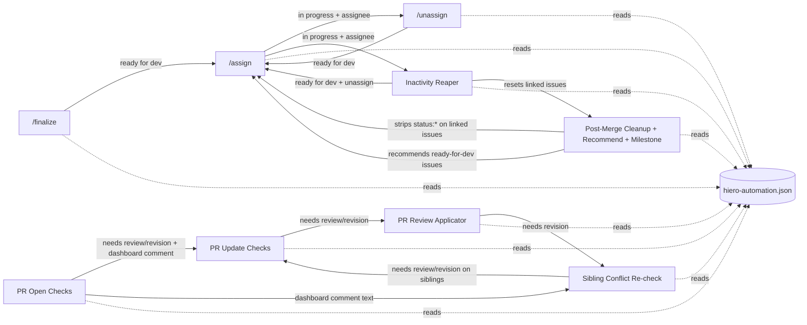

# Service Dependency and Coupling Map: Hiero C++ SDK

> **What this covers:** how the maintainer-automation services in
> [`hiero-ledger/hiero-sdk-cpp`](https://github.com/hiero-ledger/hiero-sdk-cpp) depend on each other
> through shared state, which services are entangled, which are cleanly separable, and where the concrete
> obstacles to "decouple by function" sit today.
> **Source state:** `main` at `a898153` (2026-05-14), same commit the Phase 1 and Phase 2 audits read.
> **Phase:** 3 (Service dependency and coupling). It builds on `audit/services-cpp.md` (the service
> inventory) and `audit/labels-cpp.md` (the label state machines), and serves goals.md Goal 1
> ("decoupled by function: every capability is an independent feature a repo can enable, disable, or dial
> up").
>
> **This is descriptive, not prescriptive.** It records how the existing C++ system is wired together and
> states the decoupling problem in concrete terms. It does not propose a target architecture, a split, an
> MVP, or a toggle config. Those are separate goals decisions.
>
> **Scope:** maintainer automation only. The build, CI, lint, and test workflows (`zxc-*`,
> `flow-pull-request-checks`, `on-schedule-builds`) are a project non-goal and were already shown to touch
> no shared maintainer state (see `audit/labels-cpp.md` Appendix C). They are left out here.
>
> **C++ is the primary subject of this phase.** Python is touched only as a contrast at the end (section
> 7), per the maintainer's "focus less on python now" steer.

## 1. What "coupling" means here

The wider project wants each capability to be a feature a repo can switch on or off on its own, with no
side effects on the others (goals.md Goal 1). Whether that is possible depends on what the services
**share**. Two services are coupled when they read or write the same state, fire on the same event, or
ship in the same file, so you cannot move or disable one without thinking about the other.

In the C++ SDK the services share state through six channels. The rest of this document maps each channel,
then draws the coupling together and states the decoupling problem.

| # | Channel | What is shared | Mapped in |
|---|---|---|---|
| 1 | Status labels | the `status:` namespace as a work-item state token | section 2.1 |
| 2 | Bot comments | three marker comments the bot finds and updates in place | section 2.2 |
| 3 | Assignees | the issue and PR assignee list | section 2.3 |
| 4 | Central config | the single `hiero-automation.json` policy file | section 2.4 |
| 5 | Cross-entity links | the PR to issue relationship, and milestones | section 2.5 |
| 6 | Workflow files and triggers | co-location in one file, shared events, shared concurrency | section 2.6 |

The skill and priority labels are shared read-only inputs too, but they are fixed (no service writes
them), so they couple services only at the config layer (channel 4), not as moving state. The full label
read or write detail is in `audit/labels-cpp.md`; this document uses it rather than repeating it.

## 2. The shared-state channels

### 2.1 Status labels: the spine

The `status:` namespace is the single most shared piece of moving state in the system. Nine of the ten
maintainer-automation services read or write at least one `status:` label, and `status: ready for dev` by
itself is referenced by eight distinct services. It is the token that says "this work item is available,"
so almost everything reads or moves it.

The full per-label read or write breakdown and the two state machines (issue and PR) are in
`audit/labels-cpp.md`. The two facts that matter for coupling:

1. **`ready for dev` is a handoff baton.** `/finalize` is the only service that produces it from triage
   (`awaiting triage` to `ready for dev`). `/assign` is the only service that consumes it into work
   (`ready for dev` to `in progress`). `/unassign` and the Inactivity Reaper return items to it. The
   Post-Merge Recommendation engine reads it to find candidate issues. So these services form a chain
   through one label: break a link and the items pile up at that label with nothing to move them on.

2. **The two bulk strips act on the whole namespace, not on six known strings.** Post-Merge Cleanup
   (`removeStatusLabels` in `bot-on-pr-close.js`) and the Inactivity Reaper (`resetItem` in
   `bot-inactivity.js`) both remove every label whose name starts with `status:`, then optionally re-add
   `ready for dev`. This is a prefix operation, so it also strips `status:` labels the config does not
   know about (`status: needs info`, `status: awaiting merge`), which is the namespace-coupling risk
   already recorded in `audit/labels-cpp.md` Appendix D. For coupling purposes the point is that these two
   services own the whole `status:` namespace at strip time, not just their own labels.

### 2.2 Bot comments: three markers, one cross-service read

The bot manages its own comments idempotently. Each kind starts with an HTML-comment marker, and the bot
finds its previous comment by an exact prefix match on that marker (`getBotComment` and
`postOrUpdateComment` in `helpers/api.js:309-376`, using `c.body.startsWith(marker)` at
`helpers/api.js:323`). There is no regex and no case-folding: the marker must be the literal first
characters of the comment body.

There are exactly three production markers.

| Marker | Written by | Read by | Payload |
|---|---|---|---|
| `<!-- bot:pr-helper -->` | PR Open Checks, PR Update Checks, Sibling Conflict Re-check (all via `runAllChecksAndComment`, `helpers/api.js:658`) | Sibling Conflict Re-check (`bot-on-pr-merged.js:47`) | the unified PR dashboard: DCO, GPG, merge-conflict, and issue-link results |
| `<!-- bot:inactivity-warning -->` | Inactivity Reaper (`bot-inactivity.js:477`) | Inactivity Reaper only | the inactivity warning: assignee mentions, days inactive, days left before close, the `/unassign` offer |
| `<!-- bot:blocked-checkin -->` | Inactivity Reaper (`bot-inactivity.js:513`) | Inactivity Reaper only (`bot-inactivity.js:503`) | the 30-day blocked check-in: asks if the item is still blocked, prompts removal of `status: blocked` |

Two of the three markers are private to the Reaper. The first one is the only **cross-service comment
coupling** in the codebase: the Sibling Conflict Re-check reads the dashboard text that the PR Open and PR
Update checks wrote, and decides whether a sibling PR's conflict state changed by testing whether that
comment body includes the literal substring `:x: **Merge Conflicts**` (`bot-on-pr-merged.js:48-49`). That
substring is produced by `buildMergeSection` in `helpers/comments.js:90`. So the conflict re-check depends
not just on the PR-check service having run, but on it having rendered that exact string.

### 2.3 Assignees

The assignee list is moving state that five services read and four write.

| Service | Reads assignees | Writes assignees | Where |
|---|:--:|:--:|---|
| PR Open Checks and Auto-Assign | yes (skip if author already on) | yes (adds the PR author) | `bot-on-pr-open.js:38-46` |
| `/assign` | yes (no-assignee gate, race re-check, needs-review bypass scan) | yes (adds the commenter) | `commands/assign.js:257, 348-355, 371, 569` |
| `/unassign` | yes (no-assignee gate, authorization check) | yes (removes the commenter) | `commands/unassign.js:61, 68-70, 80` |
| Inactivity Reaper | yes (scan, activity signal, mention list) | yes (removes all on reap) | `bot-inactivity.js:618-625, 89, 407` |
| Post-Merge Recommendation | yes (`no:assignee` filter on candidate issues) | none | `bot/bot-recommend-issues.js:80` |

The shared helpers `addAssignees` (`helpers/api.js:166`) and `removeAssignees` (`helpers/api.js:197`)
carry the writes. Assignees and the `status:` label move together at the same moments: `/assign` adds an
assignee and sets `in progress`; `/unassign` and the Reaper remove the assignee and reset to
`ready for dev`. So the assignment services treat "who is assigned" and "what the status label says" as one
combined state, and any feature that owns one of them has to keep the other consistent.

### 2.4 Central config: one file, high fan-out

Every label string, team slug, limit, prerequisite, and doc URL lives in one policy file,
`.github/hiero-automation.json`, loaded by `helpers/config-loader.js` and exposed as frozen constants by
`helpers/constants.js` (the constant to config-key mapping is at `config-loader.js:320-362`). This is the
centralisation the wider project wants to generalise, and it is the reason the C++ labels have zero drift.
It is also a shared dependency: most services read from this one file.

Ranked by how many distinct services read each config group:

| Rank | Config group | Services reading it | Count |
|---|---|---|:--:|
| 1 | `labels.status.*` | PR Open, PR Update, PR Review, Sibling Conflict, Post-Merge, `/assign`, `/unassign`, `/finalize`, Inactivity | 9 |
| 2 | `maintainerTeam` and `goodFirstIssueSupportTeam` | PR Open, PR Update, Sibling Conflict, Post-Merge, `/assign`, `/unassign`, `/finalize` | 7 |
| 3 | `documentation.*` | PR Open, PR Update, Sibling Conflict, `/finalize` | 4 |
| 4 | `skillHierarchy` and `skillPrerequisites` | `/assign`, Post-Merge, and the shared `resolveLinkedIssue` helper | 3 |
| 4 | `labels.skill.*` | `/assign`, `/finalize`, Post-Merge | 3 |
| 6 | `labels.priority.*` | Post-Merge only | 1 |
| 6 | `assignmentLimits.*` | `/assign` only | 1 |
| 6 | `community.discordChannel` | `/finalize` only | 1 |

The concrete values, for the record: `assignmentLimits.maxOpenAssignments` is 2 and
`assignmentLimits.maxGfiCompletions` is 5; the skill prerequisites are `beginner` needs 2 closed
`good first issue`, `intermediate` needs 3 closed `beginner`, `advanced` needs 3 closed `intermediate`,
and `good first issue` has none; the teams are `@hiero-ledger/hiero-sdk-cpp-maintainers` and
`@hiero-ledger/hiero-sdk-good-first-issue-support`.

The reading worth noting: `labels.status` and the team slugs are read so widely that they are effectively
global. The skill ladder, the limits, the priority order, and the community link are each read by only one
or a few services, so they are local to those features. The config file couples everything at the schema
level (any service can read any key), but the actual reads are concentrated: status and teams are the
shared core, the rest is feature-local.

### 2.5 Cross-entity links: PR to issue, and milestones

Several services do not stay on the entity that triggered them. They follow the PR-to-issue link and act
on the other side. This is cross-entity coupling: a PR-side feature writes issue-side state and the
reverse.

| Service | Direction | Mechanism | What it does across the link |
|---|---|---|---|
| PR Open Checks (issue-link check) | PR to issue | body regex, then GraphQL `closingIssuesReferences` fallback (`helpers/checks.js:199-236`) | verifies the PR links an issue and the PR author is assigned to it |
| `/assign` needs-review bypass | issue to PR | GraphQL `closedByPullRequestsReferences` (`helpers/api.js:1033-1100`, called at `commands/assign.js:391`) | lets a user past the assignment cap only when every open assigned issue already has their `needs review` PR |
| Post-Merge Cleanup and Milestone | PR to issue | GraphQL `closingIssuesReferences` (`bot-on-pr-close.js:59-72`) | strips all `status:*` from the linked issues, and sets the milestone on the linked issues (or on the PR only when there are none) |
| Post-Merge Recommendation | PR to issue | `resolveLinkedIssue` (`helpers/api.js:759-813`, called at `bot-on-pr-close.js:127`) | resolves the linked issue, by highest skill if several, to seed the recommendation |
| Inactivity Reaper (activity) | both ways | body regex `parseIssueNumbers` (`bot-inactivity.js:261, 596-598`) | a PR's clock counts comments on its linked issues, and an issue's clock counts activity on its linked PRs |
| Inactivity Reaper (reap cleanup) | PR to issue | body regex + REST `issues.get` (`bot-inactivity.js:660-677`) | when a PR is closed for inactivity, its linked open issues are reset (assignees removed, `status:*` stripped, `ready for dev` re-added) |

Two things stand out. First, the merge and inactivity services both reach across the link and write issue
state from a PR event, so the PR-side and issue-side lifecycles are not independent: a merge or a reap on
one entity mutates the other. Second, the link is resolved two different ways: the merge and assign paths
use the GraphQL closing-reference fields, while the Inactivity Reaper uses a body-text regex
(`parseIssueNumbers`) and never calls the GraphQL helper. The same "what is linked to what" question is
answered by two mechanisms that can disagree, which couples correctness to whichever resolver a given
service happens to use.

Milestones are touched by one service only. Post-Merge `applyMergeMilestoneAutomation`
(`bot-on-pr-close.js:50-73`) reads the latest open milestone (`fetchLatestMilestone`, `helpers/api.js:488`)
and sets it on the linked issues. If no open milestone exists it comments tagging the maintainer team and
exits the whole post-merge flow, so the recommendation step does not run either: the milestone check and
the recommendation engine are in one path and share that early exit.

### 2.6 Workflow files and triggers: deployment coupling

Even where the JavaScript handlers are separable, the workflow files can bundle services together. Two
services are deployment-coupled if they live in the same workflow file (you cannot disable one without
editing the file) or are chained by a `workflow_run` relay.

**Co-location: which file holds which services.**

| Workflow file | Services in it | Coupling |
|---|---|---|
| `on-comment.yaml` | `/assign`, `/unassign`, `/finalize` behind one dispatcher (`bot-on-comment.js`) | all three slash commands share one entry point and one permissions block; none can be disabled without changing code or adding an `if:` guard |
| `on-pr-close.yaml` | Post-Merge Recommendation (`on-pr-close` job) and Sibling Conflict Re-check (`on-pr-merged-conflict-check` job) | two unrelated services in one file, both gated `merged == true`, sharing the top-level permissions block; neither toggles independently |
| `on-pr.yaml` | PR Open Checks and Auto-Assign (one script) | one service from the workflow view |
| `on-pr-update.yaml` | PR Update Checks | one service |
| `on-pr-review.yaml` and `on-pr-review-labels.yaml` | PR Review Applicator, split across two files by a relay | a single logical service that needs both files (see relay below) |
| `on-schedule-inactivity.yaml` | Inactivity Reaper | one service |

So the two clearest deployment bundles are `on-comment.yaml` (three commands in one) and
`on-pr-close.yaml` (recommendation and sibling-conflict in one). Turning off just one member of either
bundle is not a config edit today; it is a code or YAML edit.

**The artifact relay.** The PR Review Applicator is one service split across two files for a security
reason (fork-review events must not run untrusted code with a write token). `on-pr-review.yaml` (named
`Bot - On PR Review`) captures the review event to an artifact named `review-event-<run_id>`
(`on-pr-review.yaml:33`). `on-pr-review-labels.yaml` fires on `workflow_run` keyed to the exact workflow
name string `"Bot - On PR Review"` (`on-pr-review-labels.yaml:5`) and downloads that artifact. The two
files are coupled by that literal name string: rename the producer's `name:` without updating the
consumer's `workflows:` list and the relay silently stops firing. This is the same exact-string fragility
class as the Python notifier's CI-check matching, in a different place.

**Shared concurrency group.** Three separate workflow files (`on-pr.yaml:26`, `on-pr-update.yaml:24`,
`on-pr-review.yaml:17`) all use the same concurrency group `pr-bot-${{ github.event.pull_request.number }}`
with `cancel-in-progress: false`. So a PR-open run, a PR-update run, and a PR-review-capture run for the
same PR number serialise against each other even though they are different files and different events. This
is intentional (it avoids racing label writes on one PR), but it is a real runtime coupling: the three
workflows cannot be reasoned about as fully independent because they queue behind one another.

**Trigger overlap.** The only GitHub event that fires two distinct services at once is
`pull_request_target` `closed`, which runs both jobs in `on-pr-close.yaml` (Post-Merge Recommendation and
Sibling Conflict Re-check), both gated `merged == true`. Every other event maps to a single service or a
single dispatcher.

## 3. The coupling map

Putting the six channels together, here is how the services connect. An arrow means the source service
hands state to, or shares state with, the target. Edge labels name the channel.

Read it as two clusters joined by the config file and the merge:

- **The issue lifecycle cluster** (`/finalize`, `/assign`, `/unassign`, Inactivity Reaper) all move one
  item through the `status:` issue states and the assignee list. They are tightly chained: each one's
  output is another's input.
- **The PR review cluster** (PR Open, PR Update, PR Review Applicator, Sibling Conflict Re-check) all move
  one PR through `needs review` and `needs revision`, and three of them share the dashboard comment.
- **Post-Merge** is the join: it ends a PR's life, strips status from the linked issues, hands candidate
  issues back to the assignment cluster through recommendation, and shares the merged-event trigger with
  the sibling-conflict re-check.
- **The config file** sits under all of them as a read dependency.

## 4. Entangled versus separable

Grouped by the seven service groups from `docs/services.md`, here is how independent each C++ service is
today. "Separable" means it runs on its own with only the shared config; "soft-coupled" means it shares
read-or-write state but does not strictly need another service to function; "hard-coupled" means it cannot
run, move, or switch off without another service or a file edit.

| Group | Service | Verdict | What couples it |
|---|---|---|---|
| 1. Intake | `/finalize` | soft-coupled | shares the `on-comment.yaml` dispatcher with `/assign` and `/unassign` (deployment); produces `ready for dev` that only `/assign` consumes (data). Reads config (status, skill, docs, community, team). Runs fine alone, but its output is dead state unless `/assign` exists. |
| 2. Assignment | `/assign` | hard-coupled | needs `ready for dev` to exist (produced by `/finalize`, Reaper, `/unassign`); shares the dispatcher file; the needs-review bypass reads linked-PR status; reads skill ladder, limits, status, skill, team config. The hub of the issue cluster. |
| 2. Assignment | `/unassign` | soft-coupled | shares the dispatcher file; writes the same `in progress` to `ready for dev` transition `/assign` and the Reaper use. Self-contained logic, shared state. |
| 3. PR quality | PR Open Checks and Auto-Assign | soft-coupled | writes the dashboard comment and the `needs review`/`needs revision` labels that PR Update, PR Review, and Sibling Conflict all build on; shares the `pr-bot-<n>` concurrency group. The producer the rest of the PR cluster depends on. |
| 3. PR quality | PR Update Checks | hard-coupled | only swaps a status label that is already present, so it does nothing unless PR Open Checks set one first; shares the concurrency group. |
| 3. PR quality | PR Review Applicator | hard-coupled | split across two files joined by the exact-name artifact relay; acts on the labels PR Open set. |
| 3. PR quality | Sibling Conflict Re-check | hard-coupled | co-located with Post-Merge in `on-pr-close.yaml`; reads the dashboard comment text PR Open wrote; rewrites sibling PR status labels. Depends on the PR-check service for both its trigger file and its input comment. |
| 4. Lifecycle | Inactivity Reaper | soft-coupled | owns its own file and markers, but reads the `status:` and assignee state the assignment and PR services set, bulk-strips the whole `status:` namespace, and resets linked issues. Runs alone, but only does useful work if other services created the state it scans. |
| 5. Progression | Post-Merge Recommendation, Cleanup, Milestone | hard-coupled | co-located with Sibling Conflict in `on-pr-close.yaml`; the milestone check gates the recommendation step in one path; strips status on linked issues; feeds `ready for dev` candidates back to `/assign`. |
| 7. Admin | Slash Command Dispatcher | hard-coupled | it is the single entry point for all three slash commands; the commands cannot be separated from it without restructuring. |

Group 6 (Notifications) has no C++ implementation; it is Python-only (see `docs/services.md` section 2).
The repo-hygiene part of Group 7 is CI-adjacent and out of scope.

The pattern: the four read-or-own-their-state services (`/finalize`, `/unassign`, PR Open Checks,
Inactivity Reaper) are the closest to separable, and even they share the `status:` namespace and the
config. Everything else is hard-coupled, either because it consumes another service's output (`/assign`,
PR Update, PR Review), because it is co-located in a shared file (Sibling Conflict, Post-Merge, the
dispatcher), or both.

## 5. The decoupling problem, stated concretely

Goal 1 wants every capability to be a feature a repo can enable or disable on its own with no side effects
on the others. Against the wiring above, here are the concrete obstacles in the current C++ design. These
are observations about what exists, not proposed fixes.

1. **The `status:` namespace is a single shared spine, owned by no one service.** Eight services read or
   write `ready for dev` and the two bulk strips claim the entire `status:` namespace at once. Disabling
   `/finalize` leaves nothing to produce `ready for dev` from triage, so `/assign` starves. Disabling
   `/assign` leaves items stuck at `ready for dev` with no consumer. Running the Reaper without the
   assignment services means it strips and resets state nobody set. You cannot pick one of these without
   deciding what happens to the shared label between them.

2. **Several services reach across the PR-to-issue link and write the other side.** Post-Merge Cleanup
   strips status and sets milestones on linked issues; the Reaper resets linked issues when it closes a
   PR. A repo that enabled PR-side automation but not issue-side automation would still get its issues
   mutated by the PR-side features, because the link traversal is built into those handlers.

3. **The dashboard comment is shared state between two services.** Sibling Conflict Re-check decides
   whether a sibling's conflict changed by reading the literal `:x: **Merge Conflicts**` text that PR Open
   and PR Update wrote. Enabling the sibling re-check without the PR-check service, or changing how the
   dashboard renders that line, breaks the re-check silently.

4. **Two workflow files bundle unrelated services.** `on-comment.yaml` puts `/assign`, `/unassign`, and
   `/finalize` behind one dispatcher, and `on-pr-close.yaml` puts Post-Merge Recommendation and Sibling
   Conflict Re-check in one file on one trigger. Turning off a single member of either bundle is a code or
   YAML edit today, not a configuration choice.

5. **The PR Review Applicator is one feature spread over two files joined by an exact name string.** The
   relay couples `on-pr-review.yaml` and `on-pr-review-labels.yaml` through the literal
   `"Bot - On PR Review"`. The feature cannot be moved or renamed as a unit without keeping that string in
   sync, and it cannot be reduced to a single file without losing the fork-safety the split provides.

6. **A shared concurrency group serialises three independent workflows.** `pr-bot-<pr number>` is used by
   PR Open, PR Update, and PR Review capture. They queue behind one another per PR, so they are not
   runtime-independent even though they are separate files. Splitting them apart would have to preserve
   whatever ordering that group is currently guaranteeing on the shared labels.

7. **Config centralisation is both the strength and the shared dependency.** One `hiero-automation.json`
   is why C++ has zero label drift, and it is also the one file that nine of ten services read. The
   reads are concentrated (status labels and team slugs are near-global; the skill ladder, limits,
   priority order, and community link are feature-local), so the data each feature actually needs is
   mostly local, but the schema itself is shared by all of them. Any decoupling has to decide how a
   feature carries the few keys it reads without taking on the whole file.

The short version: the C++ services are already cleanly separated in code (one shared helper barrel, no
hard-coded labels, one config file), which is the property the wider effort wants to keep. What blocks
per-feature on or off today is not messy code, it is shared moving state (the `status:` namespace, the
assignee list, the dashboard comment, the cross-entity links) and shared deployment units (the two bundled
files, the relay, the concurrency group). Stated against Goal 1: a repo cannot take a subset of the
features today without also taking on the shared state and files that tie them together.

## 6. Coupling at a glance

| Service | Status labels | Comments | Assignees | Config | Cross-entity | File-shared with |
|---|:--:|:--:|:--:|:--:|:--:|---|
| `/finalize` | read+write | none | none | high | none | dispatcher (assign, unassign) |
| `/assign` | read+write | none | read+write | high | issue to PR | dispatcher |
| `/unassign` | read+write | none | read+write | low | none | dispatcher |
| Inactivity Reaper | read+write (bulk strip) | write (2 private) | read+write | low | both ways | none |
| PR Open Checks | write (forced) | write dashboard | read+write | medium | PR to issue | none |
| PR Update Checks | read+write (conditional) | write dashboard | none | medium | none | none |
| PR Review Applicator | read+write (forced) | none | none | low | none | relay partner |
| Sibling Conflict Re-check | read+write | read dashboard | none | medium | none | Post-Merge |
| Post-Merge (clean+recommend+milestone) | read + bulk strip | write error notice | read (no:assignee) | medium | PR to issue | Sibling Conflict |
| Slash Dispatcher | none direct | none | none | none direct | none | hosts all 3 commands |

## 7. Python as a contrast (reference only)

Per the maintainer's steer to focus less on Python now, this is a contrast, not a re-audit. The full
Python detail is in `audit/services-python.md` and `audit/labels-python.md`.

The two SDKs trade one kind of coupling for the other.

- **C++ has higher deployment coupling, lower data coupling.** Many services share a few files
  (`on-comment.yaml`, `on-pr-close.yaml`) and one config, so disabling one feature often means editing a
  shared file, but the data is consistent (one config, zero label drift, no runtime-created labels).
- **Python has lower deployment coupling, higher data coupling.** It is roughly 40 small workflows, so a
  feature is closer to "one file you can delete," but the shared state is messier: four label-drift sets
  (`audit/labels-python.md`), labels created at runtime by the review-queue sync, and the Workflow Failure
  Notifier that matches seven CI checks by exact workflow-name string (the same exact-string fragility
  class as the C++ artifact relay, in a different place). So Python's features are easier to pull apart as
  files but harder to keep consistent as data.

Both systems share the same deepest coupling: a `status:`-style label namespace that many services read
and write, and PR-to-issue link traversal that makes the two entity lifecycles depend on each other. That
shared spine, not the file layout, is the core of the decoupling problem in either SDK.

## Appendix A: source citations by claim

All file:line references are against `hiero-ledger/hiero-sdk-cpp` at `a898153`, under `.github/`.

- Comment marker matching: `helpers/api.js:309-376` (`getBotComment`, `postOrUpdateComment`), prefix test
  at `helpers/api.js:323`.
- Dashboard marker written: `helpers/comments.js:11` (`MARKER`), via `runAllChecksAndComment`
  `helpers/api.js:658`, called from `bot-on-pr-open.js:60`, `bot-on-pr-update.js:34`,
  `bot-on-pr-merged.js:54`.
- Dashboard cross-read: `bot-on-pr-merged.js:47-49`, substring from `helpers/comments.js:90`.
- Inactivity markers: `bot-inactivity.js:51-52` (constants), written at `bot-inactivity.js:477, 513`, read
  at `bot-inactivity.js:503`.
- Assignee writes: `addAssignees` `helpers/api.js:166`, `removeAssignees` `helpers/api.js:197`; callers
  `bot-on-pr-open.js:46`, `commands/assign.js:569`, `commands/unassign.js:80`, `bot-inactivity.js:407`.
- Config to constants: `helpers/config-loader.js:320-362`, `helpers/constants.js:1-90`; values in
  `.github/hiero-automation.json`.
- Cross-entity helpers: `fetchClosingIssueNumbers` `helpers/api.js:456-478`; `resolveLinkedIssue`
  `helpers/api.js:759-813`; `hasNeedsReviewPR` `helpers/api.js:1033-1100`; issue-link check
  `helpers/checks.js:199-236`; reaper body-regex `parseIssueNumbers` use `bot-inactivity.js:261, 596-598,
  660-677`.
- Milestones: `applyMergeMilestoneAutomation` `bot-on-pr-close.js:50-73`; `fetchLatestMilestone`
  `helpers/api.js:488-526`; `setMilestone` `helpers/api.js:536-554`.
- Workflow co-location and triggers: `on-comment.yaml` (dispatcher, `concurrency` 52-54),
  `on-pr-close.yaml` (two jobs 39, 60, both `merged == true` 18, 44), `on-pr.yaml` (concurrency 25-27),
  `on-pr-update.yaml` (concurrency 24-26), `on-pr-review.yaml` (name line 1, artifact 33, concurrency 17),
  `on-pr-review-labels.yaml` (workflow name string line 5, artifact 34).
