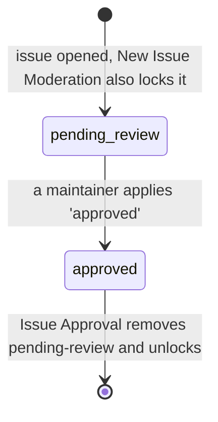
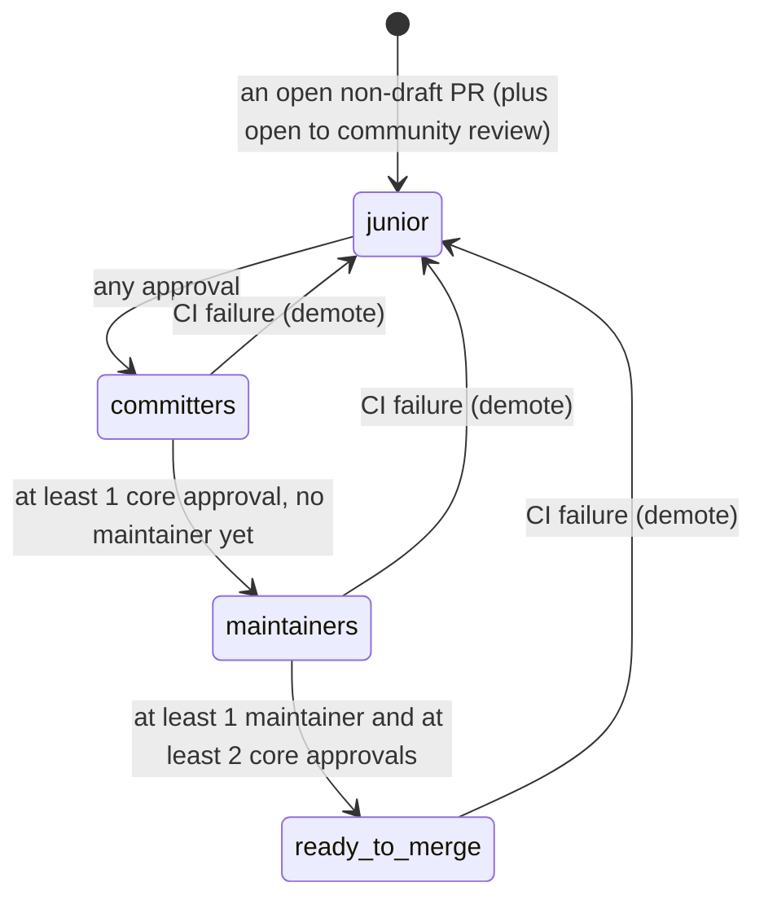

# Label Inventory: Hiero Python SDK

> **What this covers:** every label that the maintainer automation under `.github/` of
> [`hiero-ledger/hiero-sdk-python`](https://github.com/hiero-ledger/hiero-sdk-python) reads or writes,
> which service touches it, and the catalog of label spellings that have drifted apart.
> **Source state:** `main` at `cbb41d9` (it moved on from Phase 1's `5df93b7`; any differences are noted
> inline).
> **Phase:** 2 (Labels and flows). It builds on `audit/services-python.md`.
> **Left out on purpose:** the CI, build, security, and release workflows (`pr-check-primary-*`,
> `pr-check-secondary-*`, `pre-commit`, `publish`, `release-pr-coderabbit-gate`, `clusterfuzzlite`,
> `test-*`). They touch no labels and are a project non-goal, so they are excluded from the flow analysis
> (Appendix D). One workflow whose name makes it look like CI is the exception: `pr-check-feedback-all.yml`
> is an in-scope maintainer notification service that happens to write no labels. It is not CI and it is
> not a non-goal. It is written up below ("A label-free service that is still in scope") and noted in the
> appendix.

## How labels work in the Python SDK

This is the opposite of the C++ setup. There is no single policy file. Label strings come from three
different places:

1. `scripts/shared/labels.js` holds the skill and difficulty constants (`GOOD_FIRST_ISSUE_LABEL`, and so
   on).
2. `scripts/labels.js` and `scripts/review-sync/helpers/constants.js` hold the `notes:` and `queue:`
   constants.
3. Plain string literals sit inside individual workflow `if:` conditions and shell or JS scripts. These
   include `pending-review`, `approved`, `discussion`, `notes: spam`, `notes: mentor-duty`,
   `priority: critical`, and the bare `beginner`.

Because the same idea is written in several files, the Python side has real spelling drift, cataloged
below. That catalog is the headline finding on the Python side.

## Which service touches which label

How to read the columns: **Read** means it checks the label as a condition. **Added** and **Removed**
mean it writes the label.

### Skill and difficulty

| Label | Read by | Added by | Removed by | Defined in |
|---|---|---|---|---|
| `Good First Issue` | GFI Assign, Beginner Assign (the GFI guard), Assignment Limit Enforcer, Mentor Assignment (chained), Spam List Maintenance, Next Issue Recommendation | issue template | none | `scripts/shared/labels.js` as `GOOD_FIRST_ISSUE_LABEL`, but also re-typed by hand inside `bot-beginner-assign-on-comment.js` (drift D) |
| `Good First Issue Candidate` | GFI Candidate Notification | issue template | none | `scripts/shared/labels.js` as `GOOD_FIRST_ISSUE_CANDIDATE_LABEL`; the workflow gate uses a lower-case spelling (drift A) |
| `skill: beginner` | Beginner Assign, Intermediate Guard (prerequisite), Triage Review Request, CodeRabbit Plan Trigger, Next Issue Recommendation | issue template | none | `scripts/shared/labels.js` as `BEGINNER_LABEL`; a bare `beginner` is also checked (drift C) |
| `skill: intermediate` | Intermediate Guard, Advanced Check (prerequisite), CodeRabbit Plan Trigger, Next Issue Recommendation | issue template | none | `scripts/shared/labels.js` as `INTERMEDIATE_LABEL` |
| `skill: advanced` | Advanced Check, CodeRabbit Plan Trigger, Next Issue Recommendation | issue template | none | `scripts/shared/labels.js` as `ADVANCED_LABEL` |

> Just like C++, the skill labels are read-only to the bots (templates apply them). They gate the
> assignment ladder, but no bot adds or removes them.

### Review queue (the PR review state machine)

All five are owned and auto-created by the Review Queue Label Sync (`review-sync.yml`), which is the only
service that writes them.

| Label | Read by | Added by | Removed by | Defined in |
|---|---|---|---|---|
| `queue:junior-committer` | Review Queue Sync | Review Queue Sync | Review Queue Sync (stale cleanup) | `review-sync/helpers/constants.js` |
| `queue:committers` | Review Queue Sync | Review Queue Sync | Review Queue Sync | same |
| `queue:maintainers` | Review Queue Sync | Review Queue Sync | Review Queue Sync | same |
| `status: ready-to-merge` | Review Queue Sync | Review Queue Sync | Review Queue Sync | same |
| `open to community review` | Review Queue Sync | Review Queue Sync (added to every open non-draft PR) | none (it is never removed) | same |

> One cross-SDK clash to flag: `status: ready-to-merge` lives in the `status:` namespace but it belongs to
> Python's review queue, while C++'s `status:` namespace is its issue and PR review machine. The
> normalized taxonomy has to reconcile the two (see `audit/services.md`).

### Lifecycle and moderation

| Label | Read by | Added by | Removed by | Defined in |
|---|---|---|---|---|
| `pending-review` | the approval flow relies on it | New Issue Moderation | Issue Approval | typed inline in the workflows |
| `approved` | Issue Approval (the trigger checks `event.label.name == 'approved'`) | a maintainer, by hand | none | typed inline |
| `discussion` | Inactivity Unassign (a skip guard, using `grep -qi`, so it ignores case) | by hand | none | typed inline in `bot-inactivity-unassign.sh` |

### Notes and admin

| Label | Read by | Added by | Removed by | Defined in |
|---|---|---|---|---|
| `notes: broken markdown links` | Cron Broken Links (to find an existing tracking issue) | Cron Broken Links (on the tracking issue) | none | `scripts/labels.js` |
| `notes: automated` | Cron Broken Links, Spam List Maintenance | Cron Broken Links, Spam List Maintenance | none | `scripts/labels.js` |
| `notes: spam` | Spam List Maintenance (queries closed, unmerged PRs) | a maintainer, by hand | none | typed inline in `cron-admin-update-spam-list.js` |
| `notes: spam-list-update` | Spam List Maintenance (dedup) | Spam List Maintenance (on the tracking issue) | none | typed inline |
| `notes: mentor-duty` | Assignment Limit Enforcer (excluded from a triage user's count) | by hand | none | typed inline in `bot-assignment-check` |

### Priority

| Label | Read by | Added by | Removed by | Defined in |
|---|---|---|---|---|
| `priority: critical` | P0 Issue Team Alert | by hand | none | typed inline in `bot-p0-issues-notify-team.js` |
| `Priority: Critical` | P0 Issue Team Alert (the second `||` branch) | by hand | none | typed inline (workflow only); this is drift B |

### Passthrough (no fixed string)

| "Label" | What happens |
|---|---|
| any label on a linked issue | The Linked Issue Label Sync (compute then apply) copies every label from a PR's linked issue onto the PR, with no allow-list. So `notes:`, `skill:`, and lifecycle labels can all spread from the issue to the PR. With no namespace gating, a label spreads unchecked, which is a fragility in the current design. |

## The spelling-drift catalog (the headline finding)

There are four drift sets. One thing first, because it changes how serious they are: GitHub Actions
`contains()` is case-insensitive (per the GitHub expression docs), so a workflow `if:` guard with a
different casing than the label still matches at runtime. None of these is a dead workflow. The real issue
is fragility: one idea has several accepted spellings, defined in scattered places and normalized
inconsistently. That inconsistency is the finding.

### Drift A: the GFI Candidate casing
| Spelling | Where it appears | How it is matched |
|---|---|---|
| `Good First Issue Candidate` | the `shared/labels.js` constant, the issue template `labels:`, and `bot-gfi-candidate-notification.js` (a `.toLowerCase()` compare) | this is the canonical one |
| `good first issue candidate` | the `bot-gfi-candidate-notification.yaml` `if:` guard | `contains()`, which is case-insensitive, so it still matches |

**How much it matters:** low in practice, high for tidiness. It works today because `contains()` ignores
case, but the gate string and the constant disagree. If someone later switches to a case-sensitive check,
or renames the label, it breaks quietly.

### Drift B: the Priority Critical casing
| Spelling | Where it appears |
|---|---|
| `priority: critical` | the `bot-p0-issues-notify-team.js` constant and the first workflow branch |
| `Priority: Critical` | the second `||` branch of the workflow `if:` |

**How much it matters:** low, and it is tolerated on purpose. The workflow accepts both with `||`, and
the JS normalizes with `.toLowerCase()`. Still, two strings exist for one idea with no canonical source.

### Drift C: beginner, namespaced versus bare
| Spelling | Where it appears |
|---|---|
| `skill: beginner` | `shared/labels.js`, plus the beginner, intermediate, CodeRabbit, and triage paths |
| `beginner` (bare) | a third `contains()` branch in `request-triage-review.yml` |

**How much it matters:** medium. The bare `beginner` has no definition and most likely targets cross-repo
PRs or old labels. It can over-trigger if a bare `beginner` ever gets applied in this repo. This is a real
namespace inconsistency for the same skill tier.

### Drift D: `Good First Issue` defined twice
| Source | Form |
|---|---|
| `shared/labels.js`, `GOOD_FIRST_ISSUE_LABEL` | imported by most scripts |
| `bot-beginner-assign-on-comment.js` | re-declares `const GFI_LABEL = 'Good First Issue'` by hand instead of importing |

**How much it matters:** low to medium, and it is structural. The value is the same today, but renaming
the GFI label would update the shared constant and miss this hand-typed copy. It is a one-rename,
two-places hazard waiting to happen.

## How labels move: the state machines

Python has no single status machine. Labels move in two separate flows, and the skill ladder is a set of
read checks rather than label changes.

### Issue moderation flow



| From | To | Service | What triggers it |
|---|---|---|---|
| (none) | `pending-review` | New Issue Moderation | `issues: opened` (it also locks the issue) |
| `pending-review` (plus `approved`) | `pending-review` removed | Issue Approval | `issues: labeled` with `approved` (it also unlocks the issue) |

### Review queue flow (owned entirely by Review Queue Label Sync, on a `*/30` cron)



The sync adds the new label before it removes the stale ones, so a crash can never leave a PR with zero
queue labels. It stops early if the rate-limit budget drops below 200.

> **A couple of routing details worth knowing.** The label is recomputed from scratch on every cron run,
> so it is a stateless classifier, not something edge-triggered. `determineLabel()` checks these in order:
> CI failing sends it to `junior-committer` (a demote from any state); at least 1 maintainer and at least
> 2 core approvals means `ready to merge`; at least 1 maintainer but fewer than 2 core approvals sends it
> to `committers` (so when a maintainer approves first, the PR routes back to `committers` to pull in
> committer review, rather than jumping straight to `maintainers`); at least 1 core approval with no
> maintainer means `maintainers`; any approval at all means `committers`; otherwise `junior-committer`.
> The diagram shows the common forward path, and the early-maintainer case is the notable exception.

### The skill ladder, which is read checks, not label writes

```
Good First Issue --(>= 1 closed GFI)--> skill: beginner --(>= 1 closed beginner)--> skill: intermediate --(>= 1 closed intermediate)--> skill: advanced
```

Each guard (`bot-beginner-assign-on-comment`, `bot-intermediate-assignment`, `bot-advanced-check`) reads
the labels and the contributor's history of closed issues, then allows the assignment or blocks and
unassigns. It never changes the skill label itself. The core team (admin, maintain, write, triage, with
small differences per guard) skips the checks.

## Labels created at runtime

| Label(s) | Created by | How |
|---|---|---|
| `queue:junior-committer`, `queue:committers`, `queue:maintainers`, `status: ready-to-merge`, `open to community review` | Review Queue Label Sync | `issues.createLabel()` through `ensureLabel()` (idempotent, safe on a 422, with fixed colors) |
| `notes: broken markdown links`, `notes: automated` | Cron Broken Links | not created; they are passed to `issues.create({labels})`, so they have to already exist or they get dropped |
| `notes: spam-list-update`, `notes: automated` | Spam List Maintenance | same; passed to `issues.create`, not created |

Compared with C++: Python auto-creates labels, but only the queue family; the `notes:` tracking labels
are assumed to already exist. So the two SDKs differ on label creation, which is the finding here.

## Labels that are used but never defined in a constants file

These labels are used by active scripts but defined in no `labels.js`. They live only as string literals,
which is the structural root of the drift: `pending-review`, `approved`, `discussion`, `notes: spam`,
`notes: spam-list-update`, `notes: mentor-duty`, `priority: critical`, `Priority: Critical`, and the bare
`beginner`. That is about nine labels with no single place to rename or validate them.

## Archive note (this feeds the "retired" column in `audit/services.md`)

The 10 archived workflows in `.github/workflows/archive/` reference no archive-only labels. The only label
they touch, `Good First Issue`, is still active. `bot-mentor-assignment.yml` is archived because its logic
was folded into `bot-gfi-assign-on-comment.js` (chained), not because it was retired. So the retired
services leave no orphaned labels behind. They were merged in or dropped without any label residue.

## Differences from Phase 1 (`5df93b7` to `cbb41d9`)

This was re-read at the newer commit. The set of labels and the service-to-label mapping match the Phase 1
Appendix B and C. No labels were added or removed between the two commits in a way that affects this
inventory.

## A label-free service that is still in scope: the Workflow Failure Notifier

`pr-check-feedback-all.yml` reads like a CI check because of its name, but it is a maintainer-automation
notification service and belongs in this audit. It writes and reads no label (hence no row above), but
that is all it shares with the CI workflows. It is not a non-goal.

What it does: on `workflow_run: completed` for 7 named CI checks, if the run failed, it finds the open PR
behind that run and posts one deduplicated comment (keyed by a `<!-- workflow-failure-bot -->` marker)
pointing the author at the DCO, rebase, testing, and Discord guides. It turns a red CI run into actionable
guidance, the same family as the C++ PR-check dashboard, just delivered as a comment instead of labels.

The fragility worth recording: it identifies those 7 workflows by their exact display-name strings. Rename
any one and the notifier silently stops firing for it, with no error and no label to surface the gap.

## Appendix D: out-of-scope workflows (no label contact)

The CI, build, security, and release workflows (`pr-check-primary-*`, `pr-check-secondary-*`,
`clusterfuzzlite`, `pre-commit`, `publish`, `release-pr-coderabbit-gate`, `test-on-review`,
`test-review-sync`) and the two per-PR repo-hygiene checks (`pr-check-primary-{broken-links,test-files}`)
were all checked and touch no labels. They are a project non-goal (`planning/goals.md`, Non-goals) and are
left out of the flow analysis. The one workflow that looks like it belongs here but does not is
`pr-check-feedback-all`: label-free, but in scope as a notification service (see the section above).
