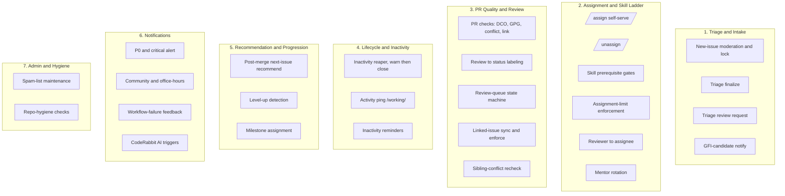
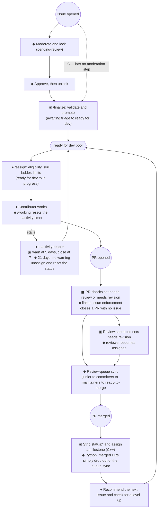

# Cross-SDK Service and Label Architecture

> **Phase 2 synthesis:** a cross-SDK view of the maintainer automation. It covers what each SDK offers,
> how the services group together, how an issue or PR moves through them, and a normalized view of the
> labels that already exist across the SDKs. It draws on the Phase 1, 2, and 3 audit files and lines up
> with `planning/goals.md` (decoupled by function, config-driven, opt-in).
>
> **Third codebase added.** The JavaScript SDK (`hiero-ledger/hiero-sdk-js`), the most used Hiero SDK, was
> audited as a third data point (`audit/services-js.md`, `audit/labels-js.md`, `audit/coupling-js.md`). Its
> result is mostly absence: it runs no maintainer issue or PR lifecycle automation, so it appears in the
> comparison below as a near-empty column. That absence is itself the finding, and it is summarized at the
> end of section 2.
>
> **This is descriptive, not prescriptive.** It records what the two existing systems do today. What the
> shared app should build, and what labels should mean, are goals questions decided separately (see the
> open questions at the end of section 4), not proposals made here.
>
> **Scope:** maintainer automation only. CI, build, release, and security are a project non-goal, so they
> appear only in Appendix Z.

## 1. The service groups, from the top down

The C++ and Python SDKs solve the same broad set of problems in very different ways. C++ is a hub and spoke
off one config file; Python is roughly 40 small, focused workflows. The JavaScript SDK solves almost none
of them: it has no lifecycle automation, only Slack notifications, a PR formatting gate, and CI. Grouped by
what each service does rather than how it is built, the whole surface falls into seven groups (the
JavaScript SDK touches only group 6, and only with generic event notifications).

The repo-hygiene checks (broken links, test-file naming) sit close to CI and are deprioritized per the
maintainer's steer.

## 2. The same capabilities, compared across the SDKs

Each row is one capability. The C++ and Python columns show which of the two implements it, and the Status
column summarizes that pair: 🟢 both · 🔵 C++ only · 🟣 Python only · ⚪ retired. The JS column is shown
separately because the JavaScript SDK is the third data point and implements almost none of these rows; a
blank JS cell means absent.

| Group | Capability | C++ | Python | JS | Status (C++ vs Python) | Notes |
|---|---|:--:|:--:|:--:|:--:|---|
| 1. Intake | New-issue moderation and lock until approved | | ✅ | | 🟣 | `moderate-new-issues` plus `approved-issues` |
| 1. Intake | Triage finalize (`/finalize`: validate, retitle, promote) | ✅ | | | 🔵 | validated against the central config |
| 1. Intake | Triage review request (ping the triage team on a PR) | | ✅ | | 🟣 | `request-triage-review` |
| 1. Intake | GFI-candidate notification | | ✅ | | 🟣 | `bot-gfi-candidate-notification` |
| 2. Assign | Self-serve `/assign` with eligibility gates | ✅ | ✅ | | 🟢 | C++ uses central limits; Python uses per-tier handlers plus the spam list |
| 2. Assign | `/unassign` | ✅ | ✅ | | 🟢 | C++ reverts the status label; Python is assignee-only |
| 2. Assign | Skill-ladder prerequisite gating | ✅ | ✅ | | 🟢 | C++ uses `skillPrerequisites` (beginner needs 2 closed GFI, intermediate 3 closed beginner, advanced 3 closed intermediate); the same skill label also drives the GFI cap and the `/finalize` title and body rewrite, so it is far more than a recommendation hint; Python uses the advanced and intermediate guards, which unassign on a fail |
| 2. Assign | Assignment-limit enforcement | ✅ | ✅ | | 🟢 | C++ uses `maxOpenAssignments` and `maxGfiCompletions`; Python uses spam-list caps |
| 2. Assign | Reviewer becomes PR assignee | | ✅ | | 🟣 | `on-review` |
| 2. Assign | Mentor rotation on assignment | | ✅ | | 🟣 | chained inside the GFI handler, via `mentor_roster.json` |
| 3. PR | PR quality checks (DCO, GPG, conflict, issue-link) plus a dashboard | ✅ | partial | | 🟢 | C++ has a unified dashboard; Python only enforces the linked issue, by closing the PR |
| 3. PR | PR formatting gate (conventional title plus assignee present) | | | ✅ | | JS-only and active (`pr_check.yml`, `statuses: write`); Python had `bot-conventional-pr-title.js` but it is archived/dead code; C++ folds checks into its dashboard instead |
| 3. PR | Auto-assign the PR author | ✅ | | | 🔵 | part of PR Open Checks |
| 3. PR | Review result becomes a status label | ✅ | | | 🔵 | the fork-safe relay sets `needs revision` |
| 3. PR | Review-queue state machine (`queue:*`) | | ✅ | | 🟣 | `review-sync` on a `*/30` cron |
| 3. PR | Linked-issue label sync (issue and PR) | | ✅ | | 🟣 | the fork-safe relay, additive only |
| 3. PR | Linked-issue enforcement (close PRs with no linked issue) | | ✅ | | 🟣 | C++ checks and labels for this but never closes |
| 3. PR | Sibling-conflict recheck on merge | ✅ | | | 🔵 | re-evaluates the other open PRs |
| 4. Life | Inactivity reaper (warn, then close or unassign) | ✅ | ✅ | | 🟢 | C++ warns at 5 days and acts at 7; Python acts at 21 days with no warning |
| 4. Life | Activity ping `/working` (resets the timer) | | ✅ | | 🟣 | read by the reaper and the reminder |
| 4. Life | Inactivity reminders (issue with no PR, inactive PR) | | ✅ | | 🟣 | comment-only, a step before unassigning |
| 5. Prog | Post-merge next-issue recommendation | ✅ | ✅ | | 🟢 | both walk a skill ladder |
| 5. Prog | Level-up detection and congratulation | ✅ | ✅ | | 🟢 | |
| 5. Prog | Milestone assignment on merge | ✅ | | | 🔵 | on the linked issues or the PR |
| 6. Notify | Generic event-to-Slack notifications (issue, PR, comment, merge, release opened) | | | ✅ | | JS-only; six read-only notifiers to one Slack channel; C++ and Python have no generic open-event Slack feed, only targeted alerts |
| 6. Notify | P0 or critical issue alert | | ✅ | | 🟣 | on `priority: critical` |
| 6. Notify | Community and office-hours reminders | | ✅ | | 🟣 | fortnightly crons |
| 6. Notify | Workflow-failure feedback on a PR | | ✅ | | 🟣 | reacts to 7 named CI checks; a notification service, not CI itself; matches the 7 by exact workflow-name string, so a rename silently breaks it |
| 6. Notify | CodeRabbit AI plan and review triggers | | ✅ | | 🟣 | matches the goals.md idea that AI should be complementary |
| 7. Admin | Spam-list maintenance | | ✅ | | 🟣 | hourly cron plus a tracking issue |
| 7. Admin | Slash-command dispatcher (one shared parser) | ✅ | | | 🔵 | architectural; Python dispatches per workflow instead |
| 7. Admin | Repo-hygiene checks (broken links, test naming) | | ✅ | ✅ | 🟣 | Python: per-PR and monthly link plus test-naming; JS: a scheduled link check only (`broken-links.yaml`), no tracking issue |
| Retired | Merge-conflict bot, auto-draft, draft explainer and reminder, missing or unassigned linked issue, verified commits, conventional title, standalone GFI-notify and mentor | | archived | | ⚪ | the 10 files in Python's `workflows/archive/` |

How to read the table. The 🟢 rows (assignment, `/unassign`, skill gating, limit enforcement, inactivity
reaping, recommendation) are the common core of the two SDKs that have automation: both C++ and Python
implement them and differ only in policy and shape. The 🔵 and 🟣 rows exist in just one of those two. The
⚪ rows are retired in Python.

**Where the JavaScript SDK lands.** It implements only three rows, all outside the lifecycle core: a PR
formatting gate (title plus assignee), generic event-to-Slack notifications, and a scheduled link check.
Every group 1 to 5 capability is absent. The contributor never meets a bot on an issue or PR in the
JavaScript SDK: no moderation, no `/assign`, no skill ladder, no status labels, no inactivity sweep, no
recommendation. So across the three SDKs, the lifecycle automation surface is a C++ and Python concern; the
most used SDK carries none of it. The detail is in `audit/services-js.md`, `audit/labels-js.md`, and
`audit/coupling-js.md`.

## 3. The end-to-end maintainer-automation flow

This is how a contribution moves through the services from start to finish. The journey is shared, but each
SDK fills in different stops along the way. C++ is `▣`, Python is `◆`, and both is `●`.

The label-level state machines behind these stops are written up in `audit/labels-cpp.md` (the issue and
PR `status:` machines) and `audit/labels-python.md` (the moderation and review-queue machines). How these
services depend on each other through shared state (labels, comments, assignees, config, cross-entity
links, and shared workflow files), and where that coupling sits, is mapped in `audit/coupling-cpp.md`.

## 4. A normalized view of the labels that exist today

This lines up the label strings that already exist across the two SDKs so the same idea sits in one row.
It is a summary and a check-in, **not a proposal**: it shows where the two agree and where they diverge
(including the four Python drift sets from `audit/labels-python.md`). What each namespace should ultimately
do is an open question, listed below.

| Namespace | Values across both SDKs | Where the two SDKs differ |
|---|---|---|
| `status:` (work lifecycle) | `awaiting triage`, `ready for dev`, `in progress`, `blocked`, `needs review`, `needs revision`, `ready-to-merge` | C++ owns the issue and PR status set; Python adds `status: ready-to-merge` (hyphenated) from its review queue |
| `skill:` (the ladder) | `good first issue`, `beginner`, `intermediate`, `advanced` | Python also has the bare `beginner` (drift C), the title-case `Good First Issue` (drift D), and `Good First Issue Candidate` |
| `priority:` | `critical`, `high`, `medium`, `low` | Python also carries `Priority: Critical` (drift B) |
| `queue:` (review routing) | `junior-committer`, `committers`, `maintainers` | Python-only |
| `notes:` (bookkeeping) | `automated`, `spam`, `spam-list-update`, `broken markdown links`, `mentor-duty` | Python-only, mostly inline literals |
| `lifecycle:` (intake gate) | `pending-review`, `approved` | Python-only |
| `meta:` | `open to community review`, `discussion` | Python-only |

The four drift sets, and where the two spellings diverge:

| Drift | What exists today | Where they differ |
|---|---|---|
| A | `Good First Issue Candidate` and `good first issue candidate` | constant and template vs the workflow gate's casing; `contains()` matches either |
| B | `priority: critical` and `Priority: Critical` | two casings, both accepted via `||` |
| C | `skill: beginner` and bare `beginner` | namespaced vs bare, in one triage branch |
| D | shared `GOOD_FIRST_ISSUE_LABEL` and a hand-typed copy | defined once vs duplicated inline |

The contrast worth noting: C++ has one config file and never types a label by hand, so it has zero drift;
Python's drift comes from the same idea being written in scattered places. That difference is the finding.

**Open questions for a labels goals.md** (for maintainers to decide, not answered here): which
classifications should be GitHub native tags or fields rather than labels (`priority` already is one,
`effort` may follow); whether `status:` and the `lifecycle:` intake gate should be one namespace; whether
`notes:` and `meta:` should be one; and what each label should do for maintainers (drive automation,
signal to humans, or both).

## 5. Capabilities common across both SDKs (a summary)

Reading section 2 by what the two SDKs already share, the recurring capabilities are:

- **Assignment and the skill ladder** (🟢): `/assign`, `/unassign`, prerequisite gates, limit enforcement.
- **Inactivity reaping** (🟢): C++ warns then acts; Python acts at 21 days.
- **Post-merge recommendation and level-up** (🟢).
- **PR quality checks and review-to-status labeling** (🟢, 🔵): DCO, GPG, conflict, issue-link.
- **Intake and triage** (🔵, 🟣): `/finalize`, moderation and lock, triage review request.
- **Review-queue routing** (🟣): the `queue:*` state machine.
- **Linked-issue sync and enforcement** (🟣).
- **Notifications** (🟣): P0 alert, reminders, workflow-failure feedback, CodeRabbit AI hooks.
- **Admin** (🟣): spam-list maintenance, mentor rotation.

The repo-hygiene and CI-adjacent checks and the 10 retired Python workflows are noted only for
completeness; they sit outside the maintainer-automation surface.

## Appendix Z: out of scope (a non-goal)

CI, build, release, and security stay as native Actions per repo and are a project non-goal
(`goals.md`, Non-goals). In both SDKs these workflows were verified to touch no labels (see
`audit/labels-cpp.md` Appendix C and `audit/labels-python.md` Appendix D). They are left out of the
classification and flow work here.
