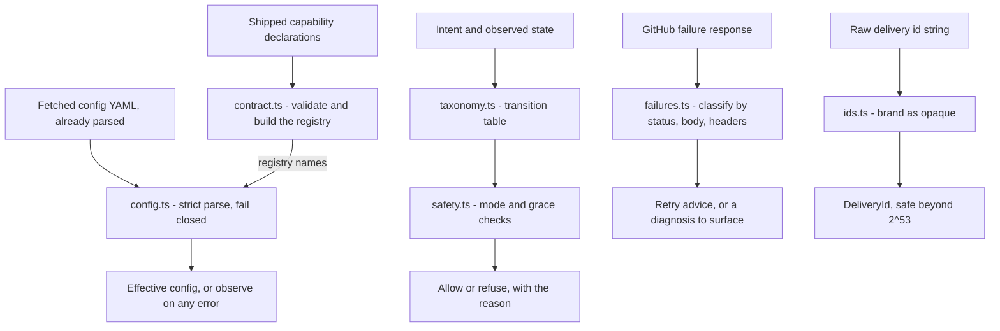

# automation-core (pure logic)

The parallel track from `design/build-plan.md` ("Parallel work the gates do
not block"): the work-item state machine, the safety engine, and the
configuration validator as typed code with invariant tests. No I/O, no
GitHub, no platform — `pnpm test` runs the whole thing in under a second.

| Module | Implements | Source of truth |
|---|---|---|
| `src/taxonomy.ts` | Both workflow state diagrams as transition tables; the blocked-pause and stale-precondition invariants | `design/core/taxonomy.md` §2–§5 |
| `src/safety.ts` | The action classes, the mechanically checkable write rules, the clock-triggered destructive gates | `design/core/safety.md` §1–§5 |
| `src/config.ts` | Strict configuration validation: unknown keys rejected, defaults off, fail closed; optional capability-registry check | `design/config/schema.md` §2–§4; experiment 6.3 finding |
| `src/contract.ts` | Capability declarations with per-intent idempotency class; registry that feeds `parseConfig` | `design/modules/contract.md` §1 + the D23 amendments (experiments 6.3, 6.5) |
| `src/ids.ts` | `DeliveryId` as a branded opaque string — numeric ids are a compile error | `FINDING(delivery-id-precision)`, experiment 6.2 |
| `src/failures.ts` | The failure catalogue as classification plus bounded retry advice, tested against observed response bodies | failure table in `design/operations/endpoint-permission-matrix.md` |

The sibling `store/` package holds the owned operational store (protocol
6.5's decision) — it does I/O, so it lives outside this no-I/O track.

## How the pieces connect

Four independent lanes of pure logic. The platform shell (stage five)
supplies every input and performs every side effect; core only decides.

The tests are the executable form of the design's own claims: the
transition matrix is exhaustive (every `(from, to, cause)` triple is either
a documented edge or rejected), destructive actions cannot fire without a
recorded warning and an elapsed grace period, and one config error yields
no configuration at all.

## Findings for the decision register

Coding the prose surfaced ambiguities; each is tagged `FINDING(...)` in the
source at the exact place the assumption was made, and each is recorded in
[`design/decisions.md`](../design/decisions.md) §3 as a hypothesis with this
code as its evidence:

- **`FINDING(taxonomy-blocked)`** → **D28** — `blocked` is listed as a
  meaning but appears in neither state diagram; safety.md treats it as a
  pause. Modelled here as an orthogonal flag (position survives a pause),
  not a position.
- **`FINDING(taxonomy-manual-entry)`** → **D29** — "every state has a
  non-module way in" implies manual entry edges the diagrams don't contain.
  Modelled as observed reality to reconcile, not as requestable transitions.
- **`FINDING(safety-grace-floor)`** → **D30** — safety.md requires a floor
  for grace periods but names none. `MIN_GRACE_DAYS = 1` encoded so the
  question cannot be silently skipped.
- **`FINDING(config-no-config-mode)`** → **D31** — "no configuration causes
  no workflow-changing writes" doesn't name the mode; `observe` chosen over
  `disabled`.

The register rows carry the required next evidence; none of these choices
is ratified by the code alone.
