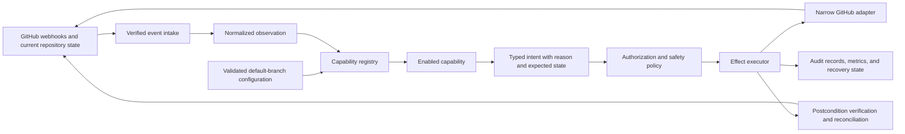

# Architecture Proposal for the Hiero Workflow App

> This document is a draft for maintainer review. It describes the product direction, the technical
> boundaries that are supported by current evidence, and the questions that still require experiments.
> It does not approve a module list, a label system, a storage technology, a hosting provider, or a rollout
> date.

## 1. Product boundary

The product is one hosted GitHub App that provides shared automation infrastructure to many repositories.
Each repository decides which workflow capabilities it wants and supplies the policy for those capabilities
through reviewed configuration.

The shared platform is universal because it handles the same GitHub and safety problems for every
repository. The repository workflow is not universal. One repository may enable assignment and inactivity
handling, another may enable only pull request feedback, and another may install nothing.

The existing C++, Python, and JavaScript automation is the starting evidence. The App should replace useful
behavior without copying accidental coupling, old label spellings, or policies that maintainers no longer
want.

## 2. Architecture overview

The main boundaries are as follows.

1. The production intake layer verifies GitHub webhooks and durably accepts the delivery identity and work
   before it returns a successful response within GitHub's time limit. Slow work does not run inside the
   webhook response path. A local observation-only experiment may use a simpler queue, but it cannot claim
   production recovery guarantees.
2. The configuration layer loads policy from the repository's default branch, validates it, and reports the
   effective configuration.
3. The registry activates only the capabilities that the repository explicitly enabled.
4. A capability receives normalized facts and its own configuration. It returns typed intent and an
   explanation. It does not receive Octokit or another raw GitHub client.
5. The policy layer checks repository mode, actor authority, required permissions, safety rules, and current
   state before any write.
6. The executor applies approved effects, verifies their postconditions, and handles results that are not
   immediately clear.
7. The adapter is the only component that understands GitHub REST or GraphQL details.

## 3. What the shared platform owns

The shared platform may own the following technical responsibilities.

- It authenticates as the GitHub App and as an installation, refreshes installation tokens, and identifies
  the installation and repository for every operation.
- It verifies webhook signatures, durably accepts work before acknowledging it, handles duplicate delivery
  identifiers, applies queue limits, and supports manual redelivery and reconciliation.
- It loads, validates, and explains repository configuration.
- It checks whether the installation has the permissions required by an enabled capability.
- It normalizes GitHub reads so capabilities do not depend on transport response shapes.
- It exposes narrow write operations with explicit preconditions and postconditions.
- It classifies API failures, applies bounded backoff, respects primary and secondary rate limits, and avoids
  blind retries after an unclear write result.
- It records enough information to explain decisions, recover incomplete work, and support dry-run mode.
- It provides global, repository, capability, and item-level ways to stop automation.
- It loads and isolates repository-selected capabilities.

The shared platform does not decide that every repository needs a skill ladder, a twelve-label taxonomy, an
inactivity rule, or a review queue. Those are optional workflow policies.

## 4. Repository configuration

Configuration is reviewed repository intent. It is not a substitute for runtime state, delivery records, or
telemetry.

The first schema uses strictly validated YAML and supports the following concepts. The exact path and final
schema still require sandbox validation.

- The configuration declares a schema version.
- The repository selects `disabled`, `observe`, `dry-run`, or `active` mode.
- The repository explicitly enables capabilities.
- Each capability receives only its own configuration block.
- Stable internal meanings may be mapped to repository labels, native fields, teams, users, or notification
  destinations.
- Every user-facing capability defaults to disabled and must be explicitly enabled.
- Profiles may provide mappings and settings, but they do not enable a capability.
- The first version does not inherit configuration from another repository or organization.
- The system reports the active configuration revision and effective value of each setting.

No configuration means that the App performs no workflow-changing writes. Invalid configuration fails
closed and produces a clear report for the repository maintainers. The design must still decide the YAML
path, default-branch revision handling, schema migration, and rollback behavior. Inheritance may be
considered later if repeated repository configuration demonstrates a need.

## 5. Capabilities and workflow profiles

A capability is one user-facing automation function. It declares the following information.

- It declares the GitHub events and scheduled observations that can wake it.
- It declares the configuration keys that it can read.
- It declares the normalized facts that it needs.
- It declares the typed intents that it may request.
- It declares the GitHub permissions that those intents require.
- It declares whether it needs scheduling, durable operational state, or cross-item coordination.
- It declares its safe disablement and rollback behavior.

A capability never imports or calls another capability. Disabling a capability stops its triggers,
scheduled work, capability-only reads, and writes. A capability does not require another capability to be
enabled unless that compatibility rule is declared and validated.

Manual entry into a workflow state is useful, but it does not by itself prove independence. Two capabilities
may still share a workflow invariant or require a tested compatibility rule. Related capabilities may be
offered as an optional workflow profile. For example, a Hiero contribution profile may combine intake,
assignment, and inactivity policies while each capability remains separately implemented and configurable.

## 6. Internal meanings and repository labels

The platform may use stable internal meanings such as `ready`, `inProgress`, or `needsReview`. A repository
maps those meanings to its own GitHub representation when an enabled capability needs them.

A mapping may point to a label, a native GitHub field, or a supported Project field. The platform must not
assume that every repository uses the same spelling or even the same concept. A Hiero workflow profile may
provide recommended defaults, including the twelve-label draft, but those defaults are not the universal
platform core.

The mapping validator must reject missing required mappings, duplicate meanings, incompatible mappings, and
unsupported field types before activation. The App removes only named values that it manages. It never
removes every label under a namespace prefix.

## 7. The adapter boundary

The adapter exposes small operations rather than the full GitHub API. Candidate operations include the
following examples.

- `readIssue` returns a normalized issue snapshot.
- `readPullRequest` returns a normalized pull request snapshot.
- `findLinkedIssues` uses one documented mechanism for the repository's link policy.
- `addMappedLabelIfMissing` adds one configured label when its precondition still holds.
- `removeMappedLabelIfPresent` removes one configured label without touching unrelated labels.
- `assignIfUnassigned` assigns a named user only when the current state still permits it.
- `renderManagedComment` creates or updates one App-authored comment identified by a stable marker.
- `closeIfCurrent` closes an item only when the expected state and safety record still match.

Every write operation states its required permission, expected current state, desired postcondition,
idempotency key, retry rule, unclear-result behavior, and recovery rule.

The adapter returns explicit results. At minimum, it must distinguish `applied`, `already`, `conflict`,
`forbidden`, `retryLater`, and `unknown`. A capability never retries an `unknown` result by itself.

## 8. Multi-call effects and storage

GitHub label, assignee, comment, and close operations are separate API calls. The App cannot treat several
calls as one transaction.

Before implementing a multi-call effect, the design must name the following details.

1. The design names the starting state and expected version of the relevant facts.
2. The design lists the calls in their safe order.
3. The design describes the valid state after each partial step.
4. The design explains how a restart finds and continues or cancels the operation.
5. The design explains how concurrent human changes take priority.
6. The design states how the final postcondition is verified.

GitHub remains authoritative for visible repository facts such as labels, assignees, comments, reviews, and
open or closed state. The system may still need owned operational storage for webhook delivery identities,
pending effects, retries, schedules, and coordination.

Comment metadata is one recovery option for comment-related work. It is not the approved database for all
operations. A personal-sandbox experiment must compare reconstruction from GitHub, App-authored comment
metadata, and a small owned store. The experiment will decide the minimum durable state required for safe
recovery.

## 9. Permissions

The GitHub App registration defines the maximum permissions available to installations. Repository
configuration cannot reduce the permission grant that maintainers see during installation.

The design must maintain an endpoint and permission matrix for every candidate capability. A capability may
run only when its required permissions are present. A capability that introduces a new organization-level or
write permission needs separate justification and maintainer review.

The App must never need permission to change repository code. Team membership, organization Projects, Checks,
and off-GitHub notifications remain optional because they introduce additional permissions or external
systems.

## 10. Delivery, recovery, and rate limits

Webhooks are fast triggers, not a durable ordered workflow. The design expects duplicate, delayed, missing,
and manually redelivered events. Correctness comes from reading current GitHub state, checking preconditions,
and reconciling postconditions.

The final hosting design must answer the following questions.

- It must state how the webhook endpoint responds within GitHub's time limit.
- It must state whether a durable queue is required before acknowledgement.
- It must state how failed and missing deliveries are found.
- It must state whether one or several App processes may run at once.
- It must state how rate-limit headers and secondary rate limits affect scheduling.
- It must state how long operational and audit records are retained.

These questions are feasibility work. The current documents do not assume that one in-memory process or one
hourly sweep is sufficient.

## 11. Safe validation and rollout

The design uses the following rollout order.

1. Pure logic and a fake adapter run locally without network writes.
2. A separate development GitHub App runs against a personal sandbox repository.
3. The App verifies authentication, webhooks, configuration, duplicate delivery handling, and dry-run output.
4. The App creates or updates one managed comment and proves that repeated delivery does not create copies.
5. The App applies one reversible mapped label and verifies the postcondition under injected failures.
6. A clearly named Hiero Hackers sandbox is used only after explicit approval.
7. One consenting repository may run in read-only or shadow mode.
8. One reversible capability may enter a pilot after its rollback and kill switch have been tested.
9. Destructive and cross-repository effects require separate approval and a longer clean observation period.

The App never tests immature writes on a maintainer's working repository. Old and new automation never write
the same managed state during migration.

## 12. Current decisions and open questions

The following principles are strong enough to guide the next work.

- The product is one shared App with repository-selected capabilities.
- No configuration causes no workflow-changing writes.
- Capabilities do not receive a raw GitHub client.
- GitHub remains authoritative for visible repository facts.
- Label and field representations are repository mappings or profile defaults rather than universal core
  strings.
- Real repository writes wait for personal-sandbox evidence and explicit approval.

The following questions remain open.

- The exact YAML path, schema migration rules, and rollback behavior remain open. Configuration inheritance
  is deferred from the first version.
- The exact capability list and first user-facing capability remain open.
- The workflow profiles that Hiero repositories want remain open.
- Durable production webhook intake is required, while the additional operational records and storage
  technology remain open.
- The deployment model, hosting provider, and operator remain open.
- The final adapter interface remains open until endpoint experiments are complete.
- The App permission manifest remains open until the first capability is selected.
- The first pilot repository and rollout dates remain open.

The decision register in `design/decisions.md` records how these questions will be resolved. Candidate
capabilities are described in `design/modules/`, and the validation order is described in
`design/build-plan.md`.

## 13. Evidence used for this revision

GitHub's official documentation supplies the platform constraints. Its guidance covers [webhook handling
within ten seconds](https://docs.github.com/en/enterprise-cloud@latest/webhooks/using-webhooks/handling-webhook-deliveries),
[failed delivery and manual redelivery](https://docs.github.com/en/webhooks/using-webhooks/handling-failed-webhook-deliveries),
[installation-token repository and permission scoping](https://docs.github.com/en/apps/creating-github-apps/authenticating-with-a-github-app/generating-an-installation-access-token-for-a-github-app),
[GitHub App permission selection](https://docs.github.com/en/apps/creating-github-apps/registering-a-github-app/choosing-permissions-for-a-github-app),
and [REST API rate-limit behavior](https://docs.github.com/en/rest/using-the-rest-api/rate-limits-for-the-rest-api).

Mature projects provide useful patterns without deciding Hiero policy. [Kubernetes Prow
plugins](https://docs.prow.k8s.io/docs/components/plugins/) show repository-selected plugins behind shared
webhook infrastructure. [Rust triagebot](https://forge.rust-lang.org/triagebot/index.html) shows reviewed
per-repository feature configuration and uses owned operational storage. These examples support the shared
platform and opt-in capability boundary. They do not prove that Hiero needs the same deployment, database,
or workflow features.
