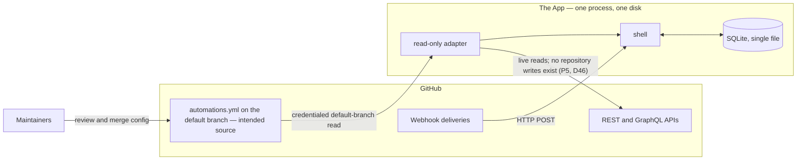
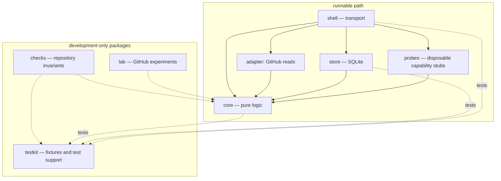
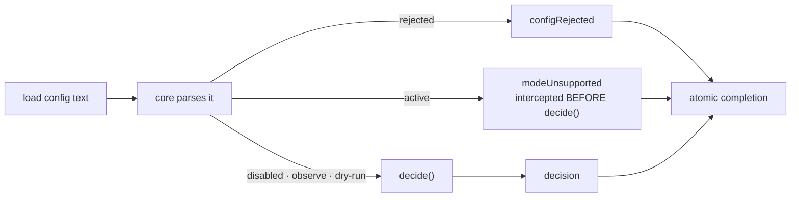
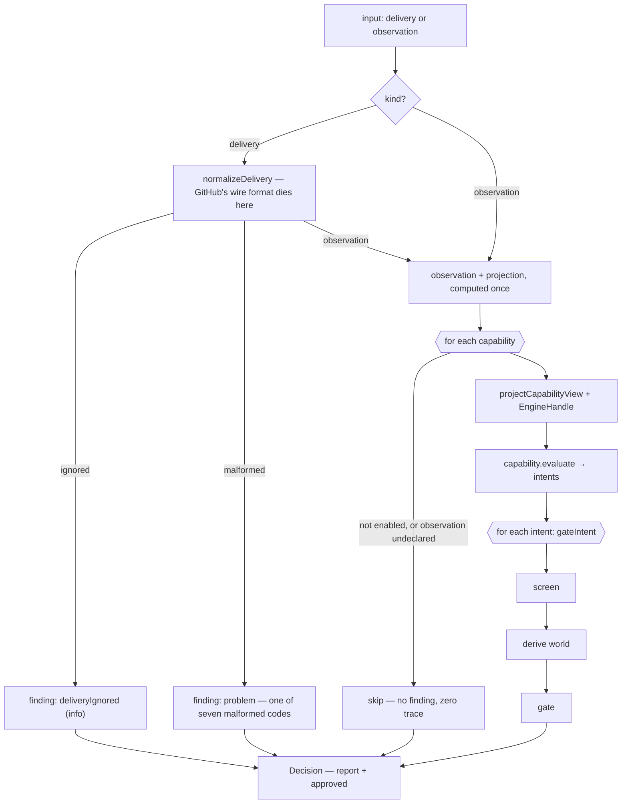
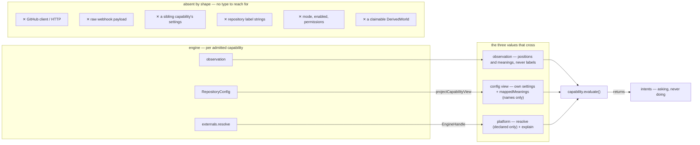
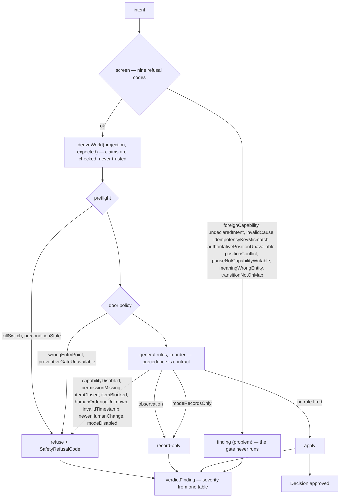
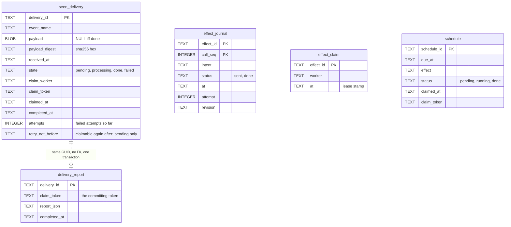
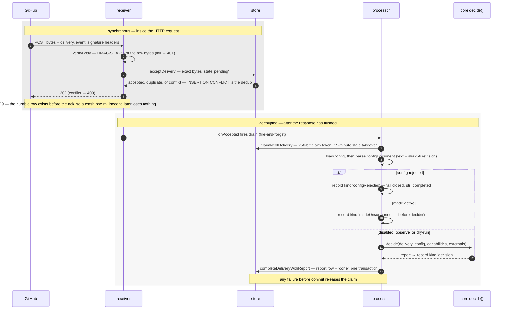
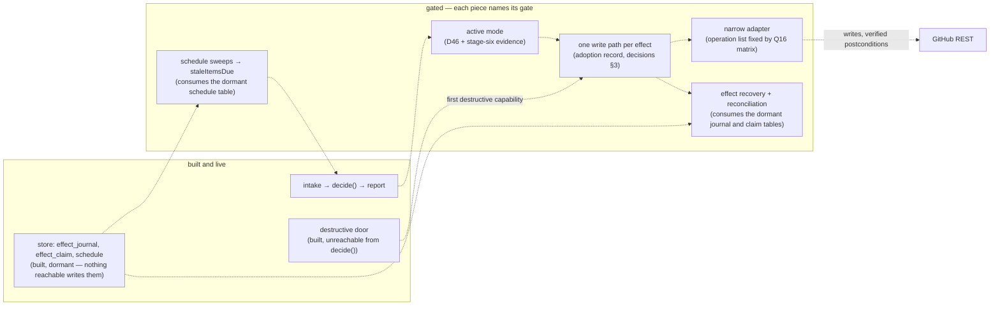

# Architecture

> Drawings. One italic line under each names the code or test that falsifies it.
> Why: [`decisions.md`](decisions.md). Vocabulary: [`packages/core/README.md`](../packages/core/README.md).

## Part 1 — The system

### 1. Context

```mermaid
flowchart LR
    subgraph GitHub
        WH["Webhook deliveries"]
        REST["REST and GraphQL APIs"]
        CFG["automations.yml on the default branch — intended source"]
    end
    subgraph App["The App — one process, one disk"]
        SH["shell"]
        AD["read-only adapter"]
        DB[("SQLite, single file")]
    end
    M["Maintainers"] -->|review and merge config| CFG
    WH -->|HTTP POST| SH
    CFG -->|credentialed default-branch read| AD
    AD --> SH
    SH <--> DB
    AD -->|"live reads; no repository writes exist (P5, D46)"| REST
```

*Sources: `packages/shell/src/receiver.ts`, `config.ts`, `main.ts`, `packages/adapter/src/` · [`decisions.md`](decisions.md)
P5, D46, D93, D110. Credential-free development and CI retain the local `CONFIG_FILE` source.*

### 2. Packages — runtime and development edges

```mermaid
flowchart TD
    subgraph runtime ["runnable path"]
        shell["shell — transport"] --> core["core — pure logic"]
        shell --> adapter["adapter: GitHub reads"]
        shell --> store["store — SQLite"]
        shell --> probes["probes — disposable capability stubs"]
        adapter --> core
        store --> core
        probes --> core
    end
    subgraph development ["development-only packages"]
        checks["checks — repository invariants"]
        lab["lab — GitHub experiments"]
        testkit["testkit — fixtures and test support"]
    end
    checks -.-> core
    checks -.-> testkit
    lab -.-> core
    core -. "tests" .-> testkit
    store -. "tests" .-> testkit
    shell -. "tests" .-> testkit
```

*Solid edges are runtime dependencies; dotted edges exist only in development/test packages. The exact
layer policy, public-barrel rule, testkit test-only rule, and cycle ban are enforced by
`.dependency-cruiser.cjs` via `packages/dev/checks/test/architecture.test.ts`.*

## Part 2 — Inside each package

### 3. shell — what the shell actually does

```mermaid
flowchart LR
    L["load config text"] --> P["core parses it"]
    P -->|"rejected"| REC["configRejected"]
    P -->|"active"| MU["modeUnsupported<br/>intercepted BEFORE decide()"]
    P -->|"disabled · observe · dry-run"| D["decide()"]
    D --> DEC["decision"]
    REC --> C["atomic completion"]
    MU --> C
    DEC --> C
```

Three steps: hand the text to core, intercept `active`, complete atomically whatever happened. Note
`disabled` is **not** intercepted — it runs through `decide()` and the `modeDisabled` gate refuses each
intent, which is why it sits with `observe` and `dry-run` rather than with `active`.

The outcome families, which are data rather than flow:

| Configuration | Mode | Record |
|---|---|---|
| absent · empty document · no `mode` key | `observe` | `decision` |
| `disabled` · `observe` · `dry-run` | as written | `decision` |
| `active` | — | `modeUnsupported` |
| any YAML or semantic rejection — including capability, mapping, and principal errors | — | `configRejected` |

Every rejection in `ConfigErrorCode` **fails closed and still completes** — no retry loop, and a redelivery
produces no second record. [`contracts/config-schema.md`](contracts/config-schema.md) is the exhaustive code
table; this architecture table deliberately groups it rather than copying it.

*Sources: `packages/shell/src/processor.ts` · the parse outcomes are core's
(`packages/core/src/config/parse.ts`, `sections.ts`) — pinned by
`packages/core/test/config/parse.test.ts` and `packages/shell/test/shell.test.ts`.*

### 4. core — inside `decide()`

```mermaid
flowchart TD
    IN["input: delivery or observation"] --> K{"kind?"}
    K -->|delivery| N["normalizeDelivery — GitHub's wire format dies here"]
    K -->|observation| OBS
    N -->|ignored| FI["finding: deliveryIgnored (info)"]
    N -->|malformed| FM["finding: problem — one of seven malformed codes"]
    N -->|observation| OBS["observation + projection, computed once"]
    OBS --> LOOP{{"for each capability"}}
    LOOP -->|"not enabled, or observation undeclared"| SKIP["skip — no finding, zero trace"]
    LOOP --> VIEW["projectCapabilityView + EngineHandle"]
    VIEW --> EV["capability.evaluate → intents"]
    EV --> IL{{"for each intent: gateIntent"}}
    IL --> SC["screen"] --> DW["derive world"] --> GT["gate"]
    GT --> D["Decision — report + approved"]
    FI --> D
    FM --> D
    SKIP --> D
```

*Source: `packages/core/src/engine/decide.ts` — total by construction; zero-trace skip proven by
`packages/probes/test/engine-matrix.test.ts`.*

### 5. core — the capability boundary (probes plug in here)

```mermaid
flowchart LR
    subgraph engine ["engine — per admitted capability"]
        CFG["RepositoryConfig"]
        OB["observation"]
        RES["externals.resolve"]
    end
    subgraph crosses ["the three values that cross"]
        O["observation — positions and meanings, never labels"]
        V["config view — own settings + mappedMeanings (names only)"]
        P["platform — resolve (declared only) + explain"]
    end
    CFG -->|projectCapabilityView| V
    OB --> O
    RES -->|EngineHandle| P
    O --> CAP["capability.evaluate()"]
    V --> CAP
    P --> CAP
    CAP -->|returns| INT["intents — asking, never doing"]
    subgraph absent ["absent by shape — no type to reach for"]
        X1["✕ GitHub client / HTTP"]
        X2["✕ raw webhook payload"]
        X3["✕ a sibling capability's settings"]
        X4["✕ repository label strings"]
        X5["✕ mode, enabled, permissions"]
        X6["✕ a claimable DerivedWorld"]
    end
```

*Sources: `packages/core/src/capability/boundary.ts` · the three probes (`prQuality`, `intake`,
`inactivity`) are today's capabilities behind this boundary · leaks refuted by
`packages/probes/test/boundary.test.ts` · independence (P3) by
`packages/probes/test/engine-matrix.test.ts`.*

### 6. core — safety: how an intent becomes a verdict

```mermaid
flowchart TD
    I["intent"] --> SC{"screen — nine refusal codes"}
    SC -->|"foreignCapability, undeclaredIntent, invalidCause, idempotencyKeyMismatch, authoritativePositionUnavailable, positionConflict, pauseNotCapabilityWritable, meaningWrongEntity, transitionNotOnMap"| SF["finding (problem) — the gate never runs"]
    SC -->|ok| DW["deriveWorld(projection, expected) — claims are checked, never trusted"]
    DW --> PRE{"preflight"}
    PRE -->|"killSwitch, preconditionStale"| R
    PRE --> DOOR{"door policy"}
    DOOR -->|"wrongEntryPoint, preventiveGateUnavailable"| R
    DOOR --> GEN["general rules, in order — precedence is contract"]
    GEN -->|observation| RO["record-only"]
    GEN -->|"capabilityDisabled, permissionMissing, itemClosed, itemBlocked, humanOrderingUnknown, invalidTimestamp, newerHumanChange, modeDisabled"| R["refuse + SafetyRefusalCode"]
    GEN -->|modeRecordsOnly| RO
    GEN -->|"no rule fired"| AP["apply"]
    AP --> APPR["Decision.approved"]
    R --> F["verdictFinding — severity from one table"]
    RO --> F
    AP --> F
    SF --> F
```

*Sources: `packages/core/src/safety/rules.ts` · `packages/core/src/safety/write.ts` ·
`packages/core/src/report/convert.ts`. The destructive door
(`packages/core/src/safety/destructive.ts`) is unreachable from `decide()` today.*

### 7. core — the workflow state machine

Drawn once, in [`contracts/taxonomy.md`](contracts/taxonomy.md), where
`packages/dev/checks/test/doc-drift.test.ts` holds its every edge equal to `PROFILE_EDGES` in
`packages/core/src/workflow/transitions.ts`. Not copied here — a second drawing would be the
unchecked one.

### 8. store — five tables, five questions

| Table | The question it answers |
|---|---|
| `seen_delivery` | is this delivery durable, claimed, done, or dead-lettered? |
| `delivery_report` | what did we decide for this delivery? |
| `effect_journal` | did this call reach GitHub? |
| `effect_claim` | who holds this effect's lease right now? |
| `schedule` | what clock-triggered work is due now? |

```mermaid
erDiagram
    seen_delivery {
        TEXT delivery_id PK
        TEXT event_name
        BLOB payload "NULL iff done"
        TEXT payload_digest "sha256 hex"
        TEXT received_at
        TEXT state "pending, processing, done, failed"
        TEXT claim_worker
        TEXT claim_token
        TEXT claimed_at
        TEXT completed_at
        INTEGER attempts "failed attempts so far"
        TEXT retry_not_before "claimable again after; pending only"
    }
    delivery_report {
        TEXT delivery_id PK
        TEXT claim_token "the committing token"
        TEXT report_json
        TEXT completed_at
    }
    effect_journal {
        TEXT effect_id PK
        INTEGER call_seq PK
        TEXT intent
        TEXT status "sent, done"
        TEXT at
        INTEGER attempt
        TEXT revision
    }
    effect_claim {
        TEXT effect_id PK
        TEXT worker
        TEXT at "lease stamp"
    }
    schedule {
        TEXT schedule_id PK
        TEXT due_at
        TEXT effect
        TEXT status "pending, running, done"
        TEXT claimed_at
        TEXT claim_token
    }
    seen_delivery ||..o| delivery_report : "same GUID, no FK, one transaction"
```

*Source: `packages/store/src/schema.ts` — schema version 4; drift rejected by the D110 fingerprint.*

## Part 3 — How they interact

### 9. One delivery, in time

```mermaid
sequenceDiagram
    autonumber
    participant GH as GitHub
    participant R as receiver
    participant S as store
    participant P as processor
    participant E as core decide()

    rect rgb(235,235,235)
    note over GH,S: synchronous — inside the HTTP request
    GH->>R: POST bytes + delivery, event, signature headers
    R->>R: verifyBody — HMAC-SHA256 of the raw bytes (fail → 401)
    R->>S: acceptDelivery — exact bytes, state 'pending'
    S-->>R: accepted, duplicate, or conflict — INSERT ON CONFLICT is the dedup
    R-->>GH: 202 (conflict → 409)
    note over R,GH: P9 — the durable row exists before the ack, so a crash one millisecond later loses nothing
    end

    rect rgb(247,247,247)
    note over R,E: decoupled — after the response has flushed
    R->>P: onAccepted fires drain (fire-and-forget)
    P->>S: claimNextDelivery — 256-bit claim token, 15-minute stale takeover
    P->>P: loadConfig, then parseConfigDocument (text + sha256 revision)
    alt config rejected
        P->>P: record kind 'configRejected' — fail closed, still completed
    else mode active
        P->>P: record kind 'modeUnsupported' — before decide()
    else disabled, observe, or dry-run
        P->>E: decide(delivery, config, capabilities, externals)
        E-->>P: report → record kind 'decision'
    end
    P->>S: completeDeliveryWithReport — report row + 'done', one transaction
    note over P,S: any failure before commit releases the claim
    end
```

*Sources: `packages/shell/src/receiver.ts` · `packages/shell/src/processor.ts` — pinned end to end
by `packages/shell/test/shell.test.ts`.*

## Part 4 — The goal

### 10. What remains — solid is built, dashed is gated

```mermaid
flowchart LR
    subgraph today ["built and live"]
        IN["intake → decide() → report"]
        DORM["store: effect_journal, effect_claim, schedule<br/>(built, dormant — nothing reachable writes them)"]
        DOOR["destructive door<br/>(built, unreachable from decide())"]
    end
    subgraph goal ["gated — each piece names its gate"]
        ACT["active mode<br/>(D46 + stage-six evidence)"]
        WP["one write path per effect<br/>(adoption record, decisions §3)"]
        ADP["narrow adapter<br/>(operation list fixed by Q16 matrix)"]
        REC["effect recovery + reconciliation<br/>(consumes the dormant journal and claim tables)"]
        SWEEP["schedule sweeps → staleItemsDue<br/>(consumes the dormant schedule table)"]
    end
    IN -.-> ACT
    ACT -.-> WP
    WP -.-> ADP
    ADP -.->|"writes, verified postconditions"| GH["GitHub REST"]
    WP -.-> REC
    DORM -.-> REC
    DORM -.-> SWEEP
    SWEEP -.-> IN
    DOOR -.->|"first destructive capability"| WP
```

*The goal is drawn only where a register row supports it: gates and order in
[`build-plan.md`](build-plan.md), stages five to eight · adapter operations in
[`endpoint-permission-matrix.md`](findings/endpoint-permission-matrix.md) · everything else is
an open question in [`decisions.md`](decisions.md) §4, deliberately not drawn.*
