# Draft Validation and Build Roadmap

> This document is working material. It is not an approved build plan or a commitment to dates. Sophie and
> Farzan are expected to change it as architecture experiments and maintainer discussions produce evidence.
> The gates control progress. A date does not permit work when its entry gate is still open.

## 1. Current position

The repository contains detailed audits and several architecture proposals. The audit snapshots are useful
and complete for their pinned revisions. The product architecture is not finished because configuration,
capability demand, label mappings, the adapter, recovery storage, hosting, and the first user-facing
capability remain open.

Pull request 23 should merge as an honest catalogue of candidate capabilities and a plan for resolving those
questions. It should not merge as an approved production schedule.

## 2. Goal for November 2026

The working goal for 30 November 2026 is the following result.

> The project has an agreed platform boundary, a working development GitHub App in a sandbox, and one
> repository-selected capability that has passed dry-run, failure, disablement, and rollback tests.

This goal does not promise fleet rollout, removal of existing repository bots, or destructive automation.
Those steps require a consenting pilot, an operator, and a clean observation period.

## 3. Work sequence

```mermaid
flowchart LR
    A["Revise pull request 23"] --> B["Confirm maintainer needs"]
    B --> C["Run GitHub App feasibility experiments"]
    C --> D["Ratify the minimum architecture"]
    D --> E["Build the shared platform foundation"]
    E --> F["Prove one managed comment"]
    F --> G["Prove one reversible mapped label"]
    G --> H["Build one selected capability"]
    H --> I["Run a Hiero Hackers sandbox soak"]
```

Each gate below names the evidence required before the next stage begins.

## 4. Stage one: Revise and align the design

**Working window:** 21 July through 31 July 2026.

The project will revise pull request 23 as one coherent change. The revision will align the goals,
architecture, configuration proposal, candidate capability documents, testing approach, and roadmap with
the accepted pre-interview proposal and the later GitHub research.

The revision will make the following distinctions clear.

- The audit contains facts about pinned repository revisions.
- Product principles state the direction that the App should follow.
- Capability documents describe candidate behavior rather than committed scope.
- Architecture mechanisms remain hypotheses until official documentation or experiments support them.
- Maintainer policy choices remain open until the affected maintainers decide them.
- Dates remain working estimates until owners and gates exist.

**Exit gate:** Sophie reviews the complete revision and confirms that it represents the shared starting
point. Pull request 23 may then merge as a discovery and architecture baseline.

## 5. Stage two: Confirm maintainer needs

**Working window:** 1 August through 7 August 2026.

The first needs review should include the C++, Python, and JavaScript SDKs, one repository that wants minimal
automation, and any repository proposed for a pilot.

The discussion will ask which automation is essential, which automation causes mistakes, which work still
costs maintainer time, which actions must remain human, which permissions are unacceptable, and what the
smallest useful capability would be.

Every candidate capability will record the requesting repositories, current behavior, policy variation,
required permissions, safe disablement, and GitHub-native alternatives.

**Exit gate:** Maintainers provide enough evidence to rank the first two candidate capabilities. The gate does
not require every repository to agree on one workflow.

## 6. Stage three: Run GitHub App feasibility experiments

**Working window:** 8 August through 21 August 2026.

The experiments will use a separate development GitHub App and a personal sandbox repository. They will not
write to a maintainer's working repository.

### 6.1 Installation and authentication experiment

The experiment will verify selected-repository installation, installation identity, short-lived token
refresh, suspension, uninstall behavior, and permission diagnostics.

### 6.2 Webhook delivery experiment

The experiment will verify signature rejection, fast acknowledgement, duplicate delivery identifiers,
delayed and out-of-order events, a process restart before and after work is accepted, failed deliveries,
manual redelivery, bounded queues, and reconciliation after a missed event.

### 6.3 Configuration experiment

The experiment will cover absent, valid, invalid, unknown, and outdated configuration. It will test a config
change that exists only in a pull request, a default-branch update, inheritance failure, effective-config
reporting, and a capability whose required permission is missing.

### 6.4 Adapter experiment

The experiment will cover pagination, conditional reads, rate-limit headers, secondary limits, redirects,
forbidden operations, validation errors, timeouts, and bounded backoff. It will confirm that capabilities can
operate through narrow normalized interfaces without receiving Octokit.

### 6.5 Recovery and storage experiment

The experiment will apply one managed comment and one reversible mapped-label change. It will stop the
process after each step and will simulate a response that is lost after GitHub may have accepted the write.

The experiment will compare three recovery sources: current GitHub state and events, App-authored comment
metadata, and a small owned operational store. The result will identify the minimum state required for
delivery deduplication, pending effects, retries, schedules, and coordination.

### 6.6 Fork and private repository experiment

The experiment will verify which installation permissions and base-repository operations are available for
public forks and private or internal forks. It will not execute pull request code with App write credentials.

**Exit gate:** The experiments produce an endpoint and permission matrix, measured failure behavior, a storage
decision, and an adapter contract that is small enough for the first capability.

## 7. Stage four: Ratify the minimum architecture

**Working window:** 22 August through 5 September 2026.

Maintainers will review only the decisions needed for the first technical slice. The review will decide the
configuration format, minimum storage, deployment model, first adapter operations, permission ceiling,
repository mapping model, and first capability.

The review will not attempt to settle every candidate capability or every Hiero workflow policy.

**Exit gate:** The decision register names the approving maintainers, date, and evidence for every decision
that authorizes implementation.

## 8. Stage five: Build the shared platform foundation

**Working window:** 6 September through 2 October 2026.

The first implementation will include the following technical path.

1. The App authenticates installations and verifies webhooks.
2. The intake path durably accepts delivery work before it acknowledges an event within GitHub's time limit.
   The ratified storage decision defines the additional recovery records.
3. The configuration layer reads the default branch, validates the schema, and reports effective values.
4. The registry activates only explicitly enabled capabilities.
5. The platform produces normalized observations and exposes narrow adapter reads.
6. The policy layer enforces repository mode, permissions, mappings, and current-state preconditions.
7. The system records operator-visible dry-run intents without applying repository writes.
8. The test harness uses recorded GitHub fixtures at the adapter boundary and owned fakes above that boundary.

**Exit gate:** The platform handles real sandbox webhooks in observe and dry-run modes, survives a restart,
and explains every proposed effect without changing repository workflow state.

## 9. Stage six: Prove reversible effects

**Working window:** 3 October through 23 October 2026.

The first effect creates or updates one App-authored managed comment. Repeated delivery must update the same
comment or return `already` without creating a copy. The test must cover an edited marker, a deleted comment,
an unclear create response, and a restart.

The second effect applies one configured label and verifies the final state. The test must cover the label
already being present, a missing permission, a concurrent human change, a rate-limit response, a timeout, and
a process restart. The App must never remove unrelated labels.

**Exit gate:** Both effects pass local failure injection and the personal-sandbox test. The repository,
capability, and installation kill switches are demonstrated.

## 10. Stage seven: Build one selected capability

**Working window:** 24 October through 13 November 2026.

The capability will be chosen from maintainer demand and the measured permission and failure surface. A
comment-only pull request quality dashboard is the current low-risk candidate, but the choice remains open
until the earlier gates close.

The capability document must contain the complete declaration, configuration, mappings, permissions, failure
behavior, disablement behavior, rollback, and tests. The capability must pass the conformance kit and run in
dry-run mode before active mode.

Contributor-facing assignment and destructive inactivity behavior are not the first live experiment unless
new evidence gives them a safer and more valuable path.

**Exit gate:** The capability passes local, adapter-contract, sandbox, disablement, and rollback tests.

## 11. Stage eight: Run a Hiero Hackers sandbox soak

**Working window:** 14 November through 30 November 2026.

The project will request permission to use a clearly named Hiero Hackers sandbox repository. The App will
begin in observe mode, then use dry-run mode, and then enable one reversible capability only after the earlier
results are clean.

The soak will measure webhook delay, duplicate processing, API use, unclear outcomes, configuration errors,
operator visibility, and rollback. Any unexplained behavior stops promotion and becomes a recorded test case.

**Exit gate:** The observation period is clean, the rollback rehearsal succeeds, and maintainers decide
whether the capability is ready for a volunteer repository pilot.

## 12. Work that remains outside this roadmap

The following work requires later approval and is not promised by November.

- The roadmap does not promise a fleet rollout or removal of current C++ or Python automation.
- The roadmap does not promise assignment, inactivity closure, issue locking, review routing, progression,
  or a skill ladder.
- The roadmap does not promise organization Projects, off-GitHub notifications, or additional App
  permissions.
- The roadmap does not permit two automation systems to write the same managed state during migration.
- The roadmap does not permit destructive or cross-repository writes without a separate review and rollback
  rehearsal.

## 13. Ownership and dates

The working windows above help order the work, but they are not commitments until each row has an owner.

| Workstream | Required owner |
|---|---|
| Pull request 23 revision and architecture review | Sophie and Farzan must confirm the review arrangement. |
| Maintainer-needs review | The affected repository maintainers must participate. |
| Development App and personal sandbox | An implementation owner must be named. |
| GitHub endpoint and permission matrix | An architecture or adapter owner must be named. |
| Configuration experiment | A configuration owner must be named. |
| Recovery and storage experiment | A platform recovery owner must be named. |
| Shared platform implementation | The project must name component owners after ratification. |
| Hiero Hackers sandbox | An organization maintainer and an operator must approve and own it. |

When an owner or gate is missing, the dependent date moves. The project does not compress safety testing to
preserve a calendar estimate.
