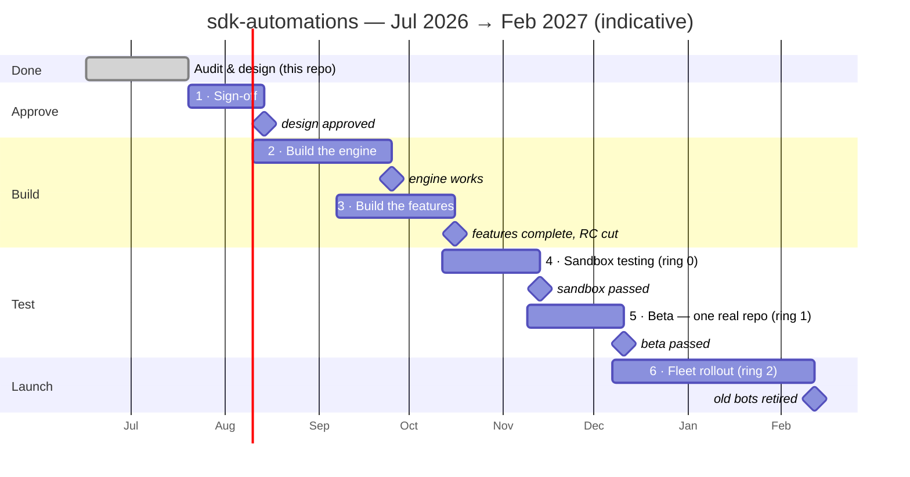
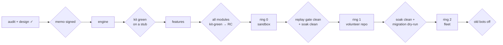

# Build Plan: Audit → Design → Build → Launch

> DRAFT — the plan the README promises: names, estimates, and what is actually committed. The plan
> is **gated, not dated**: each phase ends at a gate the design already defines (the ratification
> memo, the conformance kit, the replay gate, the ring soaks). Phases deliberately **overlap** — a
> phase's setup work (scaffolding, recruiting, doc drafting) starts during the previous phase's
> tail, but its gate-dependent work never starts before the gate is green. Dates anchor the plan to
> a start on **20 Jul 2026** (sign-off begins immediately); slipping the start slips everything by
> the same amount. Week counts are calibrated to the cadence the project has actually run at — the
> full audit-and-design effort took ~5 weeks with two part-time contributors (16 Jun → 20 Jul 2026).

## The picture

Every bar starts inside the one before it: the overlap is setup work that no gate can overturn
(scaffolding, sandbox plumbing, volunteer recruiting, runbook drafting). The milestones are the
hard sequence — no gate is passed early.

And the gates as the design defines them — a phase is over when its gate is green, not when its
weeks run out:

## Phase summary

| # | Phase | Dates | Gate at the end |
|---|---|---|---|
| ✓ | **Audit & design** | 16 Jun – 20 Jul 2026 | this repo, as it stands |
| 1 | **Sign-off** | 20 Jul – 14 Aug 2026 | ratification memo signed; hosting named; owners committed; baseline captured |
| 2 | **Build the engine** | 10 Aug – 25 Sep 2026 | conformance kit green on a stub module |
| 3 | **Build the features** | 7 Sep – 16 Oct 2026 | every chosen module kit-green; release candidate cut |
| 4 | **Sandbox testing** (ring 0) | 12 Oct – 13 Nov 2026 | replay gate diffs clean; soak window clean |
| 5 | **Beta** (ring 1) | 9 Nov – 11 Dec 2026 | soak clean; migration runbook dry-run |
| 6 | **Launch** (ring 2) | 7 Dec 2026 – mid Feb 2027 | every participating repo on the app alone; old bots retired |
| 7 | **Maintain & grow** | from Feb 2027 | — (the module lifecycle takes over) |

## The phases

### ✓ Audit & design — 16 Jun – 20 Jul 2026 (done)

The work this repo holds today: the C++, Python, and JavaScript bots read at pinned commits
([`audit/`](../audit/)), the coupling anti-patterns distilled
([`planning/lessons-learned.md`](../planning/lessons-learned.md)), and the replacement designed in
full — architecture, taxonomy, module catalogue, config schema, safety, operations, threat model.

### Phase 1 · Sign-off — 20 Jul – 14 Aug 2026

*Calendar-bound, not effort-bound: the limit is convening maintainers, not doing work.*

The design is written; nothing builds until maintainers walk the register.
[`decisions.md`](decisions.md) is already the skeleton of the ratification memo.

- Ratification memo: maintainers walk **D1–D25**, flip each to ratified / overturned.
- TSC asks: hosting vehicle (**Q1** — LFDT infra vs TSC account) and install-scope governance (**Q11**).
- Pick the first feature set, and whether the intake lock ships (**Q2**) — this fixes Phase 3's scope.
- Settle what counts as a ladder completion (**Q3**) and any manual-entry veto (**Q4**).
- Name owners for every row of this plan (**Q13** — the table below).
- ⏰ **Deadline-bound: capture baseline behaviour of the live C++/Python bots** while they still run.
- Write [`contributors.md`](contributors.md) (promised by the README, still missing).

**Gate — design approved.** Decisions ratified, hosting named, feature set fixed, at least one owner
per build workstream, baseline captured.

### Phase 2 · Build the engine — 10 Aug – 25 Sep 2026 🔨 *coding starts here*

*The long pole. Everything modules depend on and nothing they see — the core is deliberately the
biggest single build so the modules stay thin. Starts during sign-off's final week: repo
scaffolding, CI, and the fake-GitHub harness are safe under any ratification outcome; code that a
decision could overturn waits for the memo.*

- **Walking skeleton first — week one, may start during sign-off.** A throwaway repo, a webhook, one
  transition (`/assign` moves `ready for dev` → `in progress`), one adapter function — and, above
  all, **one crash-recovery path through a pending record (D27)**: kill the process mid-write,
  restart, recover from the comment-metadata log. This is the earliest possible test of the design's
  riskiest mechanism; if it fails against the real API, D1's overturn clause fires in week one
  instead of ring 0, and the memo ratifies against evidence.
- **Shell:** webhook receiver, installation keying (what makes rings possible later), adapter with
  the global token bucket + write pacer, decision log (feeds the replay gate).
- **Config:** registry, `_extends` resolution, the JSON Schema (written with the registry, per Q12),
  health-issue reporting of unknown keys.
- **Core:** the two state machines and twelve labels, per-position invariants, resolvers
  (`linkedIssues`, `eligibleLevel`, `isBot`), safety engine (warn-then-act, blocked-freezes-clocks),
  projections renderer, serializer + compare-and-set, manual-edit / incoherence handling.
- **Test harness:** fake core, conformance-kit derivation from module declarations, fixture recorder
  (fixtures recorded, never hand-written — [`testing/README.md`](testing/README.md)).

**Gate — the engine works.** Core unit + invariant suites pass; the kit runs a trivial stub module
end-to-end, including the toggle matrix and the five incoherence injections.

### Phase 3 · Build the features — 7 Sep – 16 Oct 2026

*Overlaps the engine build's tail; parallelizes perfectly across owners — no module ever depends on
another, by design.*

Each module follows the same path: spec from [`modules/TEMPLATE.md`](modules/TEMPLATE.md) → ratify →
build → pass the kit (passing the kit **is** the definition of being a module). Order is the
**risk ladder** (full table: [Module build order](#module-build-order)) — the app earns trust
rung by rung, and never takes a risk on maintainers:

1. **pr-quality, dashboard-only** — reads and one comment, no transitions: a wrong output is an
   awkward comment, never a wrong state.
2. **notifications** (a subscription or two) — a second comment-only module proves the kit
   generalises.
3. **pr-quality, full** — the first label writes, visible and hand-reversible.
4. **intake** — stamping and the nudge, then `/finalize`: the first *command*, exercised by
   maintainers before any contributor types one.
5. **assignment** — the flagship lands once commands, `eligibleLevel`, and the gates have all run
   under lower-stakes modules. Settles the native-assign repair (**Q5**).

`modules/authoring.md` and the kit implementation guide are written alongside the first real module
(Q12's triggers).

**Gate — features complete.** Every chosen module passes its derived kit; composition suite green;
release candidate cut.

### Phase 4 · Sandbox testing — 12 Oct – 13 Nov 2026 (ring 0)

*First contact with real GitHub, on a practice repo. Mostly watching it run — and measuring every
number the design estimated. The sandbox repo, webhook plumbing, and hosting deploy are set up
while the last features finish; the soak clock starts only when the RC lands.*

- Before entering: fix marker/schema format, warning templates, health-issue pinning (**Q9**).
- Sandbox live on real webhooks; nightly E2E; failures mark the dashboard, page nobody.
- Record fixtures and replay corpora from real traffic — retires all hand-guessed payloads.
- Measure timeline-read + secondary-limit budgets (**Q10**) → confirms or overturns the newer-fact
  rule (D9) and the rate arithmetic (D20).
- Build the replay gate from the decision log; first red-team pass on the threat model (D25's
  overturn clause names ring 0/1).
- Write the ring-0 sandbox runbook, against the working sandbox (Q12).

**Gate — sandbox passed.** Replay of N days of sandbox events diffs clean; agreed observation window
with zero unexplained alerts.

### Phase 5 · Beta — 9 Nov – 11 Dec 2026 (ring 1)

*One real repo with real contributors; the old bots keep running as the safety net until cutover is
scripted. Volunteer recruiting and the first draft of the migration doc begin during the sandbox
soak; the app touches the volunteer repo only after the sandbox gate.*

- Recruit the volunteer repo; agree soak duration, log retention, ring visibility (**Q8**).
- Write `operations/migration.md`: label mapping table + per-repo cutover runbook (**Q7** — blocks
  the C++/Python cutover, nothing else).
- Kill switches proven in anger: operator per-module, repo config block, item-level `blocked`.
- Failure-loudness routing validated with a real audience on the other end.

**Gate — beta passed.** Soak window clean; migration runbook dry-run on the volunteer repo.

### Phase 6 · Launch — 7 Dec 2026 – mid Feb 2027 (ring 2)

*Rolling, repo by repo, with holiday slack built in — December is a bad month to cut over live
repos, so the fleet is paced as small batches through January. First-batch prep (configs, per-repo
runbooks) starts during beta's tail; no repo cuts over before the beta gate.*

- Fleet repos onboard in batches: install → config → runbook → old-bot decommission.
- C++ and Python SDK cutovers first (they carry the richest automation); JS follows.
- Remaining modules ride the same spec → kit → ring path as capacity allows: inactivity,
  review-routing (settles the `queue:` storage question, **Q6**), progression, notifications, admin.
- Rate arithmetic re-checked at real fleet size; escape hatches (ETags → cadence → owned store) in
  reserve.

**Gate — old bots retired.** Every participating repo runs on the app alone; per-repo scripts
deleted; baseline comparison archived.

### Phase 7 · Maintain & grow — from Feb 2027

The module lifecycle takes over: proposal → fitness test → spec → kit → ring
([`modules/README.md`](modules/README.md) §4). Config keys deprecate in place, never break. Nightly
E2E on ring 0 continues as the standing drift alarm; fixtures re-recorded on schedule; the rate
arithmetic re-run when the fleet grows. AI-assist hooks are explored through the notifications
module — the one module that touches no state.

## Module build order

No module *requires* another — every consumed state has a manual way in, so the order is free to
optimize for risk and value, not dependency. The ordering principle is a **risk ladder — never
take a risk on maintainers**: each rung ships only when the rung below has run clean, and the
app's first weeks in front of real people are read-and-comment only.

> rung 0: reads + comments only → rung 1: non-destructive labels → rung 2: assignee effects +
> commands → rung 3: destructive actions

| # | Module (slice) | Rung | Why this position | Demand |
|---|---|---|---|---|
| 1 | **[pr-quality](modules/pr-quality.md)** — *dashboard-only slice* | 0 | reads checks, renders one comment, **requests no transitions**; wrong output = an awkward comment, never a wrong state; exercises adapter reads, projections, idempotent render, recorded fixtures | 🟢 (C++ full, Python partial) |
| 2 | **[notifications](modules/notifications.md)** — one or two subscriptions | 0 | zero state by construction; a second comment-only module proves the kit + config path generalises | 🟣/JS |
| 3 | **[pr-quality](modules/pr-quality.md)** — *full* | 1 | adds the entry/swap edges; label mistakes are visible and hand-reversible, and never-revert protects the human correcting them | — |
| 4 | **[intake](modules/intake.md)** — stamping + nudge, then `/finalize` | 1→2 | `awaiting triage` stamping is the lowest-stakes label write there is; `/finalize` is the *first command*, exercised by maintainers (who can judge rough edges) before contributors ever type one | 🔵/🟣 split |
| 5 | **[assignment](modules/assignment.md)** | 2 | the flagship — but it needs the command surface, `eligibleLevel`, limits, and the deny-list gate all proven before its first contributor interaction; by now every one of those has run in production under lower-stakes modules | 🟢 both SDKs |
| 6 | **[inactivity](modules/inactivity.md)** | 3 | the biggest maintainer pain — and the destructive one; enters only after warn-then-act has soaked and the pending-record recovery (D27) has survived real restarts | 🟢 both SDKs |
| 7 | **[review-routing](modules/review-routing.md)** | 1 | completes the PR side; settles Q6 (queue derived, not stored); slots after full pr-quality whenever capacity allows | 🟣 Python |
| 8 | **[progression](modules/progression.md)** | 0 | comment-only, but needs Q3 + the ladder scope ratified and `eligibleLevel` battle-tested by assignment first | 🟢 both SDKs |
| 9 | **[admin](modules/admin.md)** | 0 | degrades to no-op; half its old job moved into the core (`mayPerform`); build on demand | 🟣 Python |

Two consequences worth stating. First, the walking skeleton and this order disagree on purpose:
the skeleton exercises a risky mechanism (D27 crash recovery) on a **throwaway repo**; the build
order governs what runs in front of **real people**. Risk-first in the lab, risk-last in
production. Second, the cutover lens is unchanged — **assignment + inactivity** turns off the
Python bots, **assignment + pr-quality** the C++ ones — so modules 1–6 remain the natural MVP
proposal for Q2; only the order inside it changed.

## Who builds it (Q13)

Every dash below is Q13's open question. The baseline-capture row is the one with a real deadline —
the old bots must be recorded while they still run.

| Workstream | Phase | Owner |
|---|---|---|
| ⏰ Baseline capture of live C++/Python bots | 1 | — |
| Ratification memo convening | 1 | — |
| Walking skeleton (D1/D27 de-risk, incl. crash recovery) | 1–2 | — |
| Shell (webhooks, adapter, decision log) | 2 | — |
| Config registry + JSON Schema | 2 | — |
| Core (state machines, resolvers, safety, projections) | 2 | — |
| Test harness + conformance kit | 2 | — |
| assignment module | 3 | — |
| pr-quality module | 3 | — |
| intake module | 3 | — |
| Ring-0 sandbox + replay gate | 4 | — |
| Migration protocol (`operations/migration.md`) | 5 | — |
| Fleet rollout operator | 6 | — |

## Critical path and standing risks

- **Q1 blocks build start.** No hosting vehicle → no webhook endpoint → nothing real to build
  against. It is the first ask of the TSC and the only sign-off item that can slip the whole plan.
- **Baseline capture has a real deadline.** Everything else in this plan is elastic; that row is not.
- **Owners are the multiplier.** Phase 3's features parallelize perfectly. One owner ≈ serial; three
  owners ≈ the overlap the gantt draws. Adding people shortens the build (Phases 2–3), not the
  testing and rollout (Phases 4–6) — roughly a third of the calendar is deliberate watching-it-run.
