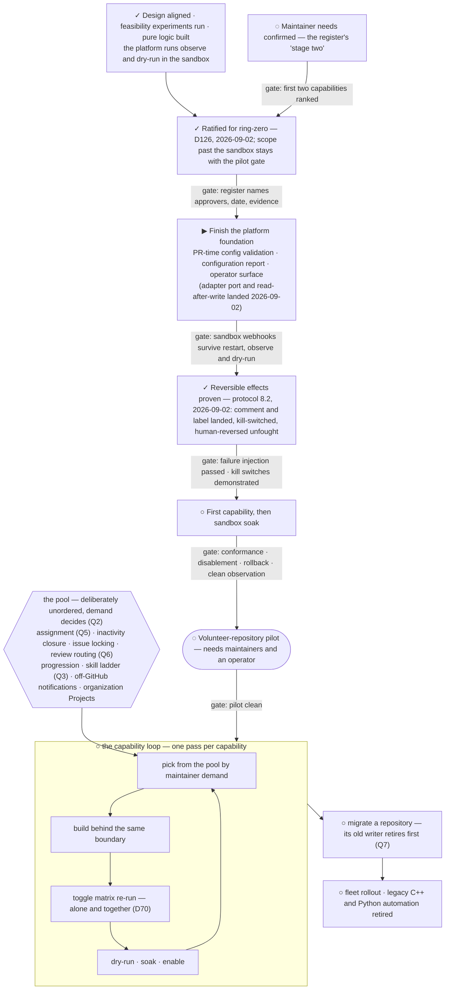

# Build plan

> Status: ✓ done · ◐ partly built · ▶ next · ◌ waiting on people · ○ not reached.

```mermaid
flowchart TD
    DONE["✓ Design aligned · feasibility experiments run · pure logic built<br/>the platform runs observe and dry-run in the sandbox"]
    NEEDS["◌ Maintainer needs confirmed — the register's 'stage two'"]
    RAT["✓ Ratified for ring-zero — D126, 2026-09-02; scope past the sandbox stays with the pilot gate"]
    PLAT["▶ Finish the platform foundation<br/>PR-time config validation · configuration report · operator surface<br/>(adapter port and read-after-write landed 2026-09-02)"]
    FX["✓ Reversible effects proven — protocol 8.2, 2026-09-02: comment and label landed, kill-switched, human-reversed unfought"]
    SOAK["○ First capability, then sandbox soak"]
    PILOT(["◌ Volunteer-repository pilot — needs maintainers and an operator"])

    DONE --> RAT
    NEEDS -->|"gate: first two capabilities ranked"| RAT
    RAT -->|"gate: register names approvers, date, evidence"| PLAT
    PLAT -->|"gate: sandbox webhooks survive restart, observe and dry-run"| FX
    FX -->|"gate: failure injection passed · kill switches demonstrated"| SOAK
    SOAK -->|"gate: conformance · disablement · rollback · clean observation"| PILOT

    POOL{{"the pool — deliberately unordered, demand decides (Q2)<br/>assignment (Q5) · inactivity closure · issue locking · review routing (Q6)<br/>progression · skill ladder (Q3) · off-GitHub notifications · organization Projects"}}

    subgraph LOOP ["○ the capability loop — one pass per capability"]
        PICK["pick from the pool by maintainer demand"]
        BUILD["build behind the same boundary"]
        MATRIX["toggle matrix re-run — alone and together (D70)"]
        CSOAK["dry-run · soak · enable"]
        PICK --> BUILD
        BUILD --> MATRIX
        MATRIX --> CSOAK
        CSOAK --> PICK
    end

    PILOT -->|"gate: pilot clean"| LOOP
    POOL --> PICK
    LOOP --> MIG["○ migrate a repository — its old writer retires first (Q7)"]
    MIG --> FLEET["○ fleet rollout · legacy C++ and Python automation retired"]
```
