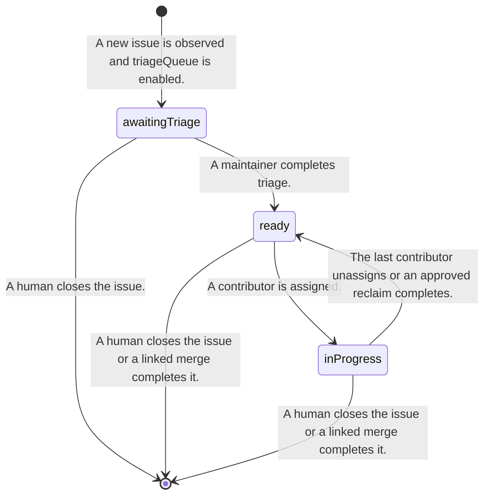
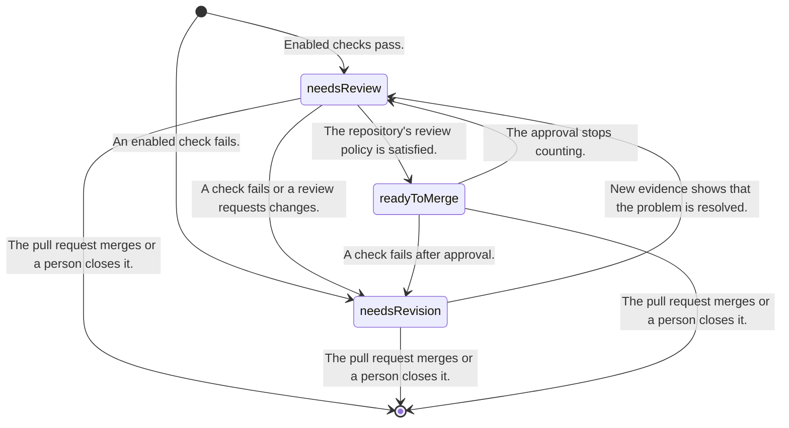

# Candidate Hiero Contribution Workflow Profile

> **Implemented as the current candidate profile, not ratified as universal policy** —
> `packages/core/src/workflow/transitions.ts`. Every edge in the diagrams below is held equal to
> `PROFILE_EDGES` by `packages/dev/checks/test/doc-drift.test.ts`.

> This document records one possible workflow profile derived from the current C++ and Python automation.
> It is not the universal state model of the GitHub App. Maintainers must review the profile, and each
> repository must choose whether to use it.

## 1. Why this is a profile

The audited repositories do not use one shared workflow. The C++ and Python SDKs automate contribution
lifecycles in different ways, while the JavaScript SDK uses no automated lifecycle labels at all.

The App therefore needs stable platform interfaces and repository mappings rather than one mandatory label
set. A repository that wants the current Hiero contribution flow may select this profile as a starting point.
A repository may instead select individual capabilities with a smaller set of meanings.

## 2. Candidate internal meanings

The profile currently needs the following internal meanings.

| Meaning | Entity | Purpose |
|---|---|---|
| `awaitingTriage` | Issue | A maintainer has not finished classifying the issue. |
| `ready` | Issue | The issue is available for a contributor to claim. |
| `inProgress` | Issue | At least one contributor is assigned and working on the issue. |
| `needsReview` | Pull request | The pull request is ready for maintainer review. |
| `needsRevision` | Pull request | The contributor needs to respond to review or mechanical feedback. |
| `readyToMerge` | Pull request | The repository's review policy is satisfied. |
| `blocked` | Either | A maintainer has paused automation for the item. |

These names are internal identifiers. They are not required GitHub label strings.

Two facts about an item are deliberately **not** meanings, because the App reads them from GitHub's own
fields and never writes them as labels: whether the item is **closed** and, if so, **why**. Closure is
recorded as a reason — `merged` (a pull request's `merged_at` is set), `closedByHuman`, or
`completedByLinkedMerge` (an issue closed by a linked pull request merging) — alongside the position,
never instead of it. See §5.1. Modelling them as meanings would make them mappable, and a merged pull
request that still carries `status: needs review` would read as two positions and therefore as a
conflict, which would silence observation on exactly the items most worth reporting on.

### 2.1 Current capability interactions

Positions are shared workflow facts, not private capability state. This is the current ownership:

| Meaning | Writer | Used by |
|---|---|---|
| `awaitingTriage` | `triageQueue` | `triageQueue` |
| `ready` | A person | `triageQueue` |
| `inProgress` | None | None |
| `needsReview` | `prDashboard` | `prDashboard`, `inactivity` |
| `needsRevision` | `prDashboard` | `prDashboard`, `inactivity` |
| `readyToMerge` | `prDashboard` | `prDashboard` |
| `blocked` | A person | Core safety, `inactivity` |

`prDashboard` writes positions only when `applyLabels` includes them. Phase 3 may give `triageQueue`
the `awaitingTriage → ready` edge. A future assignment capability must own both assignment and any
move into or out of `inProgress`.

`configReport` has no position dependency. `inactivity` can release an assignment or close a pull request,
but it does not rewrite a workflow-position label. Closing preserves the existing position as §5.1 describes.

### 2.2 Rules for adding a capability

Before a capability reads or writes a position, its design must add itself to the table above and answer:

1. Which entity carries the position?
2. Is the capability producing it, consuming it, or merely refusing to act there?
3. Which exact edge and cause authorize a write?
4. Does another capability already own that edge?
5. What happens for a conflicting position, a human `blocked` label, and a newer human change?

One automatic edge has one owner. A second capability may consume the result, but it must not silently
produce the same transition. Cross-capability handoffs use positions already present in the observation;
capabilities do not call one another. More than one mapped position remains a conflict that no capability
repairs automatically.

## 3. Example Hiero mappings

The following mappings preserve the current C++ spelling and are useful defaults for repositories that want
the full profile. The profile includes `blocked` as an expected meaning with `status: blocked` as its default
label.

| Meaning | Example label |
|---|---|
| `awaitingTriage` | `status: awaiting triage` |
| `ready` | `status: ready for dev` |
| `inProgress` | `status: in progress` |
| `needsReview` | `status: needs review` |
| `needsRevision` | `status: needs revision` |
| `readyToMerge` | `status: ready to merge` |
| `blocked` | `status: blocked` |

The configuration validator must confirm mappings before activation. The App removes only the exact mapped
label that an approved operation owns. It never removes every label whose name begins with `status:`.

A repository may explicitly map the internal `blocked` meaning to an existing label, but it cannot replace
that meaning with a different policy concept or ask normal event processing to create an arbitrary new
label.

## 4. Candidate issue flow

This state diagram describes the candidate Hiero profile. A repository that enables assignment without
triageQueue may map or create `ready` manually. A repository that does not enable contribution assignment does not
need the issue flow at all.

The assignment capability must keep the assignee state and the mapped workflow meaning consistent. The exact
behavior for multiple assignees remains a policy question for the assignment specification.

## 5. Candidate pull request flow

The repository may choose a smaller policy. For example, a repository may enable a pull request dashboard
without mapping or writing any workflow label.

Three arrows above were corrected on 2026-07-29 after the tables were read against the audit; the register
records them as D48.

- **`readyToMerge → needsRevision` was missing entirely.** An approved pull request whose checks break had
  no path to `needsRevision`, so the only way out asserted that new commits had arrived. Checks break with
  no push at all: the audited Sibling Conflict Re-check re-reads every open pull request's `mergeable`
  state whenever a *different* pull request merges, and swaps its status label
  (`design/findings/services.md` §2, the sibling-conflict recheck row).
- **`needsReview → needsRevision` needs a review cause, not only a failing check.** The audited PR Review
  Label Applicator performs exactly this move on a `changes_requested` review. Observing it requires the
  `pull_request_review` subscription the App currently lacks (experiment 6.6), so the cause exists in the
  profile before the subscription that feeds it.
- **`readyToMerge → needsReview` is caused by the approval no longer counting**, not specifically by new
  commits. Dismissal, withdrawal, and a changed base all produce it; naming the trigger instead of the
  consequence made those unexpressible.

### 5.1 Closure and reopening

Closing is not a position and reopening is not a transition.

Closing records **why** (§2: `merged`, `closedByHuman`, `completedByLinkedMerge`) and leaves every position
label untouched, because the App does not clean up labels on close — see
[`safety.md`](safety.md) §3, which owns only the values its mappings name, and the
`status:*` strip the C++ post-merge cleanup runs, which the 2026-07 fieldwork audit found removing
human-set `status: blocked` labels as a side effect. Downstream policy needs the reason: contributor
progression credits a merged linked pull request and not an abandoned one
(`design/guides/capabilities/advancement.md`), and the audited post-merge cleanup is gated on
`merged == true`.

Reopening therefore **clears the closure and restores nothing else** — the position labels were never
removed, so the item comes back exactly where it was. One invariant falls out of the reason: a **merged
pull request can never reopen**, which GitHub enforces and the profile refuses rather than omits.

An automation-initiated close now has an operation of its own — `closePullRequest`, the clock-triggered
destructive act `inactivity` requests once its grace has run (`design/guides/grace.md`) — but no closure
reason of its own: a pull request the App closed reads back as `closedByHuman`, the conservative reason,
and giving it a reason of its own is a workflow-model change with its own destructive-safety review.
No operation closes an issue.

## 6. Issue and pull request links

A pull request and an issue remain separate GitHub entities. A capability must declare when it reads across
their link and which link mechanism it uses.

Closing references are the candidate default for Hiero because they match GitHub's native close-on-merge
behavior. The App does not write an issue label merely because a linked pull request changed state. A
cross-entity write requires a separate declared operation and maintainer approval.

## 7. Human edits

Human changes remain authoritative unless an explicitly approved policy says otherwise. The platform reads
the current state before a write and refuses an operation when a newer human change invalidates its
precondition.

The profile may provide coherence checks for repositories that want a single mapped position. Those checks
must not touch unrelated labels or force a repository to adopt the full profile. There is no automatic
repair in the first version: more than one mapped position is a conflict that changes nothing, and a
repository wanting a stricter policy configures it, explained and tested as a policy of its own rather
than as an undocumented platform default. The rule the refusals encode is [`safety.md`](safety.md) §3.

## 8. Optional skill policy

A skill ladder is not part of the universal platform taxonomy. It is an optional assignment policy used by
some Hiero repositories.

The existing audit found the following candidate rungs.

| Internal rung | Example label |
|---|---|
| `goodFirstIssue` | `skill: good first issue` |
| `beginner` | `skill: beginner` |
| `intermediate` | `skill: intermediate` |
| `advanced` | `skill: advanced` |

Repositories that enable the policy must decide the rung mappings, prerequisite counts, completion rules,
and whether credit is repository-local or organization-wide. Repositories that do not enable it do not need
these labels or contribution-history queries.

## 9. Native fields and other representations

Priority, effort, review queue, and other facts should use GitHub-native fields when those fields meet the
repository's needs and the required permissions are acceptable. A resolver may hide the representation from
capabilities, but the repository still chooses and configures the authoritative source.

The App does not copy arbitrary issue labels onto pull requests. It does not create a shared namespace unless
an enabled profile requires and validates that namespace.

## 10. Questions that remain open

- Maintainers must decide which repositories want this profile and which want smaller capability sets.
- The current meanings are closed in core; stage-four review must decide whether a first real capability
  justifies keeping all of them in the platform catalogue.
- Syntactic and injective mapping validation is built. Required-meaning declarations, live label-existence
  checks, and mapping migration remain open.
- Assignment maintainers must decide the multiple-assignee behavior.
- Review maintainers must decide whether `readyToMerge` is stored or derived. This is the largest open
  lever in §5: if it is derived from approval count, check status, and policy, it is a projection rather
  than a position, and most of §5's edges collapse into that derivation. The D48 corrections above assume
  it is stored, which is the weaker assumption — they are wasted work if the answer is "derived", not
  wrong work.
- The first version has no operation or cause for an automation-initiated close (§5.1); a future capability
  must add both through catalogue and safety review.
- Repositories that want a skill ladder must decide its scope and completion policy.
- The first version requires repositories to provision mapped labels. A later explicit setup operation may
  be considered separately.
