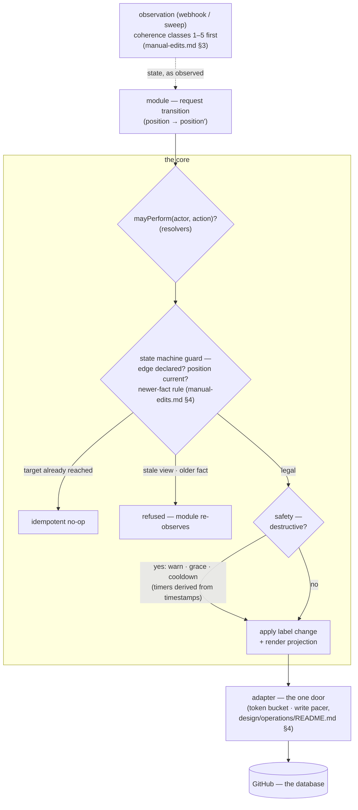
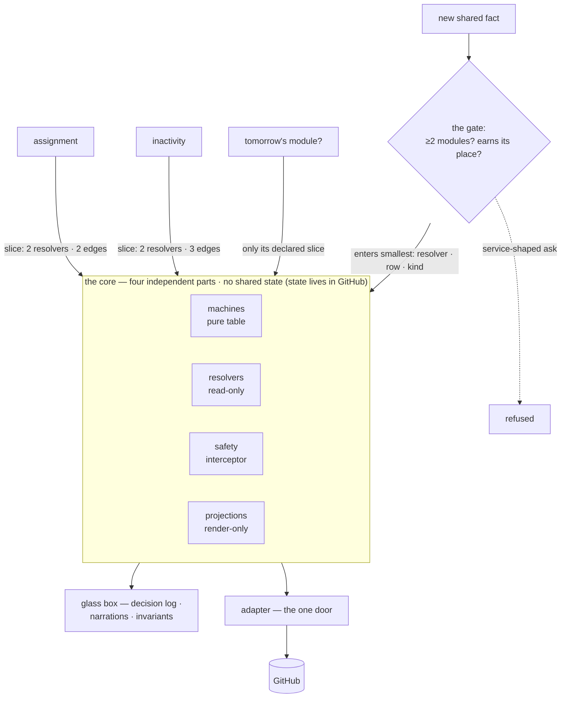

# The Core

> Index of the core's component-level design. The core is the shared middle every module talks to —
> `design/architecture.md` §4 sets its frame and its one rule (**domain vocabulary, never service
> vocabulary**: every public core operation must be describable without naming any module). This
> directory holds the detail.

## The core's anatomy

How a module's transition request flows through the four parts — and where each rule lives:

Observations travel the reverse path: the shell serialises them per item, the core classifies
coherence (`manual-edits.md` §3) — repairing, flagging, or quarantining — before any module reacts.

## Not a black box: the four structural rules

Hub-and-spoke's classic failure is trading module-to-module coupling for everyone-coupled-to-one-
blob. Four rules keep this core from becoming that blob — the picture first, then the rules:

1. **No module ever sees "the core."** Each holds `Core<D>` — the handle typed by its own
   declaration (`design/modules/contract.md` §2). Assignment's view is two resolvers, two edges,
   and `project()`. The union of views is large; every individual view is small, and an undeclared
   operation is not hidden but *inexpressible*.
2. **Inside: four independent parts, a thin pipeline, no shared mutable state.** The state machines
   are pure functions over (position, edge, invariants) — no I/O; the resolvers are read-only and
   touch only the adapter; safety is an interceptor that knows timing, not domain edges;
   projections render from state and nothing depends on them. No cycles — and since state lives in
   GitHub (`design/architecture.md` §4.1), the core owns no state to be a god object *of*. In code:
   four independently-tested packages plus a page of composition (the anatomy diagram above), which
   is what `design/testing/README.md`'s "pure logic, mocks nothing" row assumes.
3. **Glass box at runtime.** Every core decision is observable three ways: the decision log records
   `(state, event, config) → transitions` and replays offline (`design/operations/README.md` §6);
   the projection discipline means the core explains itself in the repo whenever it acts; and the
   invariants make its guarantees executable. The core cannot act invisibly by construction.
4. **The only way in is fact-promotion.** A capability enters the core only when two or more
   modules must agree on a fact (`design/modules/contract.md` §6), as the smallest thing carrying
   that fact — a resolver, a table row, a projection kind — past the earn-its-place test
   (`design/architecture.md` §8). Review corollary: **the core's public surface must stay
   enumerable on this page** — the table below is that page, and a change that makes it not fit is
   the smell that something service-shaped is leaking in.

## The design docs

| Part | Owns | Designed in |
|---|---|---|
| **state machines** | positions and edges (one machine per entity), per-position invariants, close hygiene | `taxonomy.md` §2 |
| **manual-edit semantics** | the two rulebooks, the five coherence classes, never-revert, the newer-fact rule | `manual-edits.md` |
| **resolvers** | `linkedIssues` · `eligibleLevel` · `isBot` · `mayPerform` · `priorityOf` | `resolvers.md` — incl. the ladder-scope decision (§3) |
| **safety** | the per-destructive-action table: trigger class, warn lead, grace, reversal, cooldown | `safety.md` |
| **projections** | narration comments, the health issue, config PR comments, command acks, module content — single-writer, never inputs | `projections.md` |
