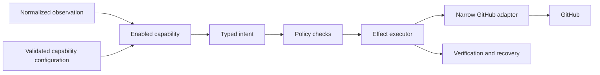

# Shared Platform Services

> The shared platform contains technical services used by every enabled capability. It does not impose one
> workflow, label system, or skill policy on every repository.

## 1. Responsibilities

The shared platform provides the following services.

| Service | Responsibility |
|---|---|
| Configuration | The service loads, validates, projects, and explains repository configuration. |
| Observation | The service converts GitHub events and current state into normalized facts. |
| Resolvers | The service answers shared read-only questions through one documented mechanism. |
| Policy | The service checks repository mode, actor authority, permissions, mappings, and safety rules. |
| Effect execution | The service plans, applies, verifies, and reconciles approved GitHub changes. |
| Managed output | The service owns App-authored comment identity, safe rendering, and updates. |
| Operations | The service records audit information, metrics, recovery state, and kill-switch status. |

Each service has a small interface and its own tests. A capability receives only the part of the platform
that its declaration allows.

## 2. Request flow

The platform reloads current state before a write when the operation depends on mutable facts. It refuses an
intent when current state no longer matches the capability's expectation. It verifies the requested
postcondition after a write and reports an explicit result.

## 3. Growth rule

A shared operation or resolver enters the platform only when at least two capabilities need the same fact or
when central ownership is necessary for permissions, safety, recovery, or audit consistency.

A service-shaped request remains in the capability. For example, the platform may expose a general operation
that assigns a user when an issue is still unassigned. It should not expose an operation named after the
assignment capability's policy.

## 4. State boundary

GitHub remains authoritative for visible repository facts. The platform may own operational records that
GitHub cannot safely reconstruct, including delivery identities, pending effects, retries, schedules, and
coordination records.

The storage experiment decided the minimum owned state (protocol 6.5, 2026-07-23): four independent tables
in one SQLite file — see `design/operations/storage-decision.md` (ratification pending) and the `store/`
package that implements it. Capabilities must not depend directly on the selected storage technology.

## 5. Related documents

- `taxonomy.md` describes a candidate Hiero contribution workflow profile.
- `manual-edits.md` describes candidate behavior when humans change mapped workflow labels.
- `resolvers.md` describes shared read-only questions.
- `safety.md` describes requirements for destructive actions.
- `projections.md` describes managed comments and other human-facing output.
- `../modules/contract.md` describes the capability boundary.
- `../operations/README.md` describes hosting, delivery, recovery, and rollout questions.

## 6. Questions that remain open

- The project must decide which normalized facts and intents belong in the first implementation.
- ~~The project must decide the minimum operational storage and its interface.~~ Decided by protocol 6.5;
  see §4 above.
- The project must decide whether one or several executor processes may run at once. (Protocol 6.5 narrowed
  this: even one process needs the claim table, because crash-restart overlap and redelivery race two
  executions of the same effect.)
- The project must decide which compatibility rules belong in the registry.
- The first two capabilities must prove that the shared interfaces remain small and useful.
