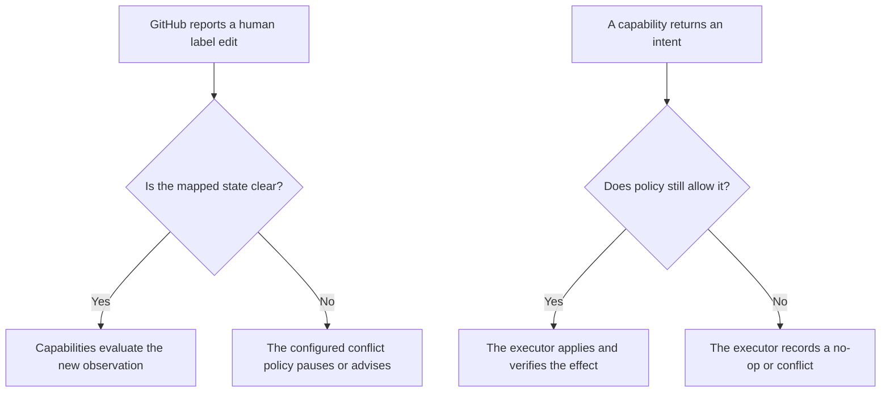

# Candidate Rules for Human Workflow Edits

> This document describes candidate behavior for a repository that chooses a workflow profile with
> mapped position labels. These rules do not apply when a repository has not enabled that profile.
> Maintainers must approve the rules before the App writes any mapped position.

The App must treat a newer human decision as more important than an older automation decision. It must
also leave every unrelated label alone. These rules are still hypotheses because GitHub does not make
ordinary labels mutually exclusive, and because repositories may want different conflict policies.

## 1. Human edits and capability requests follow different rules

A person with repository permission may place an item directly into any configured position. This is
necessary because a repository may enable only one capability and may perform every earlier step by hand.
The App must not force a human to walk through positions that belong to disabled capabilities.

A capability has a narrower rule. It may request only an intent that its declaration allows. The platform
then checks the current observation, repository configuration, actor permissions, and safety policy before
it applies that intent. A capability cannot use the adapter to bypass these checks.

## 2. The default rule preserves newer human intent

The default policy must not remove a position that a human applied after the fact that caused an
automation intent. For example, a stale scheduled evaluation must not move an issue back after a
maintainer has deliberately changed its position.

The executor can enforce this rule only when the intent includes a dated cause and the adapter can obtain
reliable ordering evidence. A webhook delivery time is not enough because delivery can be delayed or
reordered. Useful evidence may include the label event timestamp, the command comment timestamp, the
review timestamp, or a repository-owned version value.

If reliable ordering evidence is unavailable, the safe default is to return a conflict and do nothing.
The App may explain the conflict through a managed comment when the repository has enabled that output.

This default does not prevent a repository from choosing a stricter policy later. Any strict gate must be
explicitly configured, clearly explained, and tested as a separate policy. It must not appear as an
undocumented platform default.

## 3. The App must classify the observed state before writing

The following table is a candidate policy for mapped position labels. It is not a universal rule for all
repositories.

| Observation | Candidate meaning | Safe default |
|---|---|---|
| Exactly one mapped position is present. | The item has a clear managed position. | Capabilities may evaluate it normally. |
| More than one mapped position is present and their order is reliable. | A person or an interrupted effect created a conflict. | Keep the newest human choice and remove an older App-owned choice only if configuration allows that repair. |
| More than one mapped position is present and their order is unclear. | The App cannot prove which position is intended. | Pause position-changing automation and ask a maintainer to choose. |
| A mapped position conflicts with another required fact. | The item may be incomplete or may reflect a deliberate exception. | Preserve the position and let each capability fail its own precondition. Do not invent the missing fact. |
| An unknown label is present. | The label belongs to the repository or another tool. | Ignore it and never remove it. |
| No mapped position is present. | The repository may be managing this item manually. | Do not add a position unless an enabled capability has a separate, configured reason to do so. |

The App owns only the exact labels listed in the selected mapping. It does not own a prefix such as
`status:`. It must never search for a prefix and remove every matching label because that could destroy
repository-specific information.

## 4. An interrupted App effect is different from a human edit

An operation that needs several GitHub calls can stop halfway. For example, an assignment operation may
add an assignee successfully and fail before it updates a mapped position. The App may resume that effect
only when it can prove all of the following facts:

1. The saved operation identifies the repository, item, capability, intent, expected state, and desired
   state.
2. The observed partial state matches a completed step in that exact operation.
3. No newer human edit, command, configuration revision, or safety fact changes the decision.
4. Repeating the remaining call is idempotent or has a verified precondition.

If the platform does not keep enough operational state to prove these facts, it must not guess. It must
report the partial result and wait for a person or a later safe reconciliation. This requirement is one
reason the storage decision remains open.

## 5. A blocked item requires an explicit policy

A repository may map a `blocked` label or another blocking signal. The profile must state whether blocking
pauses every enabled capability or only named capabilities. The platform must not silently assume that one
meaning fits every repository.

If the profile chooses a complete pause, the App performs no item-level writes while the block is present,
including conflict repairs and managed-comment updates. Operator alerts and security controls may still
run because they protect the installation rather than advance the item.

## 6. Managed explanations must be precise and quiet

When configured, a managed explanation should state what the App observed, what it did or refused to do,
and what a maintainer can do next. The App should update its existing comment instead of posting the same
message repeatedly. Marker recognition must include App authorship so that a contributor cannot create a
fake managed comment.

The App must not comment when no action is useful. Removing all mapped positions is a reasonable way to
return an item to manual management, so the default response to that edit is silence.

## 7. Capabilities must tolerate manual entry points

Every capability must be tested as if all of its input facts were created manually. It must not depend on
an earlier capability having run. For example, an inactivity capability can observe a manually added
in-progress mapping without importing or calling an assignment capability.

Compatibility tests may enable several capabilities together. These tests prove that their declared
intents and mappings do not conflict. They do not give one capability permission to call another.

## 8. Required tests

The conformance suite for a position-writing capability must cover at least these cases:

1. A newer human position survives an older scheduled or webhook-driven intent.
2. An unknown repository label is never read as a position and is never removed.
3. Two mapped positions with reliable ordering follow the configured conflict policy.
4. Two mapped positions without reliable ordering cause no destructive repair.
5. A missing assignee, pull request, review, or other precondition is not invented automatically.
6. A disabled capability performs no reads or writes beyond shared event routing and configuration checks.
7. A redelivered event produces the same final state without duplicate comments or repeated side effects.
8. A partial multi-call effect resumes only when its saved evidence is still current.
9. A configuration change between evaluation and execution invalidates the old intent.
10. Coexistence with an older bot does not create two writers for the same mapped label.

## 9. Migration requires one writer for each managed output

Before the App manages a label or comment that an older workflow also manages, maintainers must disable
the older writer. Actor detection can reduce accidental conflicts, but it cannot replace an ordered
migration. The rollout plan must name the old writer, the new writer, the handover step, and the rollback
step for every managed output.

## 10. Open decisions

The project still needs maintainer decisions about the default conflict policy, the meaning of a blocked
signal, the cost of timeline reads, the evidence used to order edits, and the operational state required
for multi-call recovery. These decisions should be tested in a Hiero Hackers sandbox before they become a
promise to another Hiero repository.
