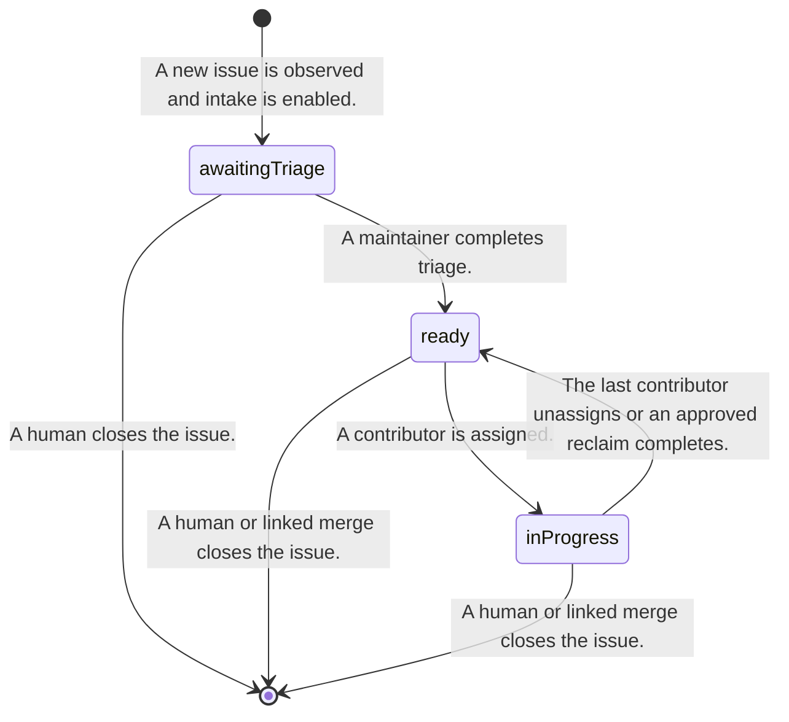
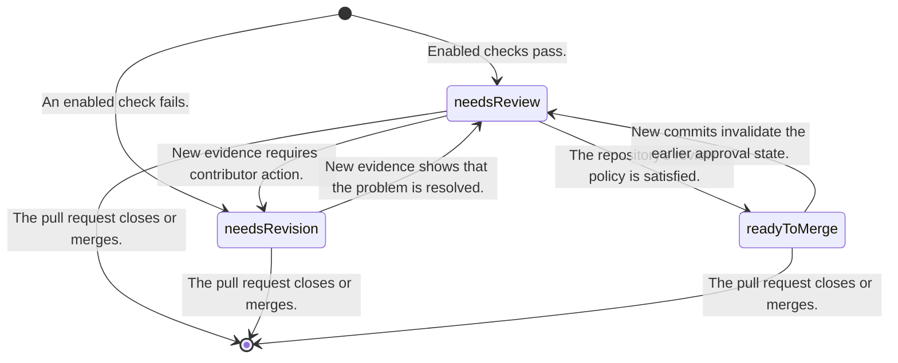

# Candidate Hiero Contribution Workflow Profile

> This document records one possible workflow profile derived from the current C++ and Python automation.
> It is not the universal state model of the GitHub App. Maintainers must review the profile, and each
> repository must choose whether to use it.

## 1. Why this is a profile

The audited repositories do not use one shared workflow. The C++ and Python SDKs automate contribution
lifecycles in different ways, while the JavaScript SDK uses no automated lifecycle labels at all.

The App therefore needs stable platform interfaces and repository mappings rather than one mandatory label
set. A repository that wants the current Hiero contribution flow may select this profile as a starting point.
A repository may instead select individual capabilities with a smaller set of meanings.

## 2. Candidate internal meanings

The profile currently needs the following internal meanings.

| Meaning | Entity | Purpose |
|---|---|---|
| `awaitingTriage` | Issue | A maintainer has not finished classifying the issue. |
| `ready` | Issue | The issue is available for a contributor to claim. |
| `inProgress` | Issue | At least one contributor is assigned and working on the issue. |
| `needsReview` | Pull request | The pull request is ready for maintainer review. |
| `needsRevision` | Pull request | The contributor needs to respond to review or mechanical feedback. |
| `readyToMerge` | Pull request | The repository's review policy is satisfied. |
| `blocked` | Either | A maintainer has paused automation for the item. |

These names are internal identifiers. They are not required GitHub label strings.

## 3. Example Hiero mappings

The following mappings preserve the current C++ spelling and are useful defaults for repositories that want
the full profile. The profile includes `blocked` as an expected meaning with `status: blocked` as its default
label.

| Meaning | Example label |
|---|---|
| `awaitingTriage` | `status: awaiting triage` |
| `ready` | `status: ready for dev` |
| `inProgress` | `status: in progress` |
| `needsReview` | `status: needs review` |
| `needsRevision` | `status: needs revision` |
| `readyToMerge` | `status: ready to merge` |
| `blocked` | `status: blocked` |

The configuration validator must confirm mappings before activation. The App removes only the exact mapped
label that an approved operation owns. It never removes every label whose name begins with `status:`.

A repository may explicitly map the internal `blocked` meaning to an existing label, but it cannot replace
that meaning with a different policy concept or ask normal event processing to create an arbitrary new
label.

## 4. Candidate issue flow

This state diagram describes the candidate Hiero profile. A repository that enables assignment without
intake may map or create `ready` manually. A repository that does not enable contribution assignment does not
need the issue flow at all.

The assignment capability must keep the assignee state and the mapped workflow meaning consistent. The exact
behavior for multiple assignees remains a policy question for the assignment specification.

## 5. Candidate pull request flow

The repository may choose a smaller policy. For example, a repository may enable a pull request dashboard
without mapping or writing any workflow label.

## 6. Issue and pull request links

A pull request and an issue remain separate GitHub entities. A capability must declare when it reads across
their link and which link mechanism it uses.

Closing references are the candidate default for Hiero because they match GitHub's native close-on-merge
behavior. The App does not write an issue label merely because a linked pull request changed state. A
cross-entity write requires a separate declared operation and maintainer approval.

## 7. Human edits

Human changes remain authoritative unless an explicitly approved policy says otherwise. The platform reads
the current state before a write and refuses an operation when a newer human change invalidates its
precondition.

The profile may provide coherence checks for repositories that want a single mapped position. Those checks
must not touch unrelated labels or force a repository to adopt the full profile. The detailed candidate
behavior is recorded in `manual-edits.md` and remains subject to profile ratification.

## 8. Optional skill policy

A skill ladder is not part of the universal platform taxonomy. It is an optional assignment policy used by
some Hiero repositories.

The existing audit found the following candidate rungs.

| Internal rung | Example label |
|---|---|
| `goodFirstIssue` | `skill: good first issue` |
| `beginner` | `skill: beginner` |
| `intermediate` | `skill: intermediate` |
| `advanced` | `skill: advanced` |

Repositories that enable the policy must decide the rung mappings, prerequisite counts, completion rules,
and whether credit is repository-local or organization-wide. Repositories that do not enable it do not need
these labels or contribution-history queries.

## 9. Native fields and other representations

Priority, effort, review queue, and other facts should use GitHub-native fields when those fields meet the
repository's needs and the required permissions are acceptable. A resolver may hide the representation from
capabilities, but the repository still chooses and configures the authoritative source.

The App does not copy arbitrary issue labels onto pull requests. It does not create a shared namespace unless
an enabled profile requires and validates that namespace.

## 10. Questions that remain open

- Maintainers must decide which repositories want this profile and which want smaller capability sets.
- The project must decide which internal meanings belong in the first capability contracts.
- The configuration design must define mapping validation and migration.
- Assignment maintainers must decide the multiple-assignee behavior.
- Review maintainers must decide whether `readyToMerge` is stored or derived.
- Repositories that want a skill ladder must decide its scope and completion policy.
- The first version requires repositories to provision mapped labels. A later explicit setup operation may
  be considered separately.
