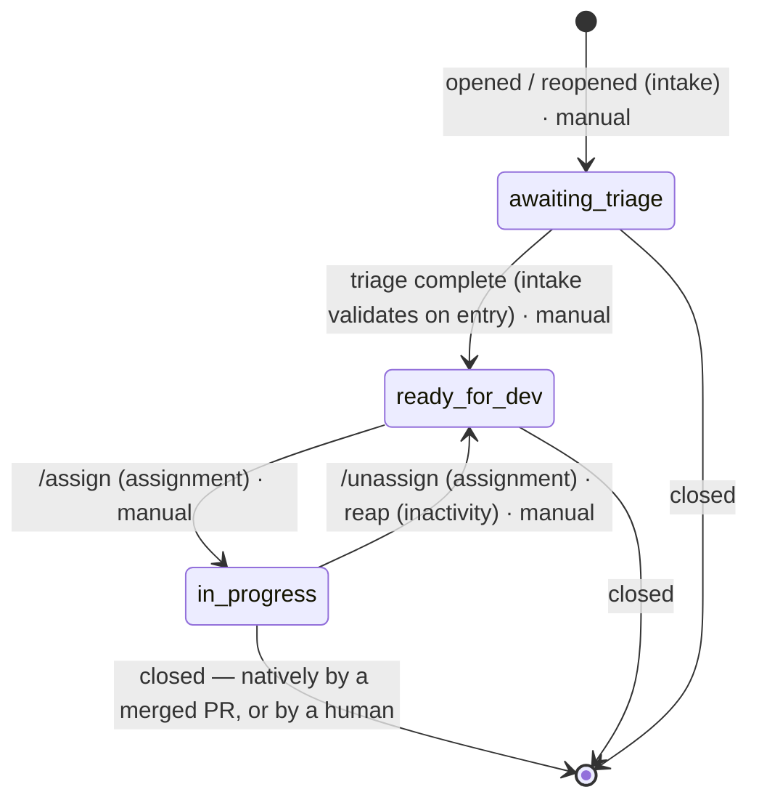
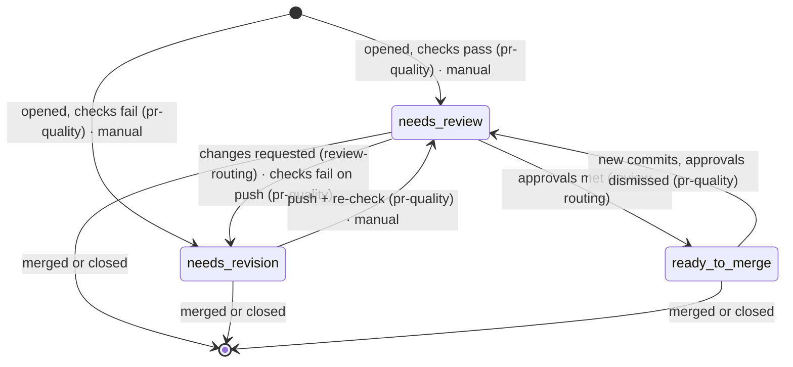

# Taxonomy Draft: Labels and the Status State Machines

> **Drafted for ratification — the foundational decision everything else waits on.** Grounded in the
> normalized cross-SDK table (`audit/services.md` §4), the drift sets (`audit/labels-python.md`), and the
> C++ zero-drift set (`audit/labels-cpp.md`). The discipline applied throughout is `design/architecture.md` §8: every
> label must earn its place against the simpler option of the core deriving the fact without storing it.
> Maintainers ratify; nothing below is settled until they do.

## 1. The four open questions, answered as proposals

**Which classifications leave labels for GitHub-native fields?** `priority:` goes native — it already has
a native home, it drives no automation in either SDK beyond display, and removing it deletes drift set B
outright. `effort` follows the same path if it is ever wanted. `skill:` stays a label: it gates automation
(the ladder) *and* is how contributors browse for work — both jobs need label visibility.

**Is the intake gate (`lifecycle:`) part of `status:`?** Yes — fold it in. Python's
`lifecycle: pending-review → approved` is the same fact as `status: awaiting triage → ready for dev` seen
from the other side. Two namespaces for one lifecycle is a second baton. One namespace, one state machine.

**Do `notes:` and `meta:` merge?** Yes, into `meta:` — reduced to a single label in §3: pause-the-automation is `status: blocked`'s job, not a second flag's.

**What is each label for?** One job per namespace, and the write-direction is the definition:

| Namespace | Written by | Read by | Job |
|---|---|---|---|
| `status:` | **the core only** (manual application = a legitimate state edit, `design/core/manual-edits.md`) | humans + modules via the core | the state machines — drive automation |
| `skill:` | maintainers (triage) | the `eligibleLevel` resolver + browsing contributors | the ladder — gates and signals |
| `meta:` | **humans only** — automation never writes one | modules via declared contract | human overrides the automation must respect |
| native fields (priority, type, effort…) | maintainers, in GitHub's own UI | modules via core resolvers | facts with a native home — never duplicated into labels |

That split is the A2/A1 cure stated as policy: machine-written state flows one way, human signals flow the
other, and no label is both.

## 2. Two state machines, one per entity

An issue and a PR are two labeled entities, and the audit found two machines (`audit/labels-cpp.md`);
the first draft concatenated them into one diagram at the "PR opened" seam, hiding the question of
where each status lives. The split is kept and made explicit:

> **Proposed.** Statuses live on their natural entity — three issue positions, three PR positions —
> and **no label is ever written across the issue↔PR link.** Cross-entity facts are *derived* through
> the `linkedIssues` resolver (`design/architecture.md` §4), per §8's discipline: "this issue has an open PR" is
> an answer, not a label. **Overturned by:** a module need that provably cannot be met by a resolver
> read — which would be met by a core-owned sync, never a module-side write.

One spelling rule kills three of the four drift sets: **lowercase, `namespace: value`, spaces not
hyphens** — the C++ convention, which produced zero drift. Python's `ready-to-merge` is adopted with
canonical spelling.

### 2.1 The issue machine

- The issue inactivity clock runs **only** in `in progress`, and only while **no open linked PR
  exists** — a derived fact, checked at sweep time, never stored.
- Assignee and position move in one transition (lessons A3): `/assign` = assignee + `in progress`;
  `/unassign` and the reap = remove assignee + `ready for dev`.
- A **reopened** issue is positionless (close hygiene stripped it — `design/core/manual-edits.md` class 5) until
  intake, which treats reopened as opened, or a human places it.

### 2.2 The PR machine

- The PR inactivity clock runs **only** in `needs revision`.
- `status: blocked` is an **overlay on either entity**, per item: blocking an issue does not block its
  PR — a maintainer blocks the entity they mean (cross-entity propagation would be a cross-entity
  write).

### 2.3 The seam: derived, never written

| Event at the seam | What happens | What is *not* written |
|---|---|---|
| PR opened | issue stays `in progress`; its clock stops by derivation (open PR exists) | no issue label |
| PR merged | GitHub closes the linked issue natively (closing keywords); each entity's close triggers its own close hygiene | no app write across the link |
| PR closed unmerged, or reaped | the issue is again "`in progress`, no PR" — its own clock resumes, and issue-side inactivity eventually reclaims it | the old cross-entity reset (lessons C1) becomes **unnecessary**, not centralized |

**Close hygiene (a core rule, not a module):** on observing an item closed or merged while carrying a
position, the core removes its canonical position labels — named labels, never a prefix (lessons A1) —
and leaves `skill:` and `meta:` untouched. This replaces the old bulk strips (post-merge cleanup and
the reaper's reset), which were module behaviour; here no module strips anything.

### 2.4 Per-position invariants

The table `design/core/manual-edits.md` §3 class 2 consumes: a broken invariant is **flagged, never repaired**.

| Position | Entity | Invariant | When broken |
|---|---|---|---|
| `awaiting triage` | issue | item open | — |
| `ready for dev` | issue | open · **no assignee** (it is the available pool) | assigned-but-available: narrate; the assignment module may declare the repair (→ `in progress`) |
| `in progress` | issue | open · ≥1 assignee | claimed-but-unassigned: narrate — no clock can run |
| `needs review` | PR | open · not a draft | draft-in-review: narrate |
| `needs revision` | PR | open | — |
| `ready to merge` | PR | open | — |
| `blocked` (overlay) | either | coexists with exactly one position | `blocked` alone = positionless (class 5) with nothing to pause: narrate |

("Open" failures are not flags: a closed item carrying a position is handled by close hygiene.)

- The states encode **whose turn it is**: the contributor holds `in progress` (no PR) and
  `needs revision` — the only two places a clock runs. Maintainers hold `awaiting triage`,
  `needs review`, and `ready to merge`; `ready for dev` is nobody's — the pool. A review backlog can
  never cost a contributor their assignment (`design/config/schema.md` §3).
- **Provisional, decided with the review-routing module**: Python's `queue:` namespace
  (`junior-committer` / `committers` / `maintainers`). It smells §8-derivable from reviewer config plus
  `needs review`; it stays out of the canonical set until that module's design proves it needs storage.

## 3. The full label set

Twelve labels in three namespaces, one spelling each, one writer each, one home each. This is the
complete set: a label not listed here does not exist in the new system.

| Label | Lives on | Written by | Meaning |
|---|---|---|---|
| `status: awaiting triage` | issue | core | new item, not yet triaged |
| `status: ready for dev` | issue | core | triaged, free to pick up |
| `status: in progress` | issue | core | assigned and being worked |
| `status: needs review` | PR | core | checks passed, awaiting review |
| `status: needs revision` | PR | core | changes requested |
| `status: ready to merge` | PR | core | approvals met |
| `status: blocked` | either | core | overlay — pauses ALL automation on that item without losing its position; apply by hand to say "leave this alone" |
| `skill: good first issue` | issue | maintainers | ladder rung 0 |
| `skill: beginner` | issue | maintainers | ladder rung 1 (after 2 good first issues) |
| `skill: intermediate` | issue | maintainers | ladder rung 2 (after 3 beginner) |
| `skill: advanced` | issue | maintainers | ladder rung 3 (after 3 intermediate) |
| `meta: open to community review` | either | humans | invitation: community review welcome |

Priority moves to GitHub's native field (§1). The ladder thresholds live in config
(`core.skillLadder`, design/config/schema.md), not in the label names. `queue:` remains provisional per §2.4.

## 4. Native fields: priority, effort, and whatever comes next

Native facts are handled by one rule: **read through a core resolver, written only by humans, never
duplicated into a label.** A module that needs priority calls `priorityOf(item)`; where the fact actually
lives — a Projects field, a native issue field, or a legacy label during migration — is the resolver's
implementation detail, swappable without any module changing. The value ordering the old
`priorityHierarchy` config carried becomes resolver config, not label spellings. `effortOf(item)` follows
the same pattern the day effort is wanted, at the cost of zero new namespaces.

One consequence to decide with eyes open: if the authoritative home is a Projects field, the core needs a
config key naming the project, and the app needs one additional read-only permission (`projects: read`).
If the fact lives on the issue itself, nothing changes. The resolver quarantines that choice.
