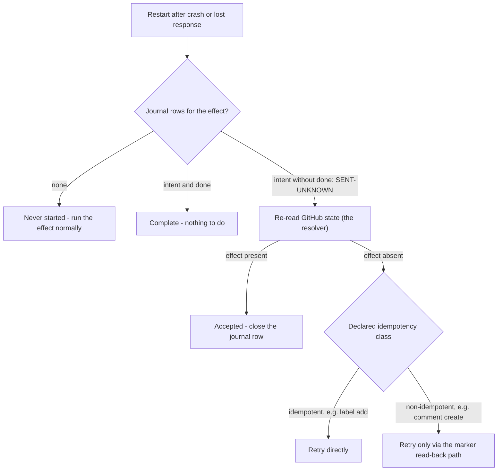

# Storage decision

**Answer (Q15, protocol 6.5): a single-file SQLite store.** Nothing else survives the observed
recovery runs. Closes D1, D13, D24, D27.

## The comparison

Judged only on observed runs, never on what a source should theoretically hold. Citations `#n` index
the 6.5 evidence log; `6.2` citations that protocol's run.

| Operational need | (a) GitHub state + events | (b) App comment metadata | (c) Small owned store | Citation |
|---|---|---|---|---|
| Delivery deduplication | insufficient — GitHub's ledger reads `OK` for a delivery the receiver lost (6.2), and redeliveries reuse the guid, so nothing GitHub-side records what *we* processed | insufficient — only effectful deliveries leave a marker; a no-op delivery leaves nothing to dedup against | sufficient — guid as primary key; the same single-`INSERT` mechanism as the claim table | 6.2 ledger `20db79d8…`; `#35` |
| Pending effects (crash mid-sequence) | insufficient — `absent` is indistinguishable from never-requested | insufficient — no record exists until the write lands | sufficient — intent row survives the crash and names the exact call | `#8` |
| Lost-response disambiguation | sufficient as the *resolver* — one re-read is the receipt | sufficient for comment-shaped effects only (the comment is its own receipt); no record for E2 | insufficient alone (`SENT-UNKNOWN`) but it is the *detector*: the open intent row is the only signal that a check is needed | `#14`, `#18`, `#25` |
| Retries with bounded history | insufficient — no attempt record anywhere | sufficient-at-cost — one payload rewrite per attempt, straight into the content-creation secondary limit (6.4: no warning header) | sufficient — attempt bookkeeping is the same journal-row mechanics observed surviving every kill | `#8,#11`; 6.4 `…T19-37-00-198Z#19` |
| Schedules (clock-triggered work) | insufficient — GitHub emits no clock events; the 6.2 delivery corpus contains only event-triggered deliveries | insufficient — same reason | sufficient — a due-time row is the same durable-row machinery (analytic: the one cell resting on construction, not a dedicated run) | 6.2 corpus; `#8` (row durability) |
| Coordination (two workers, one effect) | insufficient — race with full read-checks still duplicated (TOCTOU; GitHub has no conditional create) | insufficient — the read-check *is* the comment-metadata protocol, and it lost the race | sufficient — primary-key claim: one winner, loser exits cleanly | `#32`, `#35` |

## The recovery loop the grid decided

Every observed recovery reduces to one loop: the journal knows *what*
to check, GitHub knows *how it ended*, and the effect's idempotency
class decides how a retry must be performed. This is the shape D24's
replacement takes:

A blind retry that skips the resolver duplicated the managed comment on the first attempt.

## The decision

- **Minimum recovery state observed in protocol 6.5:** a single-file SQLite
  store with four small tables — seen delivery GUIDs, effect intent/done
  journal, claims, schedules. Every recovery in the grid needed it as a
  detector, deduper, or lock; nothing in that grid needed more of it. D110
  later adds `DELIVERY_REPORT` for a different proved boundary: committing a
  canonical decision report with delivery completion.

  The live schema — five tables since D110 — is drawn in
  [`../architecture.md`](../architecture.md) §8 and defined in `packages/store/src/schema.ts`,
  whose version fingerprint rejects any drift.

  The tables have no foreign keys. Most hot paths remain one `INSERT` or
  primary-key lookup. Delivery finalization is the intentional exception:
  it verifies `SEEN_DELIVERY`, inserts `DELIVERY_REPORT`, and changes the
  delivery to `done` inside one write transaction. `EFFECT_JOURNAL` and
  `EFFECT_CLAIM` are the two the 6.5 harness exercised under
  crashes and races; `SEEN_DELIVERY` and `SCHEDULE` are decided here
  and land as stage-five exit-gate tests (dedup by guid, a due
  schedule firing exactly once across a restart).
- **What stays on GitHub:** all effect *outcomes* (comments, labels)
  — GitHub is authoritative for results and is the resolver for every
  `SENT-UNKNOWN`: recovery is "journal says check, GitHub says how it
  ended." The deliveries API stays the *repair* tool (6.2), never the
  detection mechanism.
- **What comment metadata is still used for (D13):** effect identity
  and receipt — the marker payload makes managed comments
  self-identifying, which is what makes retry-after-check safe and
  cleanup findable. It is **not** operational storage: it cannot
  record intent, cover non-comment effects, or coordinate.
- **Register updates this authorizes:**
  - D1 → close: GitHub delivery machinery alone cannot carry recovery
    (detection requires owned state; 6.2 + dedup row).
  - D13 → close: markers = identity/receipt, not state.
  - D24 → close: lost-response is survivable via intent-journal +
    re-read reconciliation; naive retry demonstrably duplicates.
  - D27 → close: comment-metadata-as-WAL rejected on observed grounds
    (no pre-write record `#8`, no coverage `#25`, no CAS `#32`, write
    cost into an unsignaled secondary limit).
  - Q15 → answered: the recovery minimum is the original four-table
    single-file store above. The current owned schema is five tables after
    D110's separate report-completion evidence.
- **Approving review:** Sophie Bulloch (exploreriii), 2026-09-02 — author
  ratification, scoped to ring-zero: the sandbox soak and the effect path
  built and enabled against the personal sandbox only. Enablement on any
  volunteer or Hiero repository additionally requires that repository's
  maintainers and the named operator (Q1/Q13), per P8 and the pilot gate.
  Evidence: protocols 6.2 and 6.5, and the store running live under
  protocol 8.1 since 2026-09-02.

## Risk-review amendment (2026-07-28)

- **Can** fence a stale schedule completion — per-firing claim token; journal rows retain the
  configuration revision and completion time.
- **Cannot** fence a GitHub request already in flight when an effect lease is stolen.
- **So D41 reopens.** The serialized crash grid is restart evidence, not evidence that live lease
  takeover preserves a non-idempotent exactly-once outcome.
- **First-slice posture (2026-09-02):** one effect worker, and effect-lease takeover only after a
  staleness margin exceeding the HTTP client's bounded worst case (the 30 s per-request wait cap
  times the attempt budget), so a stolen lease cannot race a request still in flight. Live takeover
  under multiple workers remains unevidenced and stays blocked on D41's reopened question; the
  margin turns the unfenceable window into one that cannot open.

## Durable report and schema amendment (2026-08-09)

**The bug:** the shell appended a filesystem report, then separately completed the delivery. A crash
between those writes left a pending delivery beside an already-visible report, so retry appended a
duplicate.

**D110's fix:** `completeDeliveryWithReport` is the only public completion, and SQLite the only
canonical report store. In one `BEGIN IMMEDIATE` it verifies the delivery GUID, event name, payload
digest, processing state, and claim token; inserts one report row; marks the delivery `done`; clears
the payload.

| Retry shape | Outcome |
|---|---|
| Same token, identical JSON | `alreadyCompleted` |
| Released, stale, or stolen token | `notOwned` |
| Same token, changed JSON | `reportConflict` |

**Schema contract:** `PRAGMA user_version`, currently 4.

- A newer declared version is refused before configuration or migration.
- Version-zero files are fingerprinted against the exact owned objects of the three real prior
  schemas — whitespace normalized only, so types, nullability, keys, checks, and partial-index
  predicates all count; extra triggers, views, tables, or indexes are refused.
- Migrations run in numeric order with their version update inside one transaction, so an
  interruption leaves either the complete old schema or version 4. Unknown unversioned shapes fail
  closed.

**Migration cannot invent facts.** Identity-only delivery rows become completed legacy identities
whose unknown event and digest force a conflict on redelivery; original journal rows get attempt 1
and revision `legacy:unknown`; running schedules return to pending; deliveries already done before
version 4 get no fabricated report. The one-report guarantee applies exactly to completions made
through the version-4 operation.
