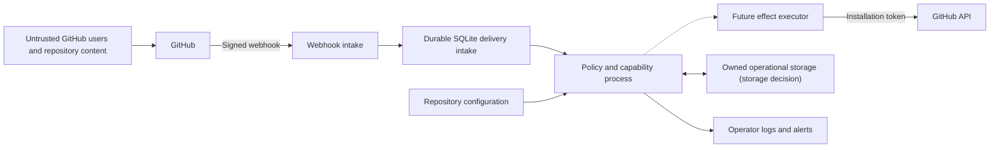

# Threat Model for the Hosted GitHub App

> **The security argument, partly implemented.** Webhook verification, durable delivery
> acceptance/deduplication, strict configuration parsing, SQLite storage, the GitHub adapter and its
> four gated write endpoints, the effect path from journal to read-back, safety refusals, and CI
> supply-chain controls exist. Production hosting and its operator, retention, and every off-GitHub
> integration remain open, so the required controls below are not claims that all of them run today.

## 1. Trust boundaries

- Each arrow crosses a boundary needing authentication, validation, limits, or data minimization.
- The service must never treat a value as trusted merely because it came through GitHub.

## 2. The security boundary

| Untrusted input | Protected asset |
|---|---|
| Repository content | The App private key and webhook secret |
| Webhook bodies | Installation tokens |
| Issue comments | Configuration snapshots and operational state |
| Configuration files | Queue contents and audit records |
| Contributor identities | The App's trusted public voice |

- The App is a shared service that may serve several repositories.
- GitHub sends events; the App reads repository configuration; capabilities return intents.
- The platform may write approved effects through an installation token.
- The shared GitHub API rate budget is also a protected asset.
- One repository must not be able to make every installation unavailable: the sweep and the webhook
  lane hold separate shares of each rate-limit pool, so neither can spend the other's (D192).
- Permissions are not fixed: the minimum set depends on the capabilities an installation enables.
- The production App requests the smallest practical installation-wide set.
- Every intent is checked against the installation grants required by its platform-owned operation facts.
- A capability needing unusually powerful access may need a separate App, or stay out of scope.

## 3. Threats and required controls

| Threat, with an example | Required control |
|---|---|
| A forged webhook — a fake issue event to the endpoint | HMAC over the raw body, before parse or queue |
| A replayed delivery — manual, API, or repeated send | Durable delivery-GUID deduplication, stable intent keys, and operation-specific recovery |
| Out-of-order events — a removal before its addition | Current observations, dated causes, state check |
| Command abuse — `/assign` spam, spending budget and noise | Syntax, actor permission, budgets |
| Untrusted text — a title with markup or a fake marker | Escape, defang mentions, limit length |
| Unsafe configuration — a PR zeroes a warning period | Safe minimums, explicit modes, validation |
| Fork content served by the base repository's own API | Pin the base default branch on every fetch |
| Inheritance from an attacker-controlled repository | The first version has no inheritance |
| A confused deputy — editing an unrelated item | Normalized observations and narrow services |
| One tenant starving another of workers or quota | Partition queues, storage, logs, metrics |
| An event storm — a bulk label change, thousands of events | Bounded queues, coalescing, backoff, jitter |
| Rate limits — a search-heavy resolver drains quota | Expose rate data, paginate, cache, delay work |
| A multi-call effect stopping halfway | Verify completed steps, resume only if valid |
| A poisoned queue item failing forever | Typed parse errors, bounded retries, isolation |
| A compromised maintainer account | Branch protection and repository permissions |
| A compromised App key or deployment | Managed secret store, audit, rehearsed rotation |
| A compromised dependency or build pipeline | Pinned dependencies and actions, reviewed |
| Stored data leaking private repository content | Minimum fields, encryption, tenant separation |
| An off-GitHub integration leaking data | Opt-in, destination validation, host allowlist |
| Reaching arbitrary network addresses | No arbitrary callback URLs in the first design |
| A relay inside the webhook path — smee acks, then forwards | Rehearsal only; never production ingress |
| The operator's machine holding secrets and payload bytes | Disk encryption, restricted access, rotation on handover |

- Intake rejects missing, invalid, and oversized requests.
- Delivery identifiers are durably deduplicated in `seen_delivery`; correctness does not rest on a cache.
- A future executor must check expected state immediately before writing.
- Future refusal output must be independently limited, and may degrade to a reaction or to silence.
- Measured ceilings (experiment 6.4): 5,000 requests per hour per installation, uniform pricing.
- Conditional 304 reads are free; a content-creation secondary limit sits near 80 writes per minute.
- That secondary limit arrives with no `retry-after` header, so per-actor budgets sit inside it.
- Untrusted text includes mentions, HTML comments, Markdown links, and fake markers.
- A marker is never treated as managed unless the App authored the object.
- A pull request may also try to enable a destructive action, not only zero a warning period.
- Configuration validation rejects unsafe document shapes today. Live permission-readiness checks and a
  pull-request effective-change report are required before `active`; neither is built.
- Fork content: a fork pull request adds or edits repository content, including `automations.yml`.
- The base repository's Contents API then serves that file at the pull-request head commit.
- Observed directly in the sandbox (experiment 6.6, `FINDING(fork-content-via-base-api)`).
- A configuration or policy fetch never honors a ref or commit a pull request can influence.
- Anything fetched by a pull-request-derived commit is contributor-controlled input.
- A later inheritance design must restrict sources, pin revisions, detect loops and deletion, and
  fail closed before activation.
- Capabilities receive normalized observations and narrow services, never raw tokens.
- An intent names capability, repository, item, operation, causal observation, claimed state, and stable
  effect identity. The shell's durable report separately records the configuration revision. A future
  executor must bind and recheck both before a write; there is no installation field on `Intent` today.
- Fair scheduling prevents one partition from taking every worker.
- Reconciliation repairs dropped event work; the service sheds load before memory is exhausted.
- The adapter reserves capacity for recovery and security actions.
- A future executor must record or reconstruct a halted operation, and report a partial result otherwise.
- Operators can inspect redacted poison-item metadata without executing the item again.
- Amplification is limited by permission ceilings, reviewable configuration, and anomaly alerts.
- Process, repository, capability, and item-level stops have code paths. Installation-wide suspension,
  deployment controls, and secret-access policy remain operator work.
- The dependency set stays small and builds produce provenance where practical.
- Secret access is unavailable to untrusted pull request code.
- Stored data also gets redacted logs and defined deletion and retention rules.
- Off-GitHub delivery also needs secret isolation and an explicit data contract.
- A later outbound HTTP feature needs scheme, host, redirect, DNS, and private-address controls,
  against server-side request forgery.
- A relay acknowledges GitHub the instant it receives a delivery, before forwarding, so the
  receiver's own response time is unmeasurable through it.
- A response held 15 s was recorded as `OK, 0.05 s`, and two forwarders on one channel turned
  154 unique deliveries into 308 accepts (experiment 6.2).
- Rehearsal tooling should make relay use obvious in its own output, so a captured timing or
  duplication is never mistaken for a measurement of the real receiver.
- The operator machine holds `WEBHOOK_SECRET`, App credentials, and a store carrying unscrubbed
  payload bytes for every delivery still pending or processing.
- The never-tracked invariant (D99) proves *git* never commits that directory; it proves nothing
  about the *disk*.

## 4. Permission design

- Permissions are derived from concrete effects, never from an imagined final product.
- The platform catalogue derives a write permission from each concrete intent operation. Candidate guides
  separately analyze read-permission impact; declarations do not carry a permissions block (D62).
- Installation checks show which enabled capabilities the granted permissions cannot support.
- A missing permission causes a visible, safe no-op, never repeated blind retries.
- The first sandbox capability avoids code writes, merges, releases, secrets, org admin, workflows.
- If a later capability genuinely needs one, the team reviews whether it belongs in the same App.

## 5. Authentication and command authorization

- The adapter resolves the current actor permission from GitHub at the time of a sensitive command.
- Display names, membership claims in comments, and cached roles are not authorization.
- A command parser uses an exact grammar and never executes edited comments as new commands.
- It binds the decision to the repository and item where the command appeared.
- A visible acknowledgement does not prove that a command completed.
- Final outcomes: applied · already satisfied · conflicted · forbidden · delayed · unknown.
- A retry uses the same idempotency identity, and rechecks authorization when still sensitive.

## 6. Secrets and logs

- Secrets never appear in logs, exception messages, queue tools, test fixtures, or comments.
- Installation tokens exist for the shortest practical time and never reach capability code.
- Logs prefer repository and item identifiers, omitting issue and comment bodies, emails, and
  private configuration values.
- Operators still need enough information to investigate a decision.
- An audit record holds config revision, capability version, cause, policy outcome, effect result,
  and GitHub request identifiers.
- It copies no unnecessary repository content.

## 7. Availability and safe degradation

- The service must stay correct when it is delayed or temporarily unavailable.
- Bounded queues and dropped work are acceptable only where later observation-based reconciliation
  can restore the intended state.
- A capability depending on every event must declare that dependency.
- It cannot use this recovery claim without additional durable delivery state.
- Retries distinguish temporary failures from permanent permission, validation, and policy failures.
- The service stops retrying permanent failures.
- Circuit breakers and kill switches disable writes without disabling operator health information.

## 8. Verification before wider installation

- Sandbox coverage: invalid signatures · duplicate deliveries · reordered events · oversized input.
- Sandbox coverage: command spam · marker spoofing · hostile Markdown · pagination.
- Sandbox coverage: rate exhaustion · partial effects · configuration changes during execution.
- Sandbox coverage: tenant isolation · key rotation · repository-level write suspension.
- A security review must examine the actual App manifest and deployment settings.
- That review comes before the App moves from Hiero Hackers to a main Hiero organization.

## 9. Open decisions

What is still unchosen, and who owes the choice. Where the register carries the question, the row is
the owner and this list is only the security reading of it ([`../constraints.md`](../constraints.md)).

- **Hosting, key custody, and the build and deployment platform.** Q1 names the organization that
  must own them; Q17 is the deployment shape that owner has to provide.
- **Retention, backup, access, and deletion** of delivery identifiers, canonical reports and warning
  records — Q17's last sub-question. Pruning exists in the store and nothing calls it, so today the
  answer is "everything is kept".
- **Whether production keeps the SQLite `seen_delivery` table as the queue boundary.** Q17's
  durable-queue sub-question. The storage decision requires a persistent single-writer disk, so what
  is open is whether hosting can hold that shape, not whether the shape is right.
- **The tenant partition level, the final installation permission ceiling, and the operator roles.**
  Q11 owns the installation scope, Q13 owns the roles; the partition level needs load testing
  whichever way those go.
- **Who may approve active or destructive modes.** Answered for ring-zero by D126, whose scope
  boundary is the pilot gate: past the personal sandbox this takes the volunteer repository's
  maintainers and the named operator (Q1, Q13), per P8. Wider than that, it is unanswered.
- **Whether configuration inheritance is ever needed.** Q14 defers it from the first version; it
  earns a separate design and review only if repeated configuration shows the need.
- **Per-actor command budgets**, which must be set within the measured ceilings.
- **The reconciliation interval and the rate reservation policy**, both of which need operational
  evidence. The client's one-percent primary reserve is a floor it chose for itself, not a policy
  across installations.
- **Focused abuse tests for projection templates.**
- **Whether any capability legitimately needs pull-request-ref reads, and how they are labeled.**
- **Whether custom callbacks are ever needed.**

Three things here are not decisions and do not become one: a compromised maintainer account is a
risk the App cannot remove, cross-repository capabilities stay out of scope until a concrete need
exists, and no off-GitHub integration belongs in the first platform milestone. Making any choice
above must update this document, which lists required properties rather than evidence that the
implementation has them.
