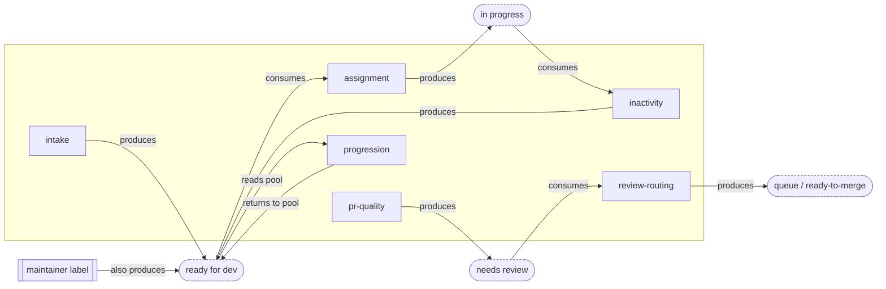

# Opt-In Modules: the Catalogue and the Interaction Graph

> DRAFT — the module-level companion to `design/architecture.md`, which designs the system these run
> on. No decision yet on which modules ship: the catalogue is a worked split of the audited
> capabilities (`audit/services.md`), with placeholder state names pending `design/core/taxonomy.md`.
> As each module is designed for build, its spec lands in this directory as `<name>.md`. The typed
> contract every module implements is `contract.md`.

## 1. The decoupling rule

**A module never depends on another module — only on the core.** Three parts make it hold, all
designed in `design/architecture.md` (§4 core, §5 contract, §7 toggle):

1. The core owns every state and every shared computation — the state machines and the resolvers
   exist even if only one module is on.
2. A module declares its full contract and never names, calls, or imports a sibling.
3. **Every state has a non-module way in** — a hand-applied label, a config default, a command — so
   an upstream module *automates* an entry point, never *is* the entry point (exact semantics:
   `design/core/manual-edits.md`).

Consequence: any single module alone is a functional-but-manual capability; adding its upstream
automates its inputs; removing it drops back to manual. Nothing breaks, nothing starves — that is
"dial a feature up or down" from `planning/goals.md`.

## 2. The module catalogue

Each module is one independently togglable unit (never bundled behind a shared trigger — lessons D1).

| Module | What it does | Consumes (state in) | Produces (state out) | Standalone when its upstream is off |
|---|---|---|---|---|
| **intake** | moderate/lock new issues, `/finalize` validate + promote | issue opened / reopened | `awaiting triage` → `ready for dev` (issue) | n/a — it is the producer; maintainers can also set `ready for dev` by hand |
| **assignment** | `/assign`, `/unassign`, skill gates, limits | `ready for dev` (issue) | `in progress` ↔ `ready for dev` (issue) | works whenever `ready for dev` is set — by intake **or** by a maintainer label |
| **inactivity** | warn → reclaim stalled work, `/working` reset | `in progress` (issue, no open PR) · `needs revision` (PR) | `ready for dev` (issue) · closed (PR) | acts on any stalled item, regardless of who assigned it |
| **pr-quality** | DCO/GPG/conflict/link checks + dashboard | PR opened | `needs review` / `needs revision` (PR) | fully self-contained on the PR side |
| **review-routing** | review → status, queue state machine | `needs review` (PR) | `queue:*` / `ready to merge` (PR) | works whenever `needs review` is set — by pr-quality **or** by hand |
| **progression** | post-merge recommend, level-up, milestone | PR merged + the `ready for dev` pool | recommendations only — the old status strip is now the core's close hygiene (`design/core/taxonomy.md` §2.3) | reads whatever `ready for dev` issues exist; recommends nothing if the pool is empty |
| **notifications** | alerts, reminders, CI-failure feedback, AI hooks | events only | comments only — **no state** | fully standalone; touches no shared label |
| **admin** | spam-list, mentor rotation | assignment events | `notes:*` bookkeeping | standalone; degrades to no-op without the events it watches |

The pattern: every "standalone when upstream is off" cell resolves to *"the state it needs can also
be set manually"* — that column is the decoupling rule made concrete.

## 3. The interaction graph

Modules interact only **through the core**, on the three channels `design/architecture.md` §4 defines: shared
state (the state machines), shared resolvers (`eligibleLevel`, `linkedIssues`, `isBot` — one mechanism
per question, lessons B2), and declared cross-entity reads (lessons C1). The dependency graph has
**no module-to-module edges** — every arrow goes module → state → module:

Read it as: intake and assignment never reference each other — both reference `ready for dev`, and
so does the manual entry point. Cut intake out and the node keeps an inbound edge
(`maintainer label`), so assignment keeps working. The missing module-to-module edge **is** the
decoupling.

## 4. The module lifecycle: proposal to retirement

- **Proposal.** A candidate service is paper-fitted against the contract's fitness test
  (`design/modules/contract.md` §6): does it fit the five declaration fields with existing
  resolvers, or one promoted fact? A service that can't fit is asking for module-to-module
  coupling — redesigned, not accommodated. Any new core fact it needs passes the gate
  (`design/core/README.md`) *before* the module is accepted.
- **Acceptance.** A spec from `TEMPLATE.md`, ratified like any design decision; then built against
  the conformance kit — passing the kit is the definition of being a module.
- **Evolution.** Config keys are deprecate-in-place, never removed within a major version (the SDK
  convention, inherited): an old key keeps working with a health-issue nudge. Declaration changes
  (new edge, new resolver) re-run the kit derivation — the tests grow with the declaration.
- **Retirement — safe by the same rule that makes toggling safe.** Removing a module from the
  system entirely is the light switch surviving the motion sensor's removal, fleet-wide: its
  consumed states remain enterable by hand (§1.3), its produced states remain consumable by
  neighbours from manual entry, its labels and past comments stay (projections resolve down), and
  its config blocks are reported by the registry as unknown-module errors in the health issue —
  loud, not silent (`design/operations/README.md` §5). No migration is needed to *remove* a module,
  ever; that property is the toggle matrix's zero-side-effect guarantee applied at the fleet level.

## 5. Worked example: dialling assignment up and down

- **assignment only.** A maintainer labels an issue `ready for dev`; a contributor runs `/assign`;
  the core moves it to `in progress`. Fully functional — maintainers produce and reclaim the pool by
  hand.
- **+ intake.** `/finalize` now fills the pool automatically. Assignment is unchanged — it consumes
  the state and neither knows nor cares who produced it.
- **+ inactivity + progression.** Stalled items return to the pool; merges recommend the next issue.
  Assignment's code is still untouched.

At no level does enabling or disabling a neighbour require editing assignment — the test from
`planning/goals.md`: "turning a feature off is one config edit and has no side effects on the others."
