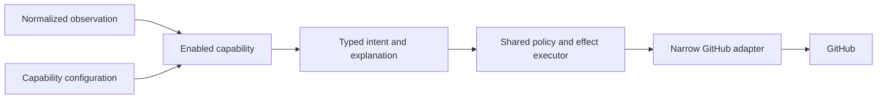

# Candidate Capabilities

> The audit found the capabilities in this directory. They are candidate product work, not a committed
> release list. Each candidate must pass maintainer-demand, permission, configuration, safety, and feasibility
> review before implementation.

## 1. What independence means

A capability is independent when all of the following statements are true.

1. The capability does not import, call, or name another capability.
2. The capability receives only its own validated configuration and the shared platform interfaces that its
   contract declares.
3. The capability does not receive Octokit, a raw GitHub context, or another unrestricted transport client.
4. Disabling the capability stops its event handling, scheduled work, capability-only reads, and writes.
5. The capability can perform its own job without requiring another capability to be enabled.
6. Any compatibility rule or shared workflow invariant is declared and validated before activation.
7. The capability declares its permissions, mappings, operational storage, rollback, and uninstall behavior.

Manual state entry can make a capability useful by itself, but manual reachability does not prove every
combination is safe or understandable. Related capabilities may be offered as an optional workflow profile
with tested compatibility rules.

## 2. Candidate catalogue

| Candidate | Maintainer problem | Current evidence | Current status |
|---|---|---|---|
| `intake` | New issues need consistent triage without silently rewriting contributor content. | The C++ and Python repositories use different intake flows. | This candidate needs maintainer demand and policy review. |
| `assignment` | Contributors need a safe way to claim and release work. | The C++ and Python repositories both automate assignment with different rules. | This candidate needs configuration, multi-assignee, and recovery decisions. |
| `inactivity` | Stalled assignments and pull requests need a fair reclaim process. | Both automated repositories act on inactivity, but their timing and warnings differ. | This candidate is destructive and requires a later safety gate. |
| `pr-quality` | Pull request authors need one clear view of mechanical checks. | C++ has a dashboard, Python enforces only some conditions, and JavaScript has a small formatting gate. | A comment-only slice is a strong first candidate. |
| `review-routing` | Some repositories want review state or reviewer routing to be visible. | Python has a review queue, while the other audited repositories do not share it. | This candidate needs named repository demand. |
| `progression` | Some repositories want to recommend new work or recognize contributor progress. | C++ and Python implement recommendation and skill progression. | This candidate depends on optional skill-policy decisions. |
| `notifications` | Maintainers and contributors may need focused alerts or explanations. | Python and JavaScript use different notification channels and triggers. | Each subscription needs separate demand and permission review. |
| `admin` | Some repositories maintain mentor rosters or abuse controls. | These behaviors appear mainly in Python. | This candidate is deferred until repositories request it. |

The catalogue records existing behavior so that it is not lost. It does not require every old service to be
rebuilt. GitHub-native behavior or a repository-local Action may remain the better solution for some rows.

## 3. Capability acceptance test

Before a candidate becomes product scope, its document must answer the following questions.

1. Which repositories and maintainers have asked for the capability?
2. What problem do they experience without naming the proposed implementation?
3. What behavior exists today, and at which pinned source revision was it observed?
4. Which repository choices must be configurable?
5. Which GitHub events, reads, writes, and permissions are required?
6. Which labels, fields, teams, users, or external systems must be mapped?
7. Does the capability need scheduling, durable operational state, or cross-item coordination?
8. What happens when the capability is disabled or uninstalled?
9. What can fail, what is the blast radius, and how does a maintainer reverse the result?
10. Can GitHub or an existing Action solve the problem with less permission and operational cost?
11. What is the smallest personal-sandbox experiment that proves the design?
12. Which compatibility rules apply when the capability runs with other capabilities?

The candidate is then classified as a shared capability, an optional workflow-profile member, a
repository-specific extension, an existing GitHub or Actions solution, or work that should be deferred.

## 4. Interaction through the platform

Capabilities share platform services instead of sharing implementation details.

A capability may request a shared fact through a declared resolver. For example, assignment and progression
may both request an answer about contributor eligibility when an optional skill policy is enabled. They do
not call each other, and the resolver does not force repositories to enable the policy.

## 5. Workflow profiles

A workflow profile packages suggested mappings, defaults, and compatibility rules for repositories with a
similar process. The candidate Hiero contribution profile may include intake, assignment, inactivity, pull
request quality, and optional progression.

A profile does not silently enable its members. The repository still selects each capability and can inspect
the effective configuration. A profile must state which combinations have been tested and which combinations
are unsupported.

## 6. Implementation order

Implementation order follows technical risk and confirmed demand rather than the catalogue order.

1. The platform first proves App authentication, webhook verification, configuration, dry-run output, and a
   narrow adapter.
2. The platform then proves one idempotent managed comment.
3. The platform then proves one reversible mapped-label operation with failure injection.
4. The project then selects the first user-facing capability from maintainer demand.
5. Contributor-facing commands and destructive actions arrive only after recovery and rollback tests pass.

The current best first candidate is a comment-only pull request quality dashboard, but maintainers must still
confirm that choice.

## 7. Candidate documents

Each file in this directory records evidence, configurable policy, technical needs, safe tests, and open
questions. Detailed behavior remains a hypothesis until the named maintainers review it.

- `intake.md` describes issue intake and triage candidates.
- `assignment.md` describes self-service assignment candidates.
- `inactivity.md` describes warnings and reclaim candidates.
- `pr-quality.md` describes pull request feedback candidates.
- `review-routing.md` describes review routing candidates.
- `progression.md` describes recommendation and recognition candidates.
- `notifications.md` describes focused notification candidates.
- `admin.md` describes mentor and abuse-control candidates.
