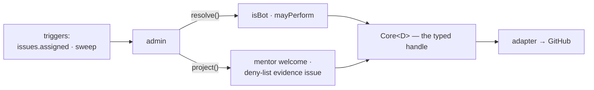
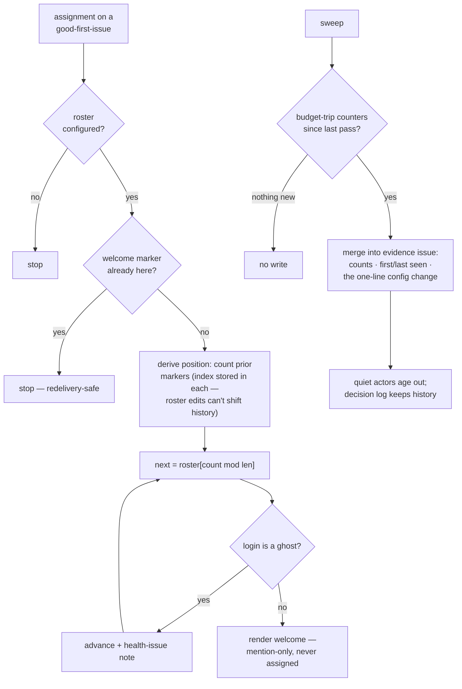

# admin: the housekeeping nobody should have to remember

> Spec for the `admin` module. Status: **draft** — catalogue-level, written from the audit
> (Python spam-list maintenance and mentor rotation, `audit/services-python.md`) to inform Q2 and
> ratification; re-worked against `TEMPLATE.md` before build. Deliberately last in the build order:
> it degrades to a no-op without the events it watches, and half its old job has moved into the
> core.

## 1. The job

Without admin, two upkeep chores fall to whichever maintainer remembers: keeping the abuse/spam
deny-list current, and rotating mentors onto good-first-issue assignments so first-timers get a
named human. Admin automates both. One outcome: **the deny-list and the mentor roster stay current
without anyone owning a chore.**

## 2. The declaration

```ts
{
  name: 'admin',
  config: { mentors: '{ roster: Login[] } | absent' },
  consumes: [],
  transitions: [],                                 // none — bookkeeping and comments only
  resolvers: ['isBot', 'mayPerform'],
  triggers: ['issues.assigned', 'sweep'],
}
```

Note what is *absent* against the old system. The catalogue's early sketch said admin produces
"`notes:*` bookkeeping" — but the taxonomy folded the `notes:` namespace away (D3), so this spec
produces **no labels at all**. And the spam list's *enforcement* is not here: contract §6 already
promoted it into the core as a `mayPerform` clause — the gate is the core's, the *upkeep* is this
module's.

The declaration, drawn — this module's **entire** view of the core; no `request()` arrow exists —
this module *cannot* touch state, by type:



## 3. Behaviour

- **Mentor rotation**: on observing a good-first-issue assignment (and `mentors.roster` present),
  pick the next mentor round-robin and render the welcome-with-mentor projection. Rotation position
  is *derived* — count prior mentor comments via the module's own marker — not stored (no owned
  state, D1).
- **Deny-list upkeep**: on sweep, refresh the evidence view for maintainers — which actors tripped
  the per-actor command budgets (`operations/threat-model.md` §3.1), with counts — rendered on one
  tracking issue. **The list itself lives in config** (the org `_extends` file), so *changing* it
  is a reviewed config PR, not a bot write: the app proposes, humans amend.
- **Manual-mode story**: with no roster configured and no budget trips, admin does nothing at all —
  and that is correct. It is pure automation of upkeep that maintainers can always do by hand in
  config.

Not carried over: Python's hourly cron editing `.github/spam-list.txt` — the app writing files
needs `contents:write`, which the permission promise forbids, permanently. The config-PR path above
is the replacement.

### 3.1 Step by step

The flows in one picture; the numbered steps below are authoritative for detail:



#### Flow A — mentor rotation

1. Trigger: `issues.assigned` on an issue carrying `skill: good first issue`. No `mentors.roster`
   configured → stop.
2. A mentor-welcome marker already exists on this issue → stop (redelivery-safe).
3. Derive the rotation position: count this repo's prior mentor-welcome markers. Each marker
   carries the **mentor's roster index at render time**, not just their login — so a later roster
   edit cannot shift the derived history.
4. Next mentor = `roster[count mod len(roster)]`.
5. The chosen login is a ghost (deleted/suspended account) → advance to the next roster entry and
   note it on the health issue — never render a broken @-mention.
6. Render the welcome: who was assigned · who their mentor is · where to ask. Mention-only — the
   mentor is **never added as an assignee** (the old `notes: mentor-duty` patch existed to fight
   exactly the invariant collision that assigning them creates; see §3.2).

#### Flow B — deny-list evidence

1. Trigger: sweep. Read the per-actor budget-trip counters the shell metered since the last pass
   (metered in-process; the decision log is the durable history).
2. Nothing tripped and the standing evidence renders nothing new → no write.
3. Merge into the one evidence-issue projection: per-actor counts · first/last seen · the exact
   one-line org-config change that would act on it.
4. Actors quiet for N days age out of the rendering (retention, §8); the decision log keeps what
   the projection forgets.
5. **The module never edits the list itself** — the list lives in org config, changed only by a
   reviewed config PR. The app proposes; humans amend.

### 3.2 Bug surface — what to test for

- **Roster edits mid-rotation**: mentor removed from the roster → the modulo must not resend
  everyone one step; the index-in-marker scheme (Flow A step 3) is what makes the derivation
  stable — kit case required.
- **Ghost mentors** (login deleted/suspended): render must degrade to the next mentor with a
  health-issue note, not a broken @-mention.
- **Missing business logic to decide**: is the mentor also *assigned* (Python assigned them as an
  issue assignee — colliding with the `ready for dev`/`in progress` invariants and the cap)?
  Proposed: mention-only, never assigned — the old behaviour actively fought the taxonomy's
  invariants (`notes: mentor-duty` existed to patch exactly that, and it folded away with D3).

## 4. Safety

None — nothing destructive. (Denying an actor via the list is `mayPerform`'s refusal at command
time — a non-action, not a taking.)

## 5. Projections

Two kinds: the **mentor welcome** (who was assigned · who their mentor is · where to ask) and the
**deny-list evidence issue** (what was observed · current configured list · the one-line config
change to act on it), updated in place.

## 6. Config knobs

- `mentors.roster`: repos with a mentoring program list logins; repos without omit the block and the
  behaviour is off. The either/or is existential, which is the cleanest kind.

The deny-list itself is org-level config, not an admin knob — one list, reviewed like all config.

## 7. Tests beyond the kit

Round-robin fairness across restarts (derived position survives a redeploy); roster shrink while
someone mid-rotation; evidence issue dedup and resolve-down when a listed actor goes quiet.

## 8. Open questions

- Whether budget-trip evidence needs retention limits (it names accounts) — decided with the
  telemetry/retention review (`operations/README.md` §6).
- Whether mentor rotation belongs here or inside assignment's welcome — kept here so assignment
  stays gate-and-transition only; ratifiers may merge them.
