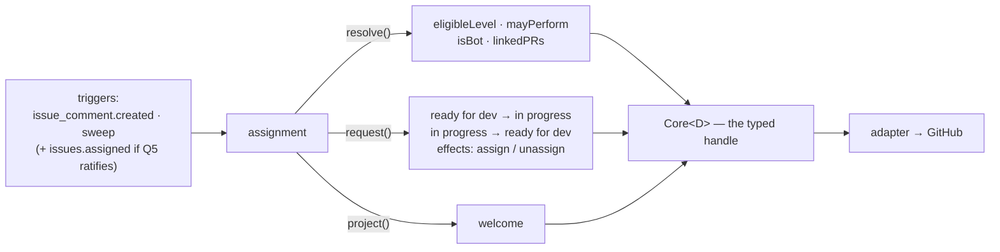
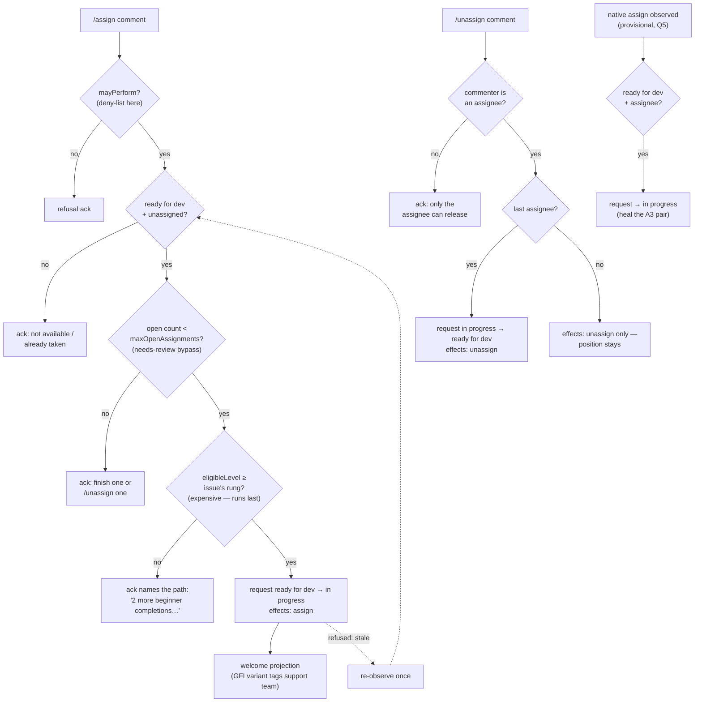

# assignment: self-serve `/assign` with the ladder as the gate

> Spec for the `assignment` module. Status: **draft** — catalogue-level, written from the audit
> (C++ `/assign`/`/unassign`, `audit/services-cpp.md` §8–9; Python's per-tier guard chain,
> `audit/services-python.md`) to inform Q2 and ratification; re-worked against `TEMPLATE.md`
> before build. This is the 🟢 common core of both audited SDKs — the flagship module, built
> deliberately *late* in the risk ladder (`design/build-plan.md`, module build order): its guards
> (`eligibleLevel`, limits, the deny-list gate) and the command surface must all have run in
> production under lower-stakes modules before its first contributor interaction.

## 1. The job

Without assignment, a contributor who wants an issue must ask and wait; maintainers do assignment
arithmetic by hand (is this person ready for an intermediate issue? how many do they already
hold?). Assignment makes claiming an issue self-service — `/assign` checks the ladder and the
limits, then hands the issue over. One outcome: **contributors claim work instantly, and the ladder
is enforced without a maintainer in the loop.**

## 2. The declaration

```ts
{
  name: 'assignment',
  config: { maxOpenAssignments: 'number (default 2)' },
  consumes: ['ready for dev', 'in progress'],
  transitions: [
    { from: 'ready for dev', to: 'in progress' },   // /assign — effects: { assign }
    { from: 'in progress', to: 'ready for dev' },   // /unassign — effects: { unassign }
  ],
  resolvers: ['eligibleLevel', 'mayPerform', 'isBot', 'linkedPRs'],
  triggers: ['issue_comment.created', 'sweep'],
}
```

`linkedPRs` is the declared cross-entity read behind the C++ *needs-review bypass*: an issue whose
PR sits in `needs review` does not count against the holder's cap — waiting on maintainers must not
freeze a contributor (`design/config/schema.md` §3, whose-turn).

The declaration, drawn — this module's **entire** view of the core; anything not shown is
inexpressible through its typed handle:



## 3. Behaviour

- **On `/assign`** (issue in `ready for dev`, commenter unprivileged — privileged actors assign
  natively and are outside all limits): gate in the threat model's cheap-first order
  (`operations/threat-model.md` §3.1) — position present and unassigned (invariant) → open-count vs
  `maxOpenAssignments`, with the needs-review bypass → `eligibleLevel(user)` ≥ the issue's `skill:`
  rung. All pass → request `ready for dev → in progress` with `effects: { assign: user }`, cause =
  the command comment. Any fail → one refusal ack naming the gate and the exit ("2 open
  assignments — finish one or `/unassign` one").
- **On `/unassign`** from the current assignee: request `in progress → ready for dev` with
  `effects: { unassign }`. Immediate — self-service on self needs no grace
  (`design/core/safety.md` §1).
- **Welcome projection** on successful assign; the good-first-issue variant tags the support team
  (from `core.teams`).
- **Manual-mode story** (assignment alone): a maintainer hand-labels `ready for dev`; `/assign`
  works from that state exactly as from intake's. This is the module the decoupling rule was
  designed around (`design/modules/README.md` §5).

Consolidated away from the old systems: Python's four separate per-tier workflows (GFI, beginner,
intermediate, advanced) collapse into the one `eligibleLevel` gate; its *assign-then-unassign* guard
pattern (accept, then revoke on a failed check) is replaced by *gate-then-assign* — the app never
gives and then takes back. The spam-list cap is not this module's business: it is a `mayPerform`
clause in the core (`design/modules/contract.md` §6).

### 3.1 Step by step

The flows in one picture; the numbered steps below are authoritative for detail:



#### Flow A — `/assign`

1. Comment created on an issue; the shell has filtered bots (`isBot`) and per-actor budgets;
   blocked and quarantined items were never dispatched.
2. Parse exact `/assign`, case-insensitive. Near-miss → corrective ack, stop.
3. Write the pending command record; ack reaction on the comment (D27 — a crash after this point
   is recoverable).
4. `mayPerform(actor, 'assign')` — the core's deny-list clause refuses spam-listed actors here.
   A *privileged* actor is not refused; their ack notes they can also assign natively (meet people
   where they typed).
5. Cheap invariants, in order, stop at the first fail with one ack naming the exit:
   - position is `ready for dev` — else "not open for assignment: it's `in progress`" or "needs
     triage first";
   - no current assignee — else "already taken; watch for it returning to the pool".
6. **Limit gate**:
   - collect the actor's open `in progress` issues in this repo;
   - for each, `linkedPRs` — an issue whose open PR sits in `needs review` or `ready to merge` is
     *excluded* from the count (the needs-review bypass: waiting on maintainers never blocks you);
   - remaining count ≥ `maxOpenAssignments` → refusal ack ("finish one or `/unassign` one"), stop.
7. **Ladder gate** (the expensive resolver runs last — threat-model gate ordering):
   - the issue has no `skill:` label → refuse with "awaiting triage details" (intake's nudge, if
     on, is already asking for the label), stop;
   - `eligibleLevel(actor)` < the issue's rung → refusal names the path ("2 more beginner
     completions unlock intermediate"), stop.
8. Request `ready for dev → in progress`; `expect` = the observed state; `cause` = the command
   comment; `effects: { assign: actor }` (the A3 pair moves as one).
9. Outcomes:
   - `applied` → welcome projection (the good-first-issue variant tags the support team from
     `core.teams`); complete the ack.
   - `already` → ack "it's already yours".
   - `refused: stale` → re-observe once (someone may have just taken it); retry if still valid,
     else ack the truth ("just taken").
   - `unknown` → ack "processing"; the sweep completes it from the pending record.

#### Flow B — `/unassign`

1. Comment created; shell filtering as Flow A step 1.
2. Parse exact `/unassign`. Near-miss → corrective ack, stop.
3. Pending record + ack reaction, as Flow A step 3.
4. The commenter is a current assignee of this issue — else refusal ack ("only the assignee can
   release it"), stop. No permission gate beyond that: releasing your own claim is always allowed.
5. Count the assignees:
   - the commenter is the **only** assignee → request `in progress → ready for dev`,
     `effects: { unassign: actor }`, `cause` = the command;
   - **other assignees remain** → request `effects: { unassign: actor }` with **no edge** — the
     position stays `in progress` while ≥1 assignee holds it (the invariant). Only the last
     assignee's `/unassign` moves the position. (The old bots never handled this; see §3.2.)
6. Outcomes:
   - `applied` → ack confirms: "back in the pool — your work is safe in your fork; `/assign` to
     reclaim."
   - `already` → a maintainer already removed them; ack the truth.
   - `refused: stale` / `unknown` → as Flow A step 9.

#### Flow C — native-assign repair *(provisional — declared only if Q5 ratifies it)*

1. Trigger: `issues.assigned` (a maintainer assigned someone through GitHub's own UI).
2. Observe: position `ready for dev` **with** an assignee — the class-2 invariant break
   (assigned-but-available).
3. This module declared the repair: request `ready for dev → in progress`, `cause` = the dated
   native-assign event. No `effects` — the assignee is already set; only the position heals.
4. Outcomes: `applied` → the pair is whole; `already` → Flow A got there first (its own write's
   echo); `refused: older-fact` → a human set `ready for dev` *after* the assign — their gesture
   stands, the core's narration flags the invariant instead.

### 3.2 Bug surface — what to test for

- **The two-`/assign` race**: serializer + `expect` → exactly one `applied`; the loser's ack must
  read "just taken", never a stack trace of refusal jargon.
- **Native assign between observe and write**: `expect` mismatch → `refused: stale` → re-observe
  shows an assignee → correct "already taken" ack.
- **The multi-assignee seam** (Flow B step 5): GitHub allows up to 10 assignees; the invariant table says
  `in progress` = ≥1 assignee. The C++ bot assumed exactly one and the Python bot removed only the
  commenter without touching labels. Position moves only when assignees hit zero — this is decided
  *here*, and the kit's invariant cases must cover it.
- **Count-limit staleness**: an issue closed seconds ago still shows in the open-count search
  (GitHub search lag). Cost: one over-strict refusal; acceptable, self-heals. Never pre-cache.
- **Comment edited after ack**: edits are not commands (`operations/threat-model.md` §3.1) — no
  re-dispatch, ever.
- **Missing business logic to decide**: may an actor `/assign` an issue while holding a
  *different* issue in `awaiting triage` they filed? (No interaction — filing ≠ holding.) May a
  maintainer `/assign` **someone else** (`/assign @user`)? The old bots said no (self-service
  only); native assignment covers it — proposed: keep self-only, revisit on demand.

## 4. Safety

None — nothing destructive. `/unassign` is the actor releasing their own assignment; the reap of
*stalled* assignments belongs to inactivity.

## 5. Projections

One **welcome** per item on assign: what happened ("assigned to you") · what's next (branch, link
the issue with a closing keyword) · the exit (`/unassign` returns it to the pool). Refusals are
command acks (core kind), not module content.

## 6. Config knobs

- `maxOpenAssignments` (default 2): a large repo with a deep pool tolerates 3–4 concurrent claims;
  a small repo protecting a shallow pool wants 1–2. Genuine either/or. Caps command users only —
  GitHub's permission model is the tier system (`design/config/schema.md` §3).

Dropped: C++ `maxGfiCompletions` (cap 5 GFI completions) — its job (move people up the ladder, stop
GFI-farming) is the ladder's own, via `eligibleLevel`; a second counter is a second mechanism for
the same question (lessons B2). Ratifiers can restore it as a knob if the incentive proves real.

## 7. Tests beyond the kit

Gate ordering (cheap checks refuse before `eligibleLevel`'s search runs); the needs-review bypass;
race — two `/assign`s in one sweep window (serializer + `expect` yields one `applied`, one
`refused: stale`); assign on a hand-labeled pool issue (manual-mode); privileged actor assigns
natively and no limit fires.

## 8. Open questions

- **Q5**: does this module declare the class-2 repair (native-assign observed on `ready for dev` →
  request `in progress`, healing the A3 pair)? Recommended yes — it is this module's domain — but
  it adds `issues.assigned` to `triggers` and one edge; decided at spec ratification.
- Whether `eligibleLevel` credit is org-wide or per-repo — decided in the memo
  (`design/core/resolvers.md` §3), consumed here unchanged.
