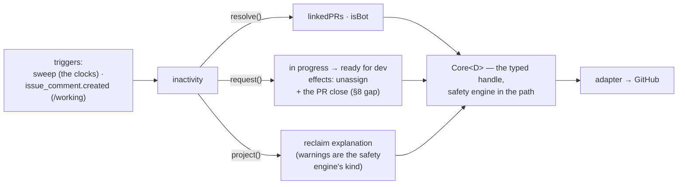
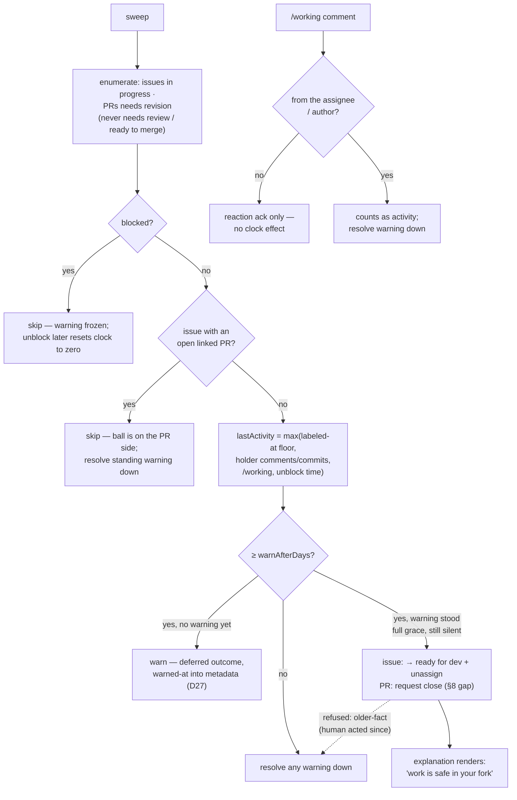

# inactivity: warn, then reclaim stalled work

> Spec for the `inactivity` module. Status: **draft** — catalogue-level, written from the audit
> (C++ reaper 5d/7d, `audit/services-cpp.md` §11; Python 21d no-warning unassign,
> `audit/services-python.md`) to inform Q2 and ratification; re-worked against `TEMPLATE.md`
> before build. 🟢 in both audited SDKs; the C++ warn-then-act shape is the one that generalised
> into the safety engine (`design/core/safety.md`).

## 1. The job

Without inactivity, abandoned work squats: issues stay assigned to people who left, PRs sit in
`needs revision` forever, and the pool starves while appearing full. Inactivity watches the two
states where the contributor holds the ball, warns with a grace period, then returns the work. One
outcome: **stalled work flows back to the pool without a maintainer playing bad cop.**

## 2. The declaration

```ts
{
  name: 'inactivity',
  config: {
    issue: { warnAfterDays: 'number (default 7)',  unassignAfterDays: 'number (default 21)' },
    pr:    { warnAfterDays: 'number (default 10)', closeAfterDays:    'number (default 60)' },
  },
  consumes: ['in progress', 'needs revision'],
  transitions: [
    { from: 'in progress', to: 'ready for dev' },   // the reclaim — effects: { unassign }
  ],
  resolvers: ['linkedPRs', 'isBot'],
  triggers: ['sweep', 'issue_comment.created'],     // sweep-only clocks; comments for /working ack
}
```

Clock-triggered modules must be sweep-triggered (`design/modules/contract.md` §5.3): after a
`deferred` grace, nobody re-requests — the next sweep re-derives.

The declaration, drawn — this module's **entire** view of the core; anything not shown is
inexpressible through its typed handle:



## 3. Behaviour

- **Issue side** — on sweep observing `in progress` with **no open linked PR** (`linkedPRs`, derived
  each sweep, never stored) and no assignee activity for `warnAfterDays`: the safety engine warns
  (projection with the exits). Still silent at `unassignAfterDays`: request
  `in progress → ready for dev`, `effects: { unassign }`, cause = the dated silence.
- **PR side** — on sweep observing `needs revision` with no author activity for `warnAfterDays`:
  warn. Still silent at `closeAfterDays`: request the PR closed (see §8 — the close does not fit the
  position-edge shape yet). The linked issue is **not** touched (`design/core/taxonomy.md` §2.3): the
  core re-derives its clock eligibility when the PR's closure is observed.
- **What resets the clock** (`design/core/safety.md` §3): any commit, push, or comment from the
  assignee/author, or `/working` (acked with a reaction). A reset clears the standing warning.
- **What freezes it**: `blocked` — and on unblock the clock *resets*, not resumes (D11).
- **Whose-turn is absolute**: the clock never runs in `needs review` or `ready to merge` — a review
  backlog can never cost a contributor their work. Not configurable.
- **Manual-mode story** (inactivity alone): a maintainer hand-labels `in progress` on assignment
  day; the reaper watches from there. It acts on any stalled item regardless of who assigned it.

Consolidated away: Python's separate reminder crons (issue-no-PR, PR-inactive) are this module's
warn stage, not siblings; its no-warning 21-day unassign is replaced by warn-then-act — mandatory,
not configurable (D10). Python's `discussion`-label skip is `blocked`'s job.

### 3.1 Step by step

The flows in one picture; the numbered steps below are authoritative for detail:



#### Flow A — the issue sweep

1. Enumerate open issues in `in progress` (repo-scoped GraphQL page). Blocked overlay → skip
   entirely; the standing warning neither escalates nor updates.
2. Per issue: `linkedPRs(issue)` — any *open* linked PR → skip (the ball is on the PR side). If a
   warning projection stands, resolve it down: the item went healthy.
3. Invariant check: no assignee (class 2 — claimed-but-unassigned) → no clock can run; skip.
   Narrating the break is the core's job, not this module's.
4. Compute `lastActivity` = the max of:
   - the position's `labeled` timestamp — **the floor: a freshly assigned issue can never be
     instantly stale**;
   - the latest assignee comment on the issue;
   - the latest assignee commit/push on linked branches (upstream-visible only);
   - the latest `/working` ack;
   - the unblock timestamp, if the overlay was recently lifted (reset-on-unblock, D11).
5. `now − lastActivity < warnAfterDays` → if a warning stands, resolve it down (activity
   happened); done with this item.
6. `≥ warnAfterDays` and no standing warning → request the warn. Safety engine: `deferred`
   outcome; warned-at written into the projection's metadata before anything else (exception 1,
   D27).
7. `≥ unassignAfterDays` **and** the warning has stood the full grace **and** `lastActivity`
   predates the warning → request `in progress → ready for dev`, `effects: { unassign: * }`,
   `cause` = the dated silence. The core re-checks everything; a maintainer's hand edit after the
   warning wins (newer-fact).
8. Outcomes:
   - `applied` → the return-to-pool explanation renders ("your work is safe in your fork;
     `/assign` to reclaim").
   - `refused: older-fact` → a human acted since the warning; resolve the warning down, done.
   - `unknown` → nothing; the next sweep re-derives, and the pending record prevents a double-act.

#### Flow B — the PR sweep

1. Enumerate open PRs in `needs revision` only. `needs review` and `ready to merge` are **never
   enumerated** — whose-turn is absolute and not configurable. Blocked → skip, warning frozen.
2. Per PR, compute `lastActivity` = the max of:
   - the position's `labeled` timestamp (the same floor as Flow A);
   - the latest author comment on the PR or its linked issues;
   - the latest author commit/push to the PR branch;
   - the latest `/working` ack on the PR;
   - the unblock timestamp, if any.
3. `< warnAfterDays` → resolve any standing warning down; done.
4. `≥ warnAfterDays`, no standing warning → request the warn (`deferred`, warned-at metadata).
5. `≥ closeAfterDays`, warning stood the full grace, activity predates it → request the PR
   **close** (§8's contract gap — the close is not a position edge; the request shape is settled
   at contract refinement, the safety semantics are already this row's).
6. The linked issue is **not touched** (`design/core/taxonomy.md` §2.3): when the PR's closure is
   observed, the core recomputes the issue's open linked PRs, and Flow A becomes eligible again on
   a later sweep. No cross-entity write, ever.
7. Outcomes as Flow A step 8; reversal is native reopen (the PR re-enters positionless).

#### Flow C — `/working`

1. Comment `/working` created on an issue or PR; shell filtering as every command.
2. The commenter is the issue's assignee or the PR's author — else reaction-ack only, **no clock
   effect** (a passer-by must not keep a claim alive; the old Python bot missed this check).
3. From the holder: the comment itself is the activity — nothing is stored; the next sweep's
   `lastActivity` picks it up (step A4/B2).
4. Ack with a reaction; resolve any standing warning down in the same pass (the item is healthy —
   a stale warning is noise).
5. No transition is ever requested from this flow.

#### Flow D — blocked and unblock

1. `blocked` applied (always by hand, never narrated): the item vanishes from Flows A and B at
   their first step; the warning, if standing, is frozen exactly as rendered.
2. `blocked` removed: the unblock timestamp enters the `lastActivity` max — the clock restarts
   from zero (**reset, not resume** — D11). An item blocked at day 6 of 7 and unblocked a month
   later has a full fresh clock.
3. The frozen warning is now stale by construction → the next sweep resolves it down (step A5/B3).

#### Flow E — reversal and cooldown

1. After an act (unassign or close), any human reversal — re-assign, reopen, hand-relabel — is a
   newer fact; the app never fights it (never-revert).
2. The reversal restarts the clock from zero: the full `warnAfterDays` lead must elapse before the
   item can be warned again (`design/core/safety.md` §3 — a reversal immediately re-warned reads
   as the app arguing).
3. The old warning projection is resolved down, not reused — the next warning, if ever, is a fresh
   record with fresh metadata.

### 3.2 Bug surface — what to test for

- **The instant-reap bug** (Flow A step 4's floor): the C++ bot clocked from `max(lastActivity,
  labeled-at)` for exactly this reason — without the floor, an issue assigned after 20 quiet days
  is reaped the next morning. The floor is load-bearing; the kit must have a case for it.
- **Warn-then-act ordering across restarts**: crash between warn and act → the warned-at metadata
  is the record; a re-observing sweep must *not* re-warn (idempotent render) and must *not* act
  early (grace runs from warned-at, not from observation).
- **Reversal cooldown**: reap → maintainer re-assigns → clock restarts from zero, full lead again
  (`design/core/safety.md` §3). Re-warning the next day reads as the app arguing.
- **Activity the old bots missed**: commits in a fork the app cannot see (`contents:read` on the
  *upstream* only) — a contributor pushing to their fork with no PR looks silent. Known limitation;
  the warning's exits (`/working`) are the mitigation, and the warning text must say so.
- **`/working` from a non-assignee**: acked with a shrug or ignored? Proposed: reaction-ack but no
  clock reset (only assignee/author activity counts); anything else lets a passer-by keep a claim
  alive. The old Python bot did not check — a real bug, fixed here.
- **Missing business logic to decide**: does a *maintainer's* comment on the issue reset the
  contributor's clock? (Proposed no — only the holder's activity proves the holder is active; a
  maintainer nudge that reset the clock would defeat the reaper.) What of an issue whose assignee
  left the org / deleted their account? (The unassign path handles it; the search step must not
  crash on ghost users.)

## 4. Safety

The two clock rows already in `design/core/safety.md` §2 are this module's:
**unassign a stalled issue** (7d → 21d; reversal `/assign` or re-assign) and **close a stalled PR**
(10d → 60d; reversal = reopen, it re-enters positionless). Warn-then-act structure is policy;
only timings are knobs.

## 5. Projections

None of its own — the warning is the safety engine's projection kind (core-rendered, carries
warned-at metadata per `design/core/projections.md` §3). The post-action comment ("returned to the
pool — your work is safe in your fork, `/assign` to reclaim") is the act's explanation, rendered by
the core from this module's content.

## 6. Config knobs

All four timings: a fast-moving repo reclaims issues in 2 weeks; a research-y repo waits 6. Closing
real code (a PR) always gets more patience than releasing an untouched issue — the *defaults*
encode that; the floors (`operations/threat-model.md` §3.3 — `warnAfterDays: 0` is a validation
error) make the knob safe.

## 7. Tests beyond the kit

Clock arithmetic across: activity from each reset source; warn → reset → re-warn (full lead must
elapse again — cooldown); blocked at day N → unblock → clock at zero; open linked PR appears
mid-grace (clock stops, warning resolves down); reap of a hand-assigned item (manual-mode);
restart mid-grace (pending record, D27 — the warn survives, the act still waits out the grace).

## 8. Open questions

- **The PR close does not fit `Edge`** — `{from, to}` speaks positions, and "closed" is terminal,
  not a position. Options at contract refinement (D23): an `effects: { close: true }` extension, or
  a distinct `requestClose` with the same `expect`/`cause`/safety path. Must be settled before this
  module's build; the safety row already assumes the act exists.
- Whether the assignment module's class-2 repair (Q5) changes what this module observes after a
  reap-then-manual-reassign.
- Exact warning template wording — build-time, against the voice rules
  (`design/core/projections.md` §4).
