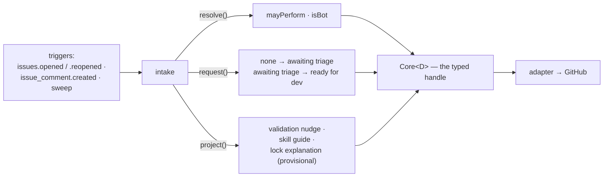
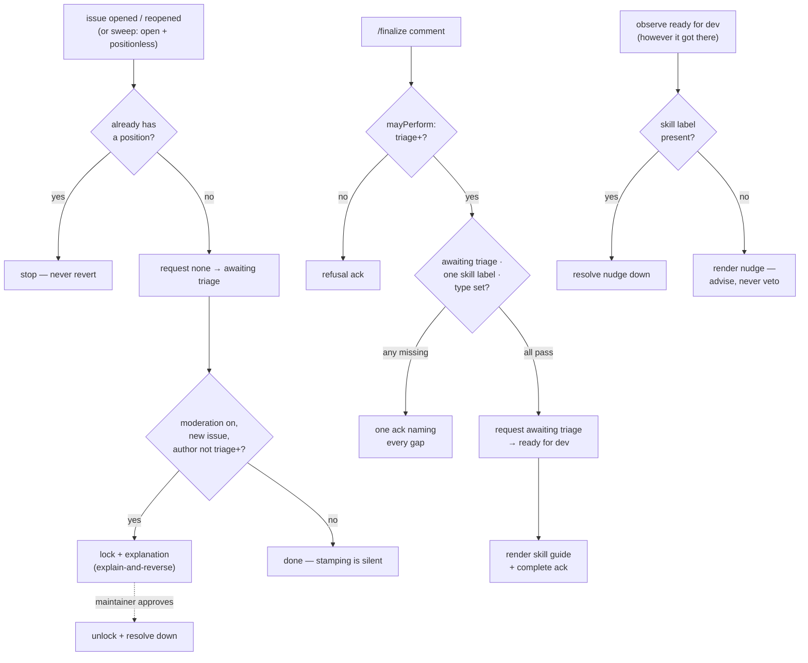

# intake: every new issue enters labeled, and the pool gets filled

> Spec for the `intake` module. Status: **draft** — catalogue-level, written from the audit
> (C++ `/finalize`, `audit/services-cpp.md` §10; Python moderation/approval,
> `audit/services-python.md`) to inform Q2 and ratification; re-worked against
> `TEMPLATE.md` before build. The contract it implements is `design/modules/contract.md`.

## 1. The job

Without intake, every new issue sits unlabeled until a maintainer notices it, and the
`ready for dev` pool fills only by hand. Intake stamps each new issue `awaiting triage` and gives
maintainers `/finalize` — one command that validates the triage (skill label present, type set) and
promotes the issue into the pool. One outcome: **the pool is fed, and only validly-triaged issues
reach it.**

## 2. The declaration

```ts
{
  name: 'intake',
  config: { moderation: 'boolean (default false)' },   // the lock — ships only if Q2 says so
  consumes: ['awaiting triage'],
  transitions: [
    { from: 'none', to: 'awaiting triage' },           // positionless entry — the producer edge
    { from: 'awaiting triage', to: 'ready for dev' },
  ],
  resolvers: ['mayPerform', 'isBot'],
  triggers: ['issues.opened', 'issues.reopened', 'issue_comment.created', 'sweep'],
}
```

The declaration, drawn — this module's **entire** view of the core; anything not shown is
inexpressible through its typed handle:



## 3. Behaviour

- **On observing a new or reopened issue with no position** (event or sweep — a reopened issue is
  positionless after close hygiene): request `none → awaiting triage`, cause = the opened/reopened
  event. Idempotent; a hand-placed position wins (never-revert).
- **On `/finalize`** from an actor `mayPerform('finalize')` allows (triage and up): validate —
  exactly one `skill:` label, issue type set (Bug/Feature/Task via native field). Pass → request
  `awaiting triage → ready for dev`, cause = the command comment. Fail → refusal ack naming what is
  missing; no state change.
- **On observing hand-placed `ready for dev` with no `skill:` label**: advise, never veto
  (`design/core/manual-edits.md` §2) — one validation-nudge projection; the state stands.
- **Moderation lock** *(provisional — ships only if Q2 keeps it)*: on issue opened, lock the
  conversation with an immediate explanation comment; a maintainer's approval (label edit or
  `/finalize`) unlocks. Event-triggered preventive → explain-and-reverse, per
  `design/core/safety.md` §1.
- **Manual-mode story** (intake alone): the repo gets auto-stamped new issues and the `/finalize`
  gate, nothing else. With intake *off*, maintainers hand-label `ready for dev` directly — that is
  the designed fallback, not a degraded mode.

**The skill guide survives; the body edit does not.** C++ `/finalize` rewrote the issue title with
a skill prefix and prepended level-appropriate boilerplate to the body (what a good-first-issue
expects of you, how to claim it, where to ask — `audit/services-cpp.md` §10). That content is
genuinely valuable onboarding documentation and is **kept** — but as a **skill-guide projection**
(a posted comment, level-appropriate, rendered by the core) instead of an edit of the
human-authored body: the app never rewrites a person's text, and the comment can be re-rendered
when the skill label changes, which a body-prepend never could. The title's skill prefix stays
dropped — it duplicated the label (one source of truth); browsing by skill is the label's job.
Ratifiers can overturn either half.

### 3.1 Step by step

The flows in one picture; the numbered steps below are authoritative for detail:



#### Flow A — new-issue stamping

1. Trigger: `issues.opened` or `issues.reopened` webhook, or the sweep observing an open,
   positionless, non-blocked issue (the sweep is the missed-webhook backstop).
2. Coherence is already classified by the core; blocked or quarantined items were never dispatched.
3. The issue already carries a position (an issue-form template applied one, or a human beat the
   bot to it) → stop. The state is legitimate; never-revert applies.
4. Request `none → awaiting triage`; `expect` = the positionless observation; `cause` = the
   opened/reopened event.
5. Outcomes:
   - `applied` → done. Stamping is silent — no comment; the label is the message.
   - `already` → done (webhook + sweep both fired; idempotency absorbed it).
   - `refused: stale` → someone placed a position mid-flight; re-observe, land in step 3, stop.
   - `unknown` → nothing; the next sweep re-observes and completes.

#### Flow B — moderation lock *(provisional — ships only if Q2 keeps it)*

1. Precondition: `moderation: true` and Flow A just stamped a genuinely new issue
   (`opened`, not `reopened` — re-locking an issue with history is noise; see §8).
2. `mayPerform(author, 'bypass-moderation')` — triage and up are exempt: the app must not lock its
   own maintainers' issues.
3. Lock the conversation and render the explanation projection in the same pass (event-triggered
   preventive: explain-and-reverse, `design/core/safety.md` §1). The explanation names the exit —
   "a maintainer approves and this unlocks."
4. Crash between lock and explanation → the sweep observes a locked issue with no app marker and
   renders the missing explanation (idempotent repair).
5. On observing approval — a maintainer's `/finalize`, or a hand edit to `ready for dev` — unlock
   and resolve the explanation down to its one-line note.

#### Flow C — `/finalize`

1. Comment created on an issue; the shell has already filtered bots (`isBot`) and per-actor
   budgets; blocked and quarantined items are never dispatched.
2. Parse: exact `/finalize`, case-insensitive. Near-miss (`/finalise`, `/finalize!`) → corrective
   command ack, stop.
3. Write the pending command record; ack reaction (👀) on the comment (D27 — from here a crash is
   recoverable).
4. `mayPerform(actor, 'finalize')` — triage and up. Fail → refusal ack ("this command needs triage
   permission"), stop.
5. Validate, cheapest first, **collecting all failures** (one ack listing everything beats three
   round-trips):
   - position is `awaiting triage` — a hand-moved issue is already past this gate; refuse with
     "already `ready for dev`, nothing to do";
   - exactly one `skill:` label present;
   - issue type set (Bug/Feature/Task — native field).
6. Any failure → one refusal ack naming each gap and its one-line fix, stop.
7. Request `awaiting triage → ready for dev`; `expect` = the observed state; `cause` = the command
   comment (dated).
8. Outcomes:
   - `applied` → render the **skill guide** for the issue's rung; complete the command ack.
   - `already` → ack "was already done".
   - `refused: stale` → re-observe once, retry once, then ack the truth.
   - `unknown` → ack "in progress, will confirm"; the sweep completes it from the pending record.

#### Flow D — the hand-set nudge

1. Observe `ready for dev` (label webhook or sweep) — however it got there.
2. A `skill:` label is present → resolve any standing nudge down (the gap closed), stop.
3. No `skill:` label → render the validation-nudge projection. **No state change** — advise, never
   veto (`design/core/manual-edits.md` §2).
4. Identical nudge already rendered → no write (churn-free).

#### Flow E — reopen

1. The issue was stripped of its position by close hygiene at close (`design/core/taxonomy.md`
   §2.3) — a reopened issue arrives positionless by construction.
2. `issues.reopened` enters Flow A step 1; reopened issues skip Flow B (step B1).
3. A human may instead hand-place any position on the reopened issue first — Flow A step 3 yields
   to them.

### 3.2 Bug surface — what to test for

- **Double `/finalize`** (two maintainers, seconds apart): serializer + `expect` → one `applied`,
  one `already`. Both get truthful acks.
- **Issue-template auto-labels**: an issue form that applies `skill:` labels at creation must not
  confuse Flow C step 5's "exactly one" (two forms → two labels → refusal is *correct*, but the
  ack must say which to remove).
- **Reopen race**: reopened issue observed by sweep before the reopen webhook → both paths request
  the same stamp; idempotency absorbs it.
- **`/finalize` immediately after hand-placing `ready for dev`**: refusal must read as "nothing to
  do", not as an error — the manual path is legitimate (never-revert).
- **Missing business logic to decide**: does `/finalize` *validate* the skill label matches issue
  difficulty? (No — that judgment is the triager's; the bot checks presence, not correctness.)
  Does the moderation lock apply to issues opened by maintainers? (Proposed: `mayPerform` exempts
  triage-and-up — locking your own maintainer's issue is noise.)

## 4. Safety

One provisional row (already in `design/core/safety.md` §2): **lock a new issue pending approval** —
event-triggered preventive, immediate + explanation, reversal = maintainer approves (unlock +
`awaiting triage`). If Q2 drops the lock, this module has no destructive action.

## 5. Projections

Two kinds:

- **Validation nudge** (one per item): what was observed (e.g. "`ready for dev` with no skill
  label") · what awaits (nothing — advisory) · the remedy ("add one `skill:` label").
- **Skill guide** (one per item, rendered on successful `/finalize`): the level-appropriate
  onboarding content the old body-prepend carried — what this rung expects, how to claim
  (`/assign`), where to ask for help. Re-rendered if the `skill:` label changes; resolved down
  never (it stays useful for the life of the issue).

The `/finalize` refusal ack is the core's command-ack kind, not module content.

## 6. Config knobs

- `moderation` (default `false`): repos with heavy drive-by spam lock new issues until approved;
  repos courting first-time contributors would never lock. A genuine either/or — and the knob only
  exists if the lock ships at all (Q2).

No other knobs: what `/finalize` validates is the taxonomy's business, not per-repo preference.

## 7. Tests beyond the kit

Reopened-issue re-entry (close hygiene → positionless → re-stamped); `/finalize` against each
missing-precondition case; the nudge appears once and resolves down when the skill label lands;
moderation on/off toggle leaves approval-by-hand working.

## 8. Open questions

- Whether the lock ships (Q2 — decided with the module set).
- Whether dropping the title-rewrite survives ratification (maintainers liked the uniform titles).
- Python's triage-review-request ping (a comment tagging the triage team on beginner PRs) — here, in
  notifications, or dropped.
