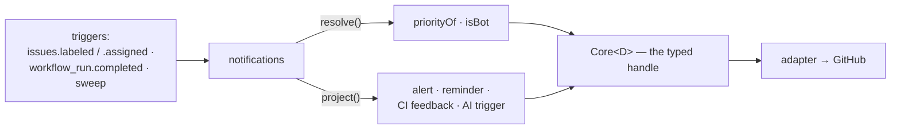
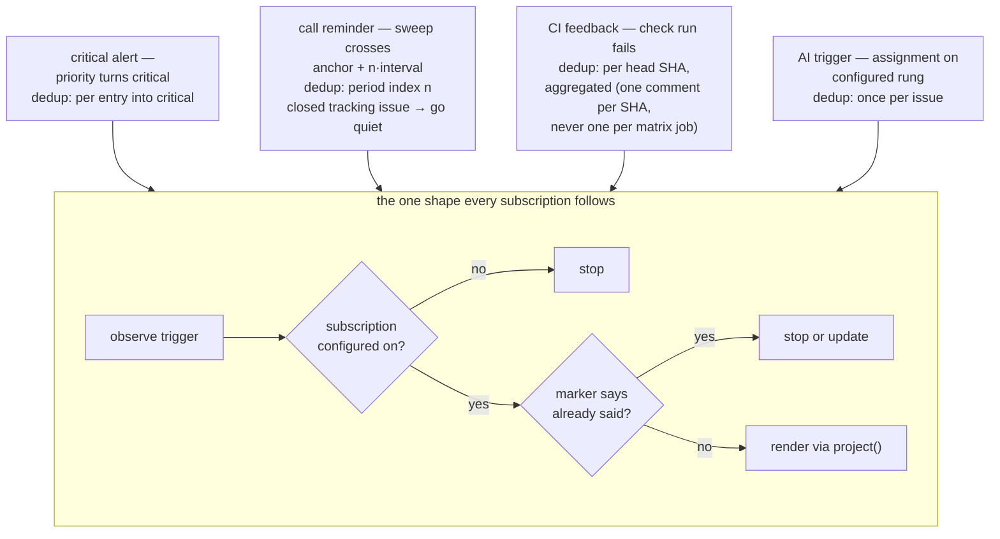

# notifications: the module that only ever speaks

> Spec for the `notifications` module. Status: **draft** — catalogue-level, written from the audit
> (Python's alert/reminder crons and CodeRabbit triggers, `audit/services-python.md`; the JS SDK's
> Slack notifiers, `audit/services-js.md`) to inform Q2 and ratification; re-worked against
> `TEMPLATE.md` before build. Zero state, zero destructive actions — the cheapest module to ship
> and the natural home of every future "just tell someone" ask, including AI hooks.

## 1. The job

Without notifications, the humans who should hear about something hear about it late: a critical
issue waits for someone to look, the fortnightly call goes unannounced, a failed check sits
unexplained on a first-timer's PR. Notifications turns configured events and schedules into
comments that tag the right people. One outcome: **the right humans hear about the right events
without watching the firehose.**

## 2. The declaration

```ts
{
  name: 'notifications',
  config: {
    criticalAlert:  'boolean (default true)',     // priority-critical issues tag the team
    callReminders:  '{ anchorDate, intervalDays, targets } | absent',
    ciFeedback:     'boolean (default false)',    // failed-check explainer on PRs
    aiTriggers:     '{ onAssign: boolean } | absent',   // e.g. @coderabbitai plan
  },
  consumes: [],                                   // events and clocks only — no state read
  transitions: [],                                // none, ever — this module cannot touch state
  resolvers: ['priorityOf', 'isBot'],
  triggers: ['issues.labeled', 'issues.assigned', 'workflow_run.completed', 'sweep'],
}
```

The declaration, drawn — this module's **entire** view of the core; no `request()` arrow exists —
this module *cannot* touch state, by type:



## 3. Behaviour

- **Critical alert**: on observing `priorityOf(issue) == critical`, one deduped comment tagging
  `core.teams.maintainers`.
- **Call reminders**: sweep-clocked from `anchorDate` every `intervalDays` (Python's two fortnightly
  crons collapse into one mechanism with two config entries).
- **CI feedback**: on a failed check run on a PR, one comment explaining which check failed and
  where to look. The old system matched **7 workflows by exact name string** — a rename silently
  killed it (`audit/services-python.md` appendix C). Here the trigger is the check-run event itself;
  no name list exists to drift.
- **AI triggers**: on assignment, post the configured AI invocation (e.g. `@coderabbitai plan`) —
  the goals' "AI should be complementary" hook, as config rather than architecture.
- **Manual-mode story**: fully standalone by construction — it consumes no state, so there is
  nothing to hand-produce. It is also the perfect *second* module through the kit: it exercises
  triggers, config, and projections while touching no state machine.

Not carried over: the JS SDK's **Slack** notifiers. The app's voice is GitHub comments; an outbound
Slack integration is a new egress surface (webhook secrets, delivery failure modes) with no
in-repo audit trail — parked in §8, not smuggled into v1.

### 3.1 Step by step

Every subscription is the same shape — observe, dedup by marker (the projection's own marker is
the memory; there is no store), render through `project()` — but each has its own flow:



#### Flow A — critical alert

1. Trigger: `issues.labeled` / field change, or sweep; `priorityOf(issue)` resolves critical.
2. Subscription off (`criticalAlert: false`) → stop.
3. A critical-alert marker for this *entry into critical* already exists → stop (one alert per
   entry; a re-escalation after a downgrade is real news and gets a fresh one).
4. Render: what was observed ("this issue is `priority: critical`") · what was done ("tagged
   `core.teams.maintainers`") · no remedy line (the tag *is* the action).

#### Flow B — call reminders

1. Trigger: sweep only. Compute the period index `n = floor((now − anchorDate) / intervalDays)`.
2. No `callReminders` block → stop.
3. The tracking thread already carries a marker with period index `n` → stop. The integer index,
   not the date, is the dedup key — DST and year boundaries cannot skip or double a reminder.
4. The tracking issue is closed → go quiet + one health-issue note (a closed tracking issue is a
   human opt-out gesture — class-5 spirit).
5. Render/update the reminder on the tracking thread with marker index `n`.

#### Flow C — CI-failure feedback

1. Trigger: a check run concluding `failure` on an open PR. Subscription off → stop.
2. PR author `isBot` → stop (dependabot does not need consoling).
3. Aggregate: collect all failed checks for the PR's current **head SHA** before rendering — a
   12-job matrix failing is one comment naming the first failure and counting the rest, never
   twelve comments.
4. A feedback marker for this head SHA exists → update it (another job failed) rather than post.
   A new push (new SHA) legitimately re-notifies.
5. Render: which check failed · the log link · one line on where to start.

#### Flow D — AI triggers

1. Trigger: `issues.assigned` on a rung the `aiTriggers` config names. Block absent → stop.
2. An AI-trigger marker on the issue exists → stop (one invocation per issue).
3. Render the configured invocation comment (e.g. `@coderabbitai plan`) — echo policy applies to
   it like any projection (`operations/threat-model.md` §3.2).

### 3.2 Bug surface — what to test for

- **Priority flapping** (critical → high → critical): one alert total or one per entry? Proposed:
  one per entry to critical, deduped within an entry by marker — a re-escalation is real news.
- **Period arithmetic**: DST shifts and year boundaries must not skip or double a reminder — the
  period *index* (integer since anchor), not the date, is the dedup key.
- **Check-run storms**: a 12-job matrix failing → one comment naming the first failure and
  counting the rest, not twelve comments — aggregate by head SHA before rendering.
- **Missing business logic to decide**: does CI feedback fire for bot-authored PRs (dependabot)?
  Proposed no (`isBot`). Do reminders post when the tracking issue is closed? (Re-open it, create
  anew, or go quiet — proposed: go quiet + health-issue note; a closed tracking issue is a human
  opt-out gesture, class-5 spirit.)

## 4. Safety

None — comments only. (The per-actor reply rate-limits of
`operations/threat-model.md` §3.1 apply to it like every projection: the module that only speaks
must never become the amplifier.)

## 5. Projections

One per kind per item, all three-part: what was observed ("this issue is `priority: critical`") ·
what was done ("tagged the maintainer team") · remedy where one exists (the failing check's log
link). Reminders render on a well-known thread (the call's tracking issue) updated in place.

## 6. Config knobs

Every block above is a knob, and every one passes the either/or test trivially — these are
*subscriptions*, and repos genuinely subscribe differently. This is the one module whose config is
mostly toggles, and that is its nature, not a smell: each toggle is a whole notification, not a
behaviour switch inside one.

## 7. Tests beyond the kit

Dedup (the same critical label observed twice → one comment); anchor-date arithmetic across DST and
year boundaries; check-run feedback on a fork PR (permissions); reminder thread re-render is
idempotent.

## 8. Open questions

- **Slack/off-GitHub egress**: out for v1; if demanded, it enters as an adapter-level capability
  with its own threat-model row, never a module-private HTTP call.
- Python's GFI-candidate and triage-review pings — here as two more subscription knobs, or retired
  (usage evidence thin in the audit). Decided with the migration mapping.
- Whether `ciFeedback` needs `checks:read` added to the permission set — verify at build; if yes,
  it goes through the permission-promise gate (`design/modules/contract.md` §6) rather than quietly.
