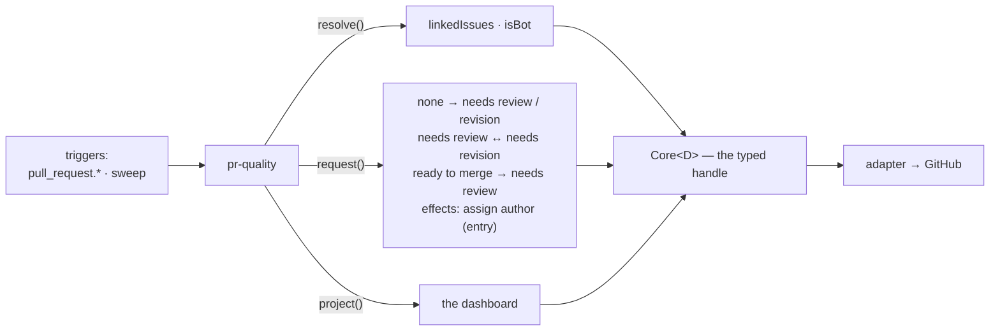
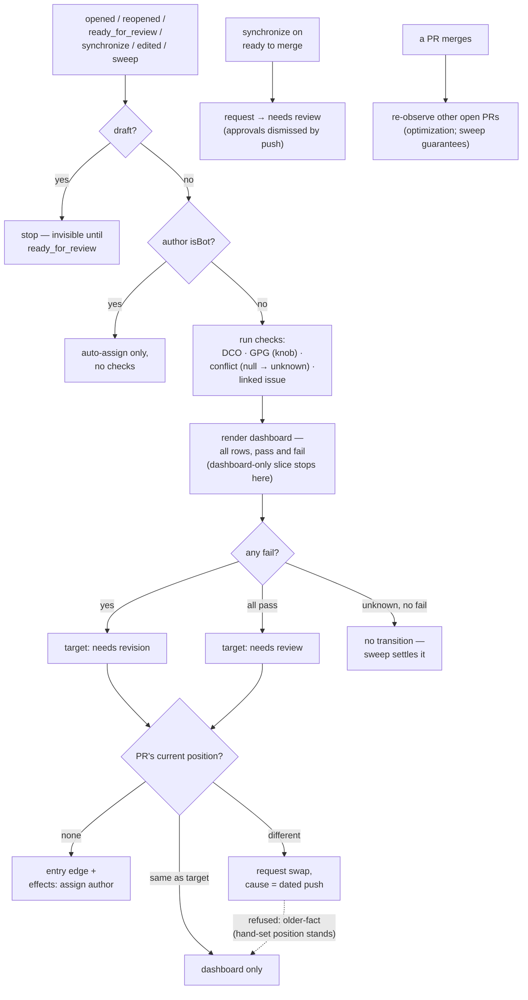

# pr-quality: the checks and the dashboard — a PR's first contact

> Spec for the `pr-quality` module. Status: **draft** — catalogue-level, written from the audit
> (C++ PR Open/Update Checks + dashboard, `audit/services-cpp.md` §1–2, §6; Python's linked-issue
> enforcer, `audit/services-python.md`) to inform Q2 and ratification; re-worked against
> `TEMPLATE.md` before build. Fully self-contained on the PR side — the recommended first module,
> and it ships in **two slices** (`design/build-plan.md`, module build order): first
> *dashboard-only* — Flow A alone, reads and one comment, **no transitions declared** — then the
> full module once the dashboard has run clean in front of real PRs. The dashboard-only slice's
> declaration simply omits the `transitions` entries; the kit derives correspondingly fewer cases,
> which is the contract working as designed.

## 1. The job

Without pr-quality, every PR needs a maintainer to check the boring things — DCO sign-off, merge
conflicts, a linked issue — before review can even start, and the author finds out piecemeal.
pr-quality runs the checks on open and on every push, posts one dashboard, and places the PR in
`needs review` or `needs revision` accordingly. One outcome: **a reviewer opening a PR knows the
mechanical hygiene is already settled.**

## 2. The declaration

```ts
{
  name: 'pr-quality',
  config: { checks: { gpg: 'boolean (default false)' } },
  consumes: ['needs review', 'needs revision', 'ready to merge'],
  transitions: [
    { from: 'none', to: 'needs review' },            // entry, checks pass
    { from: 'none', to: 'needs revision' },          // entry, checks fail
    { from: 'needs review', to: 'needs revision' },  // checks fail on push
    { from: 'needs revision', to: 'needs review' },  // push + re-check pass
    { from: 'ready to merge', to: 'needs review' },  // new commits dismiss approvals
  ],
  resolvers: ['linkedIssues', 'isBot'],
  triggers: ['pull_request.opened', 'pull_request.reopened', 'pull_request.ready_for_review',
             'pull_request.synchronize', 'pull_request.edited', 'pull_request.closed', 'sweep'],
}
```

The declaration, drawn — this module's **entire** view of the core; anything not shown is
inexpressible through its typed handle (the dashboard-only slice drops the `request()` arrow
entirely):



## 3. Behaviour

- **The checks**, re-derived on every trigger: DCO sign-off per non-merge commit; merge-conflict
  (`mergeable`, tolerant of GitHub's `null`-while-computing — the audit's famous mock gap,
  `audit/testing-cpp.md`); linked issue via `linkedIssues` (closing references only — a PR without
  a closing keyword is simply not linked, and the dashboard is where the author learns the
  keyword); GPG only if the knob is on.
- **On observing a non-draft PR with no position**: all checks pass → request
  `none → needs review`; any fail → `none → needs revision`. Drafts are invisible (the
  `needs review` invariant excludes them); `ready_for_review` is the entry event.
- **On push/edit**: re-run, request the swap only when the outcome *changed* — cause = the dated
  push, which is what lets the newer-fact rule protect a maintainer's hand-set `needs revision`
  from polite re-assertion (`design/core/manual-edits.md` §4).
- **On observing a merge** (sibling effect): other open PRs' conflict state is stale; the sweep
  re-derives naturally. The C++ event-driven sibling recheck becomes an *optimization* — on
  `pull_request.closed(merged)`, re-observe open PRs — not a correctness mechanism.
- **Auto-assign the author** on entry (C++ behaviour): `effects: { assign: author }` rides the
  entry transition — the A3 pair moves as one.
- **Manual-mode story** (pr-quality alone, nothing else on): PRs get the dashboard and
  `needs review`/`needs revision` placement; a repo with no issue automation at all still gets
  working PR hygiene. This is the module that gives the JS SDK its first real value.

Not carried over: Python's **close-a-PR-with-no-linked-issue enforcer** — closing someone's PR for
a missing link is a destructive act out of proportion to the offence; the dashboard states the gap
and review-routing's humans decide. Ratifiers can overturn (then it needs a safety row and a warn
period, not day-one closure).

### 3.1 Step by step

The flows in one picture; the numbered steps below are authoritative for detail:



#### Flow A — the check pipeline (shared by every flow below)

1. Fetch the PR's commits (paginate — 100+-commit PRs exist) and its live `mergeable` state.
2. Run each check, producing `{pass | fail | unknown, detail}`:
   - **DCO** — every non-merge commit's message carries a valid `Signed-off-by`;
   - **GPG** (knob on) — every commit `verification.verified`;
   - **Conflict** — `mergeable`; GitHub returns `null` while computing → re-read with backoff up
     to N; still `null` → `unknown`, and the dashboard says "still checking". **Never fail on
     unknown** — the audit's hand-written mock famously never returned `null`; the real API does;
   - **Linked issue** — `linkedIssues(pr)` non-empty; the detail includes the closing-keyword hint
     when empty ("add `Fixes #123` to the description").
3. Hand the dashboard content to `project()` — all four rows, every render, pass *and* fail (a
   pass-only dashboard teaches nobody what is checked). Identical content → no write.
4. Decide the target position:
   - any `fail` → `needs revision`;
   - all `pass` → `needs review`;
   - any `unknown` and no `fail` → **no transition** — never move a PR on facts not yet known; the
     sweep settles it.

#### Flow B — entry (`opened`, `reopened`, `ready_for_review`)

1. Draft → stop; drafts are invisible (`needs review`'s invariant excludes them), and
   `ready_for_review` is their entry event.
2. Author `isBot` → skip the checks; auto-assign still applies (even bot PRs get an owner — the
   C++ behaviour, pending §8's ratification question).
3. Run Flow A.
4. Request the entry edge — `none → needs review` or `none → needs revision` per A4 — with
   `effects: { assign: author }` riding it (the A3 pair moves as one); `cause` = the opened event.
5. Outcomes: `applied` / `already` → done. `refused: stale` → a human placed a position mid-flight;
   the dashboard stands, the position is theirs. `unknown` → the sweep re-enters this flow.

#### Flow C — re-check (`synchronize`, `edited`)

1. `edited` with neither body nor base change → stop (a title edit changes no check). A base
   change → re-run the conflict check only.
2. `synchronize` (new push): run Flow A in full.
3. The outcome equals the current position's implication → dashboard updated, no transition
   (churn-free).
4. The outcome *changed* → request the swap (`needs review ↔ needs revision`), `cause` = the dated
   push/edit — the dated fact is what lets a *push* legitimately re-assert `needs review` over a
   maintainer's older hand-set `needs revision`, and nothing else can (newer-fact rule).
5. Outcome `refused: older-fact` → the human's edit is newer; dashboard updates, position stands,
   telemetry counts it as normal (see §3.2).

#### Flow D — approvals dismissed (`ready to merge` → `needs review`)

1. On `synchronize` observing position `ready to merge`: new commits dismissed the approvals that
   justified it.
2. Request `ready to merge → needs review`, `cause` = the push. (This edge is this module's
   because the *push* is the fact — review-routing re-derives the approval state afterward and
   may re-promote.)
3. Then continue as Flow C.

#### Flow E — merge ripple (`closed` with `merged == true`)

1. The merged PR itself: close hygiene (the core's) strips its position; this module does nothing
   to it.
2. Enumerate the other open non-draft PRs (bounded page, paced by the adapter's write pacer).
3. Each whose recorded conflict state could have flipped runs Flow A + Flow C semantics.
4. This flow is an **optimization** — the sweep is the correctness guarantee; if the ripple is
   shed under backpressure, nothing is wrong, only later.

#### Flow F — sweep reconciliation

1. Enumerate open non-draft PRs; positionless ones → Flow B semantics (a missed `opened` webhook
   heals here); positioned ones → Flow C semantics with the sweep as trigger.
2. `unknown` check results from previous passes are re-derived — this is where "still checking"
   resolves.

### 3.2 Bug surface — what to test for

- **`mergeable: null`** — the recorded-fixture case. Poll budget, backoff, and the `unknown`
  rendering all need real-traffic fixtures, not hand-written ones.
- **Synchronize storms**: a contributor force-pushes 5 times in a minute → serializer coalesces
  per item, the dashboard renders once with the final state, and the write pacer absorbs the rest.
  No transition flip-flop mid-storm (each request's `expect` is re-checked).
- **The hand-set override loop** (the newer-fact rule's reason to exist): maintainer hand-sets
  `needs revision` on a green PR → every sweep re-derives "all pass" → every request refused
  `older-fact` → **telemetry must not read this as an error storm**; it is the design working.
  A new *push* is a newer fact and legitimately re-asserts `needs review`.
- **Fork PRs**: all reads are upstream-side (`contents:read` on the fork is absent). DCO/GPG read
  the PR's commit objects via the API — works; anything needing a checkout does not exist here by
  design.
- **Missing business logic to decide**: does the linked-issue check require the *author* to be
  assigned to the linked issue (Python enforced this; C++ checked link-only)? Proposed: dashboard
  states the mismatch ("linked issue is assigned to someone else") without failing the check —
  review-routing's humans judge. Base-branch edits (`edited` + base change) → re-run conflict
  check only.

## 4. Safety

None — nothing destructive. The status swap is reversible by hand; the never-revert rule protects
the hand that swaps back.

## 5. Projections

One **dashboard** per PR: each check with its state · what changed since last render · the one-line
remedy per failing check ("add `Fixes #123` to the description"). Marker-keyed, updated in place,
resolved down when all checks pass.

## 6. Config knobs

- `checks.gpg` (default off): a security-sensitive repo requires signed commits; most repos accept
  DCO alone. Genuine either/or. DCO itself is not a knob — it is LFDT table stakes.

## 7. Tests beyond the kit

`mergeable: null` polling (the recorded-fixture case); entry with checks green vs red; hand-set
`needs revision` survives a sweep with green checks (newer-fact); draft → ready-for-review entry;
merge-triggered sibling re-observation; dashboard renders identically from event and sweep paths
(idempotent, no comment churn).

## 8. Open questions

- Whether the JS SDK's conventional-title gate (its one live PR check) folds in here as a second
  knob or stays a repo-local Action — leaning knob, decided with the JS migration mapping.
- Whether auto-assign-the-author survives ratification (it is C++-only behaviour; Python assigns
  reviewers instead — see review-routing).
