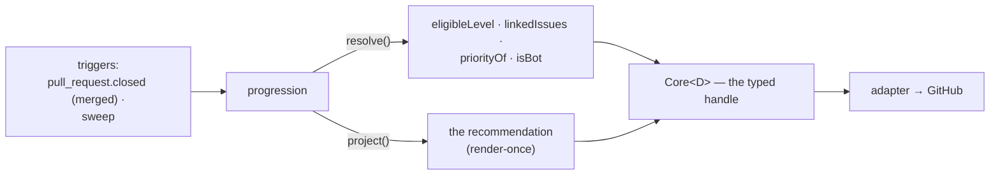
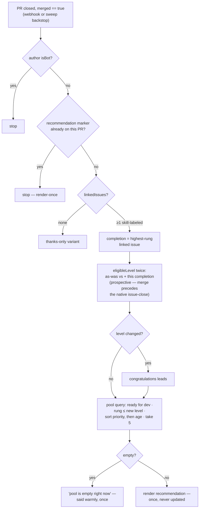

# progression: the merge is celebrated, and the next step is offered

> Spec for the `progression` module. Status: **draft** — catalogue-level, written from the audit
> (C++ post-merge recommendation + milestone, `audit/services-cpp.md` §5; Python next-issue
> recommendation, `audit/services-python.md`) to inform Q2 and ratification; re-worked against
> `TEMPLATE.md` before build. 🟢 in both audited SDKs.

## 1. The job

Without progression, a contributor's merged PR ends with silence: no acknowledgement, no "you've
unlocked the next level," no pointer at what to do next — and retention is exactly the moment after
a first merge. Progression watches merges, detects level-ups, and recommends next issues from the
pool. One outcome: **every merge ends with a next step in hand.**

## 2. The declaration

```ts
{
  name: 'progression',
  config: {},                                   // none — see §6
  consumes: ['ready for dev'],                  // reads the pool; requests nothing on it
  transitions: [],                              // recommendations only — no state
  resolvers: ['eligibleLevel', 'linkedIssues', 'priorityOf', 'isBot'],
  triggers: ['pull_request.closed', 'sweep'],   // acts on merged == true
}
```

The old post-merge **status-label strip is not here**: it is the core's close hygiene now
(`design/core/taxonomy.md` §2.3) — no module strips anything.

The declaration, drawn — this module's **entire** view of the core; note the missing `request()`
arrow — this module *cannot* touch state, by type:



## 3. Behaviour

- **On observing a merge** of a non-bot PR: resolve the linked issues; if one carries a `skill:`
  rung, resolve the author's `eligibleLevel` before and after this completion.
- **Level-up detected** → the congratulations block leads the projection.
- **Recommend**: from the `ready for dev` pool (unassigned by invariant), filter to rungs the
  author may now take, sort by `priorityOf`, offer up to 5. Empty pool → say so, warmly, once.
- **Manual-mode story** (progression alone): it reads whatever `ready for dev` issues exist —
  hand-labeled or not — and recommends after any merge. Nothing upstream is required; an empty pool
  just means quiet recommendations.

Not carried over as-is: **milestone assignment on merge** (C++-only). It writes a native field,
which no declaration field expresses — and the audit shows it entangled with the old label strip.
Parked in §8 rather than smuggled in.

### 3.1 Step by step

The flows in one picture; the numbered steps below are authoritative for detail:



#### Flow A — a PR is merged

1. Observe a `closed` PR with `merged == true` (webhook or sweep). Author `isBot` → stop.
2. An already-rendered recommendation marker exists for this PR → stop. Render-once; the marker,
   not memory, absorbs event redelivery and restarts.
3. `linkedIssues(pr)`:
   - none → render the thanks-only variant, stop;
   - several → take the highest-rung skill-labeled one as "the completion";
   - none skill-labeled → thanks-only variant, stop.
4. Resolve `eligibleLevel(author)` twice — as-was, and **counting this completion prospectively**.
   The merge event routinely arrives before GitHub's native issue-close is observable, so the
   resolver must accept an explicit "plus this one" argument, or every level-up fires one merge
   late (the C++ bot solved exactly this; losing it is the classic reimplementation regression).
5. The two levels differ → the congratulations block leads the projection.

#### Flow B — building the recommendation

1. Query the pool: open issues in `ready for dev` — unassigned by invariant — with a `skill:` rung
   ≤ the author's (new) eligible level.
2. Sort: `priorityOf` first, then oldest-first (age breaks ties toward neglected issues).
3. Take up to 5. An empty result is content too: "the pool is empty right now — watch
   `ready for dev`," said warmly, once.
4. Hand one dated recommendation projection to the core, rendered on the merged PR's thread:
   congratulations (if earned) · the up-to-5 issues with rungs · how to claim (`/assign`).
5. Rendered once, never updated — a recommendation is a moment-in-time message (the render-once
   exception argued in §5).

#### Flow C — sweep backstop

1. The sweep observes recently merged PRs (activity-bounded window) with no recommendation marker
   → enter Flow A at step 1. A missed merge webhook costs latency, never the message.

### 3.2 Bug surface — what to test for

- **The prospective-count regression** (Flow A step 4) — the kit needs a fixture where the
  issue-close webhook arrives *after* the merge observation.
- **Redelivered merge events** → the marker dedup (Flow A step 2), not memory, is the guard
  (restarts).
- **Multiple PRs closing one issue** (the seam table allows it): the completion credits once —
  `eligibleLevel`'s counting query must be issue-based, not PR-based.
- **Missing business logic to decide**: does a completion count when the merged PR's author was
  never assigned to the linked issue? (Q3's definition decides; proposed merged-PR-close only,
  assignment not required — drive-by fixes are still fixes.) Cross-repo recommendations when the
  local pool is thin (Python's 5-tier ladder had a cross-repo tier): v1 stays repo-local; the
  org-wide ladder makes cross-repo a natural later knob.

## 4. Safety

None — comments only.

## 5. Projections

One **recommendation** per merged PR (rendered on the PR thread): the congratulations (with
level-up when earned) · up to 5 next issues with their rungs · how to claim (`/assign` on the
issue). Resolved down if re-rendered after the pool changes? No — it is a moment-in-time message;
rendered once, never updated (an exception to update-in-place worth stating: re-rendering a
recommendation as the pool shifts would churn forever; the projection is dated content).

## 6. Config knobs

None. The recommendation count (5) and sort are behaviour — no two reasonable repos answered them
differently in the audit; Python's 5-tier fallback ladder and C++'s priority sort merge into one
policy at build. A knob returns only if a real either/or emerges.

## 7. Tests beyond the kit

Level-up arithmetic at each rung boundary (2 GFI → beginner, etc., thresholds from org config);
merge with no linked issue (acknowledge, no recommendation); merge by a privileged actor (no ladder
talk — the ladder gates commands, not people); empty pool; cross-repo credit if the org-wide scope
ratifies (`design/core/resolvers.md` §3).

## 8. Open questions

- **Milestone-on-merge**: dropped, kept as a fourth declaration-field extension (native-field
  effects), or left as a repo-local Action? Leaning dropped-for-v1 — it is release bookkeeping, not
  contributor workflow. Decided at ratification.
- What counts as a completion for the ladder (merged-PR closes only? — `core/resolvers.md` §4,
  Q3) — consumed here, decided in the memo.
- Whether the render-once exception above amends `design/core/projections.md` §1 or recommendation
  content is defined as immutable-by-content. Cosmetic; settled at build.
