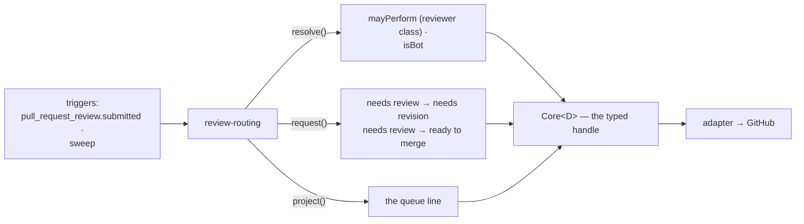
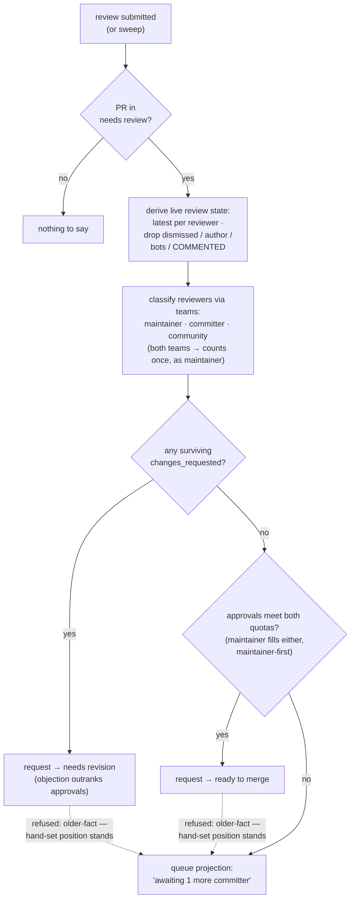

# review-routing: reviews become status, and the queue becomes visible

> Spec for the `review-routing` module. Status: **draft** — catalogue-level, written from the audit
> (C++ review label relay, `audit/services-cpp.md` §3–4; Python `review-sync` queue machine,
> `audit/services-python.md`) to inform Q2 and ratification; re-worked against `TEMPLATE.md`
> before build. **This spec owns Q6** (the `queue:` namespace) and proposes: derive, don't store.

## 1. The job

Without review-routing, a submitted review changes nothing an automation or a browsing contributor
can see — "changes requested" lives only in the review tab, and nobody knows which PRs await which
kind of reviewer. review-routing turns review events into status (`needs revision`,
`ready to merge`) and renders where each PR sits in the approval ladder. One outcome: **the review
state of every PR is legible at a glance, without a maintainer relabeling by hand.**

## 2. The declaration

```ts
{
  name: 'review-routing',
  config: { approvals: { committers: 'number (default 2)', maintainers: 'number (default 1)' } },
  consumes: ['needs review'],
  transitions: [
    { from: 'needs review', to: 'needs revision' },   // changes requested
    { from: 'needs review', to: 'ready to merge' },   // approval thresholds met
  ],
  resolvers: ['mayPerform', 'isBot'],
  triggers: ['pull_request_review.submitted', 'sweep'],
}
```

The old fork-safety relay (C++'s two-workflow artifact dance, `audit/services-cpp.md` §3–4)
dissolves: a hosted app's webhook handling is privileged by construction — the relay was an
Actions-era workaround, and none of it survives.

The declaration, drawn — this module's **entire** view of the core; anything not shown is
inexpressible through its typed handle:



## 3. Behaviour

- **On a `changes_requested` review** on a `needs review` PR: request
  `needs review → needs revision`, cause = the review. Approved/commented reviews trigger
  re-derivation, not a direct edge.
- **On sweep (or any review event), derive the approval state**: count approvals by reviewer class
  (committer/maintainer team membership via config `core.teams` + `mayPerform`). Thresholds met →
  request `needs review → ready to merge`. New commits dismissing approvals is pr-quality's edge
  (`ready to merge → needs review`), not this module's — each module owns the edges its own facts
  justify.
- **The queue, answered for Q6 — derived, never stored** *(proposed)*: Python's
  `queue: junior-committer / committers / maintainers` labels are a *display* of "whose approval is
  still missing," fully computable from the approval state plus config. Here that display is a line
  in a **projection**, not a label: the taxonomy's §8 discipline (a derivable fact is an answer,
  not a label) holds, the twelve-label set stays twelve, and the old `*/30` cron that existed to
  repair queue-label drift has nothing to repair. **Overturned by:** contributors demonstrably
  needing to *filter* by queue tier in GitHub's UI, which only labels can do — then the namespace
  enters by taxonomy amendment, not by this module quietly writing labels.
- **Manual-mode story** (review-routing alone): a maintainer hand-labels `needs review`;
  routing takes it from there. With routing *off*, reviews still work — maintainers just move
  labels by hand after reviewing.

Not carried over: Python's reviewer→assignee mirroring (requested reviewers copied into the
assignee field) — it duplicated GitHub's own review-request fact into a second field (one source
of truth).

### 3.1 Step by step

The flows in one picture; the numbered steps below are authoritative for detail:



#### Flow A — deriving the review state (shared)

1. Fetch the PR's **live** review set — never trust the triggering event's snapshot (the
   dismissal race: a review event can arrive before the `synchronize` that dismissed it).
2. Reduce to the latest review per reviewer.
3. Drop from the set: dismissed reviews · reviews by the PR author (self-review counts for
   nothing) · reviews by `isBot` actors · `COMMENTED` reviews (noise, by decision).
4. Classify each surviving reviewer via `core.teams` membership: maintainer, committer, or neither
   (community — welcome, counts toward no quota). A reviewer in both teams counts **once**, as
   maintainer.

#### Flow B — a review is submitted

1. Trigger: `pull_request_review.submitted` on a PR in `needs review` (any other position → this
   module has nothing to say; blocked → never dispatched).
2. Run Flow A.
3. Any surviving `changes_requested` → request `needs review → needs revision`, `cause` = that
   review. Stop — a standing objection outranks any approval count.
4. Else count approvals against `approvals.committers` and `approvals.maintainers` (a maintainer
   approval fills either quota, maintainer-first — §3.2's explicit ratification item).
5. Both quotas met → request `needs review → ready to merge`, `cause` = the latest qualifying
   approval.
6. Quotas not met → no transition; render the queue projection ("awaiting 1 more committer
   approval") and stop.
7. Outcomes: `applied` → queue projection resolves to its done state. `refused: older-fact` → a
   human hand-placed the position after these reviews; the projection still renders, the position
   stands. `refused: stale` → re-observe (pr-quality may have just moved it on a push); re-enter
   at step 1.

#### Flow C — sweep reconciliation

1. Enumerate open PRs in `needs review`; run Flow A + Flow B steps 3–7 for each (a missed review
   webhook heals here).
2. A PR whose derived state says `changes_requested` but whose position was hand-reset to
   `needs review` after that review: the hand edit is newer → refused, correctly — the maintainer
   overruled the objection, and re-requesting every sweep is the newer-fact rule's job to absorb
   silently.

#### Flow D — the queue projection

1. Rendered on every Flow B/C pass whose PR remains in `needs review`: the surviving approvals by
   class · which quota is still open · nothing to remedy (informational).
2. May share a rendered comment with pr-quality's dashboard — the **core** merges rendering;
   the modules stay strangers (each hands content, neither knows the other exists).
3. Identical content → no write; position leaves `needs review` → the projection resolves down.

### 3.2 Bug surface — what to test for

- **Stale-approval arithmetic**: approvals dismissed by a new push must vanish from step 2 before
  this module ever counts them — but the *dismissal race* (review event arrives before the
  synchronize event) means step 2 must read live review state, never trust the triggering event's
  snapshot.
- **A reviewer in both teams** counts once, at the higher class (maintainer) — decided here; the
  old Python cron double-counted.
- **`changes_requested` then the same reviewer approves**: latest-per-reviewer (step 2) makes the
  approval supersede — matches GitHub's own review model.
- **Team membership reads** are per-observation via resolver (memoized within the pass, D-resolver
  rules) — a member removed mid-day is seen next observation, never cached across passes.
- **Missing business logic to decide**: do `COMMENTED` reviews affect anything? (No — noise.) Does
  a maintainer approval also satisfy a missing *committer* approval (strict hierarchy vs distinct
  quotas)? Proposed: a maintainer approval counts toward either quota, greedily maintainer-first —
  the audit's Python cron implied hierarchy but never documented it. Ratify explicitly.

## 4. Safety

None — nothing destructive.

## 5. Projections

One **queue line** per PR (may merge into pr-quality's dashboard *rendering* — the core renders
both modules' content; the modules stay strangers): current approval state · which class's approval
is awaited · nothing to remedy (informational).

## 6. Config knobs

- `approvals.committers` / `approvals.maintainers`: a small repo merges on one maintainer approval;
  a large one wants two committers plus a maintainer. Genuine either/or — this is the one place the
  audited repos' policies actually differed by number.

## 7. Tests beyond the kit

Threshold arithmetic per reviewer class; approval-then-new-commits (this module's `ready to merge`
undone by pr-quality's edge — composition test); hand-set `needs review` consumed identically to
pr-quality's (manual-mode); derived queue rendering matches Python's cron output on recorded
fixtures (migration fidelity).

## 8. Open questions

- **Q6 is answered above as a proposal** — ratified with this spec; the overturn path is named.
- Whether `meta: open to community review` (human-applied invitation) gets a rendered nudge here or
  stays purely a browsing signal.
