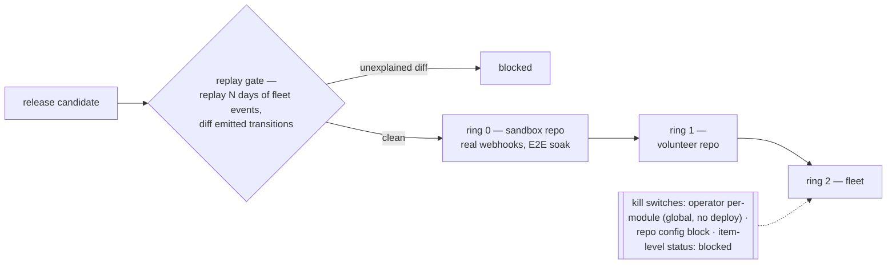

# Operations and Failure Loudness

> **Drafted for ratification.** The rest of the design describes the software; this describes the
> system in operation — who hosts it, how releases roll out, what the rate limits permit, and where
> every failure is heard. Written *before* the module contract is finalised because its conclusions
> change that contract's surroundings (§7). Positions are marked **proposed**. Numbers in §4 are
> order-of-magnitude, re-checked at build time; conclusions survive a 2× error.

## 1. The posture: the app must be safe to be down

> **Proposed.** The app may be down, slow, or restarted at any moment without loss or corruption.
> Downtime delays automation; it never breaks state.

This is the stateless reducer (`design/architecture.md` §4.1) plus the sweeper (§2) read as an availability
story: GitHub holds all state, missed webhooks heal on the next sweep, crashes are absorbed by
idempotency. Everything follows from it:

- **No pager.** Operator response time is business-hours; an outage costs a delay in labels moving.
- **Exactly one instance** *(proposed)* — the per-item serializer stays an in-process queue; a second
  instance would reintroduce the race it exists to kill. **Overturned by:** growth past §4's
  arithmetic, at which point the queue moves behind the shell, changing no module.
- **Restart is the recovery tool.** There is no state to reconcile.
- **Safe to shed, too:** the shell's queues are bounded — an event storm (a bulk-label import, 500
  webhooks at once) is shed past the bound and healed by the next sweep. Correctness never depends
  on processing any particular event (`threat-model.md` §3.4).
- **Uninstall is graceful.** Labels, comments, assignees all survive; maintainers continue by hand —
  the light-switch rule (`design/architecture.md` §7) at system level.
- Deliberately **not** built: HA, clustering, queue infrastructure, per-repo cadence tiers, new
  permission scopes. Each would be state or surface to operate, and §1 makes them unnecessary.

The one real-time expectation — a contributor watching their `/assign` — is answered by
acknowledgement (§5), not an availability target.

## 2. Who hosts, who operates

**The vehicle — hosted app, defended.** Against the alternative (org reusable workflows /
Actions-hosted):

| | Hosted app | Reusable workflows |
|---|---|---|
| per-item serializer | in-process, exact | impossible (Actions groups = the accidental mutex, lessons D2) |
| sweeper | first-class scheduler | best-effort cron, per repo |
| fork safety | structural — webhooks never run repo code; the relay class (B1) vanishes | rebuilt per the C++ contortion |
| cross-repo consistency | one deployment | version skew per repo |
| ops burden | one stateless container | zero services, N repos of YAML |

**Proposed:** hosted — *because* §1 shrinks its ops cost to near the workflows level. **Overturned
by:** no org-level operator being found; the fallback is reusable workflows, and the module contract
should know its vehicle before finalising. This is the largest way this document could still change
the design.

**The operator — an org role, never a person** *(proposed)*: LFDT/Hiero project infrastructure or a
TSC-owned account. The quantified ask: one small container, one secret store (App private key +
webhook secret — the key is the one secret whose leak is an incident, bounded by the three scopes),
log retention (§6), and a rotating **gardener** who checks the dashboard on business days and owns
releases. No on-call.

## 3. Rollout: replay gate, rings, kill switches

- **The replay gate** *(proposed)* is the purity payoff cashed in: the reducer is
  `(state, event, config) → transitions`, so every production decision replays offline from the
  decision log (§6). Regression testing against real traffic, no infrastructure, no risk. It joins
  `design/testing/README.md` as a layer.
- **Rings** are keyed by installation in the shell — one deployment, no per-repo versions. Promotion
  is soak-time plus zero unexplained alerts. Ring 0 is the E2E sandbox doing double duty.
- **Rollback safety** is the comment-metadata schema versioning (`design/architecture.md` §4): v(n) must read
  v(n+1), so schema changes are additive within a soak window.

## 4. The rate-limit arithmetic

The shaping fact: **an App installation is per-organisation, and the rate budget belongs to the
installation** — so every participating hiero-ledger repo draws on one shared budget (~5,000 REST
req/hr and ~5,000 GraphQL points/hr, scaling modestly with repo count). Not per-repo, as
`design/architecture.md` §10 first guessed.

To be precise about what "per-organisation" does and does not mean — **budget is org-level; consent
is repo-level, twice over.** A repo that wants nothing to do with the app is untouched: the org
installation is scoped to *selected repositories* (a repo outside the selection sends no webhooks
and grants no access at all), and inside the selection the config file is the real switch — no
config means safe defaults, and an absent module block means that module is off (`design/architecture.md` §3).
What repos *cannot* have is separate budgets: opting in means drawing on the shared installation
allowance, which is why cadence is fleet arithmetic (below) and not a per-repo knob. (Multiplying
budget by registering one app per repo is technically possible and rejected: N keys, N webhook
endpoints, N installations to garden — and §4's arithmetic shows it is unnecessary.)

The estimate, pessimistic: ~15 repos × ~200 open items = 3,000 items; a fleet sweep ≈ 30 GraphQL
pages ≈ **≤150 points** → hourly sweeps use ~3% of budget, 10-minute sweeps ~18%. Hourly is
*sufficient*: webhooks are the fast path, the sweep is the backstop, and the slowest clock any module
runs is day-granular. Follow-up reads (timelines, linked PRs) apply only to items changed within the
interval — activity-bounded, a few percent. Writes are human-bounded; their real constraint is
GitHub's *secondary* burst limits.

The decisions this fixes:

1. **Budget enforcement lives in exactly one place: the adapter** — a global token bucket plus a
   write pacer (~1 mutation/sec sustained). Modules never see limits; their cost is *metered* at the
   core's resolvers, not declared (a fifth contract line was considered and rejected — it would break
   the four-declarations-for-four-tangles symmetry for something the core can measure itself).
2. **Sweep cadence is not a config knob** — derived from fleet arithmetic, jittered across repos.
   Joins `design/config/schema.md` §3's not-configurable list.
3. **Saturation degrades cadence, never correctness** (§1 makes that safe); sustained saturation is
   an operator alert.
4. **Overturned by:** the arithmetic failing >2× at build time — escape hatches in order: ETags in
   the adapter, longer cadence, then the owned store §4.1's overturn clause already prices in.

## 5. Failure loudness: every failure has exactly one audience

> **Proposed.** Every failure class is assigned one primary audience, on a channel that audience
> already watches. A failure class with no assigned audience is a design bug.

(The cure for the old system's grade-D silence, `audit/principles-review-cpp.md` §9.)

| Failure | Audience | Channel |
|---|---|---|
| config invalid (parse, schema, unknown module, bad `_extends`) | repo maintainers | PR comment at edit time + the health issue at runtime |
| slash command failed or refused | the commenter | reaction + reply comment |
| module refusal loop (contract bug) | developers | telemetry + decision log — never a repo comment (`design/core/manual-edits.md` §4) |
| incoherent manual state | repo maintainers | narration comment (`design/core/manual-edits.md` §5) |
| sustained budget saturation | operator (repo only if its cadence visibly degrades) | telemetry; health-issue line |
| webhook outage | operator | delivery-lag metric; sweeps heal meanwhile |
| poison item (processing crashes repeatedly) | operator | telemetry + skip; narrated only if a human is visibly waiting |
| GitHub 5xx | nobody (retry) → operator if sustained | adapter retry + telemetry |

The three repo-facing mechanisms, all inside the existing three scopes:

- **Config PR comment** — a PR touching `.github/hiero-automation.json` gets a marker-keyed
  validation comment: errors, or "valid; enables X, disables Y". (A check run would cost
  `checks:write`; rejected to keep the scope promise.)
- **One health issue** — an unhealthy installation has exactly one open app-authored issue
  ("Automation health"): what is wrong, what runs meanwhile, the one-line fix; closed by the app when
  clear. Degradation is scoped and loud: a broken module block disables that module; a broken top
  level runs safe defaults. Never last-known-good — there is no memory to be good from.
- **Command acks** — 👀 on intake (webhook, seconds), then ✅ or a reply explaining refusal. The
  reaction doubles as the processed-marker, so the sweep finds and runs un-acked commands after
  downtime — commands are durable with no store.

## 6. Telemetry, secrets, retention

The decision log — `(observed state, event, config slice) → transitions → adapter outcome` per
decision — is at once the debugging story (replay any behaviour offline), the release gate (§3), and
the audit trail `planning/goals.md` promises. Dashboard, readable in one glance: webhook lag, sweep
staleness, budget consumption vs §4, refusal rate per module, ack latency, per-ring deltas. Alerts
page nobody (§1); they mark the dashboard and, where §5's table says so, the health issue.

The app stores no repo data at rest; what remains is the two secrets (§2) and logs holding public
repo metadata, retained for the replay window only *(proposed: 30–90 days)*. Webhook signatures are
verified at intake before anything runs. The full adversarial pass — command griefing, content
injection through the app's voice, config as weapon, compromised accounts and keys — is
`design/operations/threat-model.md`.

## 7. The shape-changes this forces

1. **Adapter** (`design/architecture.md` §4): token bucket, write pacer, retry policy — budgets at the one
   door, nowhere else.
2. **Shell** (`design/architecture.md` §2): single instance explicit; sweep jitter; command 👀-acks and the
   un-acked-command scan.
3. **Projections** (`design/architecture.md` §4): three new kinds — health issue, config PR comment, command
   acks (the reaction-as-marker is the same sanctioned metadata carve-out as the safety engine's).
4. **Module contract** (`design/architecture.md` §5): *unchanged* — costs metered, not declared (§4).
5. **Config** (`design/config/schema.md` §3): cadence joins the not-configurable list.
6. **Tests** (`design/testing/README.md`): replay gate added; ring 0 = the E2E sandbox.
7. **Corrected:** the rate budget is per-org, not per-repo (`design/architecture.md` §10).

## 8. Open

- Where hosting concretely lands (LFDT infrastructure vs TSC cloud account) — a TSC decision; the
  ask is §2.
- The ring-1 volunteer repo and soak durations.
- Log retention length, set with the infrastructure owner.
- Whether sweep-path (late) commands warrant an apology line beyond the ack.
- Secondary-limit pacing numbers — measured at ring 0, not taken from docs.
- Whether ring membership is visible to repos (a health-issue line?) or stays operator-side.
- Whether the installation's repo selection stays tight or installs org-wide with the config file
  doing the consenting — a governance choice for the TSC (selection is org-admin controlled; the
  config file is the maintainers' own switch).
