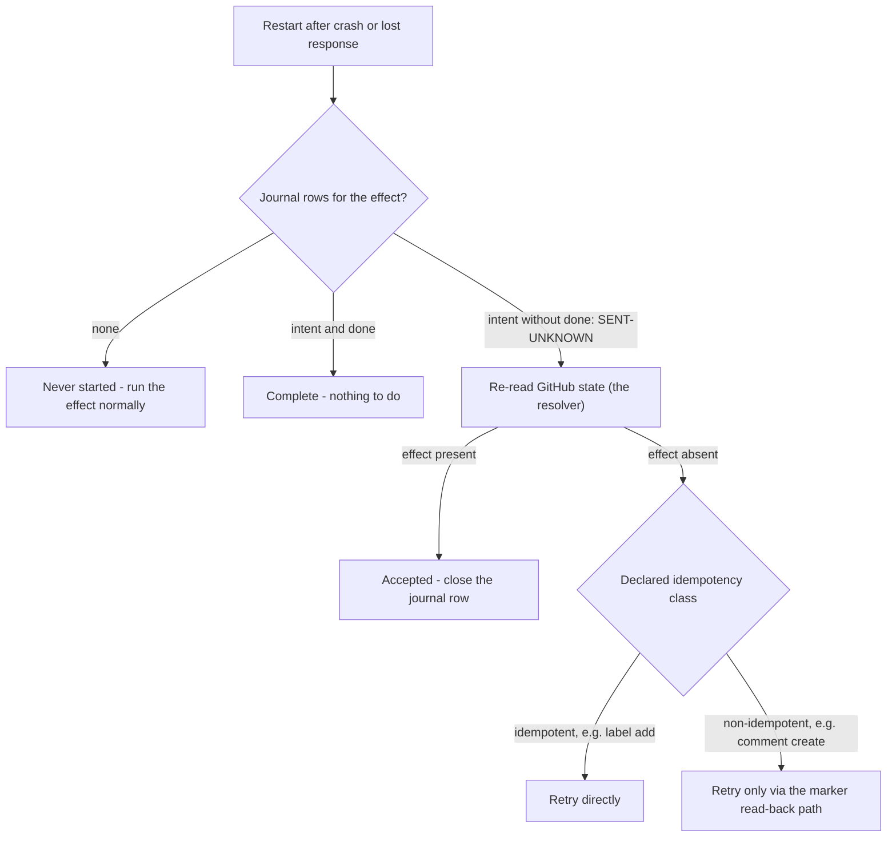

# Storage decision

> Moved from `experiments/` on 2026-07-23: experiments produce evidence,
> their conclusions live in `design/`. The cited evidence logs are local
> and untracked under `experiments/harness/evidence/`.

The stage-three exit-gate artifact for Q15, produced by protocol 6.5:
what minimum owned operational state does recovery require? The answer
moves D1, D13, D24, and D27 out of `reopened`.

## The comparison

Each cell: `sufficient` / `insufficient` / `sufficient-at-cost` (name
the cost), with a citation into the 6.5 evidence log. Judged **only** on
observed recovery runs — not on what a source should theoretically hold.

Citations `#n` are into `6.5-recovery-2026-07-23T19-45-28-929Z.jsonl`
unless prefixed; 6.2 citations are from that protocol's run.

| Operational need | (a) GitHub state + events | (b) App comment metadata | (c) Small owned store | Citation |
|---|---|---|---|---|
| Delivery deduplication | insufficient — GitHub's ledger reads `OK` for a delivery the receiver lost (6.2), and redeliveries reuse the guid, so nothing GitHub-side records what *we* processed | insufficient — only effectful deliveries leave a marker; a no-op delivery leaves nothing to dedup against | sufficient — guid as primary key; the same single-`INSERT` mechanism as the claim table | 6.2 ledger `20db79d8…`; `#35` |
| Pending effects (crash mid-sequence) | insufficient — `absent` is indistinguishable from never-requested | insufficient — no record exists until the write lands | sufficient — intent row survives the crash and names the exact call | `#8` |
| Lost-response disambiguation | sufficient as the *resolver* — one re-read is the receipt | sufficient for comment-shaped effects only (the comment is its own receipt); no record for E2 | insufficient alone (`SENT-UNKNOWN`) but it is the *detector*: the open intent row is the only signal that a check is needed | `#14`, `#18`, `#25` |
| Retries with bounded history | insufficient — no attempt record anywhere | sufficient-at-cost — one payload rewrite per attempt, straight into the content-creation secondary limit (6.4: no warning header) | sufficient — attempt bookkeeping is the same journal-row mechanics observed surviving every kill | `#8,#11`; 6.4 `…T19-37-00-198Z#19` |
| Schedules (clock-triggered work) | insufficient — GitHub emits no clock events; the 6.2 delivery corpus contains only event-triggered deliveries | insufficient — same reason | sufficient — a due-time row is the same durable-row machinery (analytic: the one cell resting on construction, not a dedicated run) | 6.2 corpus; `#8` (row durability) |
| Coordination (two workers, one effect) | insufficient — race with full read-checks still duplicated (TOCTOU; GitHub has no conditional create) | insufficient — the read-check *is* the comment-metadata protocol, and it lost the race | sufficient — primary-key claim: one winner, loser exits cleanly | `#32`, `#35` |

## The recovery loop the grid decided

Every observed recovery reduces to one loop: the journal knows *what*
to check, GitHub knows *how it ended*, and the effect's idempotency
class decides how a retry must be performed. This is the shape D24's
replacement takes:



A blind retry that skips the resolver step is the demonstrated failure
mode: it duplicated the managed comment on the first attempt.

## The decision

- **Minimum owned state:** a single-file SQLite store with four small
  tables — seen delivery guids, effect intent/done journal, claims,
  schedules. Nothing else. Every recovery in the grid needed it as
  detector, deduper, or lock; nothing in the grid needed more of it.

  ```mermaid
  erDiagram
      SEEN_DELIVERY {
          string delivery_id PK "opaque string, ids exceed 2^53"
          string at
      }
      EFFECT_JOURNAL {
          string effect_id PK
          int call_seq PK
          string intent "the call about to be made"
          string status "sent or done"
          string at
      }
      EFFECT_CLAIM {
          string effect_id PK
          string worker
          string at
      }
      SCHEDULE {
          string schedule_id PK
          string due_at
          string effect "the work to run when due"
          string status
      }
  ```

  The tables are independent — no foreign keys, no joins; each is one
  `INSERT` or primary-key lookup on its own hot path. `EFFECT_JOURNAL`
  and `EFFECT_CLAIM` are the two the 6.5 harness exercised under
  crashes and races; `SEEN_DELIVERY` and `SCHEDULE` are decided here
  and land as stage-five exit-gate tests (dedup by guid, a due
  schedule firing exactly once across a restart).
- **What stays on GitHub:** all effect *outcomes* (comments, labels)
  — GitHub is authoritative for results and is the resolver for every
  `SENT-UNKNOWN`: recovery is "journal says check, GitHub says how it
  ended." The deliveries API stays the *repair* tool (6.2), never the
  detection mechanism.
- **What comment metadata is still used for (D13):** effect identity
  and receipt — the marker payload makes managed comments
  self-identifying, which is what makes retry-after-check safe and
  cleanup findable. It is **not** operational storage: it cannot
  record intent, cover non-comment effects, or coordinate.
- **Register updates this authorizes:**
  - D1 → close: GitHub delivery machinery alone cannot carry recovery
    (detection requires owned state; 6.2 + dedup row).
  - D13 → close: markers = identity/receipt, not state.
  - D24 → close: lost-response is survivable via intent-journal +
    re-read reconciliation; naive retry demonstrably duplicates.
  - D27 → close: comment-metadata-as-WAL rejected on observed grounds
    (no pre-write record `#8`, no coverage `#25`, no CAS `#32`, write
    cost into an unsignaled secondary limit).
  - Q15 → answered: the minimum is the four-table single-file store
    above.
- **Approving review:** _(names, date — per the ratification rule)_
