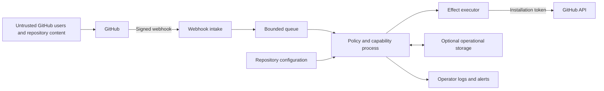

# Threat Model for the Hosted GitHub App

> This document is a draft. It describes threats that the architecture must address before a production
> installation. Permission choices, storage choices, and off-GitHub integrations remain open, so the final
> threat model must be updated after those decisions are made.

## 1. The security boundary

The GitHub App is a shared service that may serve several repositories. GitHub sends events to the App,
the App reads repository configuration, enabled capabilities return intents, and the platform may write
approved effects through an installation token. Repository content, webhook bodies, issue comments,
configuration files, and contributor identities are untrusted inputs.

The App private key, webhook secret, installation tokens, configuration snapshots, operational state,
queue contents, audit records, and the App's trusted public voice are protected assets. The service must
also protect the shared GitHub API rate budget so that one repository cannot make every installation
unavailable.

Permissions are not fixed yet. The minimum permission set depends on the capabilities that an installation
enables. The production App should request the smallest practical installation-wide set, and every effect
must also pass a capability-level permission check. Capabilities that require unusually powerful access
may need a separate App or may remain out of scope.

## 2. Trust boundaries

Each arrow crosses a boundary that needs authentication, validation, resource limits, or data minimization.
The service must never treat a value as trusted merely because it came through GitHub.

## 3. Threats and required controls

| Threat | Example | Required control | Remaining question |
|---|---|---|---|
| A forged webhook causes unauthorized work. | An attacker sends a fake issue event to the public endpoint. | The intake verifies the GitHub HMAC over the raw request body before parsing or queueing it. It rejects missing, invalid, and oversized requests. | The maximum body size and rejection telemetry need measurement. |
| A valid webhook is replayed or delivered twice. | An operator requests a manual or API redelivery, or a sender repeats an accepted delivery. | Intent keys and effects are idempotent. Delivery identifiers may support short-term deduplication, but correctness does not depend only on a delivery cache. | The retention period for delivery identifiers depends on storage. |
| Events arrive out of order. | A label removal is processed before an earlier label addition. | Capabilities evaluate current observations and include dated causes. The executor checks expected state immediately before writing. | Some ordering evidence requires timeline reads or operational versions. |
| A contributor abuses commands. | A user posts many `/assign` comments to spend rate budget and produce notification noise. | The service checks syntax, actor permission, and a per-actor and per-repository budget before expensive reads. Refusal comments are independently limited and may degrade to a reaction or silence. | Exact limits must be measured in the sandbox. |
| Untrusted text abuses the App's voice. | A title contains mentions, HTML comments, Markdown links, or a fake marker. | Rendering escapes or removes active content, defangs mentions, limits length, and never treats a marker as managed unless the App authored the object. | Projection templates need focused abuse tests. |
| Repository configuration enables unsafe behavior. | A pull request changes a warning period to zero or enables a destructive action. | The schema uses safe minimums, explicit modes, capability-specific validation, and permission checks. Configuration validation reports the effective change during review. | The project must decide who may approve active or destructive modes. |
| Configuration inheritance crosses a trust boundary. | A repository extends a mutable file from an attacker-controlled repository. | Inheritance is restricted to approved sources and pinned revisions. The resolver detects loops, depth overflow, deletion, and revision changes. Invalid inheritance fails closed. | Whether inheritance is needed at all remains open. |
| A capability becomes a confused deputy. | A module uses the App's authority to edit a repository or item that did not cause the event. | Capabilities receive normalized observations and narrow services, not raw tokens. Every intent names the installation, repository, item, configuration revision, and allowed effect. The executor rechecks all of them. | Cross-repository capabilities should remain out of scope until a concrete need exists. |
| One tenant affects another tenant. | A large repository consumes all workers, memory, or API quota. | Queues, concurrency, retry budgets, storage keys, logs, and metrics are partitioned by installation or repository. Fair scheduling prevents one partition from taking every worker. | The useful partition level needs load testing. |
| An event storm exhausts the service. | A bulk label change creates thousands of deliveries. | Intake queues are bounded, work is coalesced where safe, retries use backoff and jitter, and reconciliation repairs dropped event work. The service sheds load before memory is exhausted. | The reconciliation interval depends on rate limits and capability needs. |
| GitHub rate limits cause partial behavior. | A search-heavy resolver consumes the installation's remaining quota. | The adapter exposes rate information, paginates correctly, caches safe reads, delays low-priority work, and reserves capacity for recovery and security actions. | The reservation policy needs operational evidence. |
| A multi-call effect stops halfway. | The App assigns a user but cannot update the mapped position. | The executor records or reconstructs the operation, verifies completed steps, and resumes only when no newer fact invalidates it. Otherwise it reports the partial result. | The minimum durable record remains an architectural decision. |
| A poisoned queue item fails forever. | One unexpected payload causes a worker crash on every retry. | Parsing produces typed errors, retries are bounded, poison items move to an isolated failure path, and operators can inspect redacted metadata without executing the item again. | The queue technology has not been selected. |
| A maintainer account is compromised. | An attacker changes config or uses trusted commands. | GitHub branch protection and repository permissions remain the first control. The App limits amplification through permission ceilings, reviewable configuration, anomaly alerts, and kill switches. | This risk cannot be removed by the App. |
| The App key or deployment is compromised. | An attacker creates installation tokens and writes across repositories. | Secrets use a managed secret store, access is audited, rotation is rehearsed, deployments are protected, and organization and repository kill switches stop writes. | Hosting and key custody have not been selected. |
| A dependency or build pipeline is compromised. | A malicious package reads App secrets during deployment. | Dependencies and actions are pinned, changes receive review, the dependency set stays small, builds produce provenance where practical, and secret access is unavailable to untrusted pull request code. | The exact build and deployment platform remains open. |
| Stored data leaks private repository information. | Logs retain titles, comment bodies, or identities from a private repository. | The service stores the minimum fields needed for correctness, encrypts data in transit and at rest, separates tenants, redacts logs, and defines deletion and retention rules. | Storage fields and retention cannot be finalized before recovery design. |
| An off-GitHub integration leaks data. | A notification capability sends private issue information to Slack or another service. | Off-GitHub delivery requires separate opt-in, destination validation, secret isolation, an explicit data contract, and an allowlist for outbound hosts. | No off-GitHub integration belongs in the first platform milestone. |
| The service reaches arbitrary network addresses. | Untrusted configuration supplies a webhook URL that targets an internal service. | The first design should not support arbitrary callback URLs. Any later outbound HTTP feature needs scheme, host, redirect, DNS, and private-address controls against server-side request forgery. | Whether custom callbacks are ever needed remains open. |

## 4. Permission design

The project must derive permissions from concrete effects instead of selecting them from an imagined final
product. A capability declaration lists its required read and write permissions. Installation checks show
which enabled capabilities cannot work with the granted permissions. Missing permission causes a visible,
safe no-op and never triggers repeated blind retries.

The first sandbox capability should avoid code writes, merges, release changes, secret access, organization
administration, and workflow-file changes. If a later capability genuinely needs one of those permissions,
the team must review its threat model and decide whether it belongs in the same App.

## 5. Authentication and command authorization

The adapter resolves the current actor permission from GitHub at the time of a sensitive command. Display
names, organization membership claims in comments, and cached role assumptions are not authorization. A
command parser must use an exact grammar, must not execute edited comments as new commands, and must bind
the decision to the repository and item where the command appeared.

A visible acknowledgement does not prove that a command completed. The App records the final outcome as
applied, already satisfied, conflicted, forbidden, delayed, or unknown. A retry must use the same
idempotency identity and must recheck authorization when the action is still sensitive.

## 6. Secrets and logs

Secrets must never appear in logs, exception messages, queue inspection tools, test fixtures, or managed
comments. Installation tokens should exist only for the shortest practical time and should never be passed
to capability code. Logs should use repository and item identifiers where possible and should omit issue
bodies, comment bodies, email addresses, and private configuration values.

Operators still need enough information to investigate a decision. An audit record should contain the
configuration revision, capability version, normalized cause, policy outcome, effect result, and GitHub
request identifiers without copying unnecessary repository content.

## 7. Availability and safe degradation

The service must remain correct when it is delayed or temporarily unavailable. Bounded queues and dropped
work are acceptable only when later observation-based reconciliation can restore the intended state. A
capability that depends on processing every event must declare that dependency and cannot use this recovery
claim without additional durable delivery state.

Retries must distinguish temporary failures from permanent permission, validation, and policy failures.
The service must stop retrying permanent failures. Circuit breakers and kill switches must disable writes
without disabling health information that operators need for recovery.

## 8. Verification before wider installation

The sandbox must verify invalid signatures, duplicate deliveries, reordered events, oversized input,
command spam, marker spoofing, hostile Markdown, pagination, rate exhaustion, partial effects, configuration
changes during execution, tenant isolation, key rotation, and repository-level write suspension. A security
review must examine the actual App manifest and deployment settings before the App moves from Hiero Hackers
to a main Hiero organization.

## 9. Open decisions

The team still needs to choose the hosting environment, queue, storage boundary, retention period, key
custody process, tenant partition, permission strategy, and operator roles. Those choices must update this
document. The current draft is a list of required properties, not evidence that the implementation already
has them.
