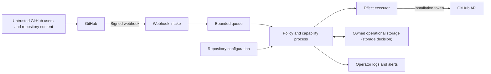
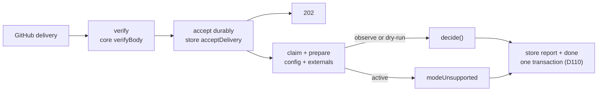

# Threat Model for the Hosted GitHub App

> This document is a draft. It describes threats that the architecture must address before a production
> installation. Permission choices, storage choices, and off-GitHub integrations remain open, so the final
> threat model must be updated after those decisions are made.

> **2026-08-15 audit (#110).** Every row below was originally written when this repository contained no
> runnable code: every threat was anticipated, none observed. A runnable, observe/dry-run-only application
> now exists, and this revision audits the original draft against it row by row, tagging each **landed**
> (cite the D-row or workflow that implements it), **gap** (still required, still absent), **obsolete**
> (the threatened component does not exist in the runnable system), or **not yet applicable** (the feature
> the threat depends on has not been built, and the control stays correct as a requirement for when it is).
> Two threats the original draft never anticipated are added at the end of §3. Nothing here approves a
> permission manifest, a hosting provider, or an operator — those stay with Q1 and the rest of
> `design/decisions.md`.

## 1. The security boundary

The GitHub App is a shared service that may serve several repositories. GitHub sends events to the App,
the App reads repository configuration, enabled capabilities return intents, and the platform may write
approved effects through an installation token. Repository content, webhook bodies, issue comments,
configuration files, and contributor identities are untrusted inputs.

The App private key, webhook secret, installation tokens, configuration snapshots, operational state,
queue contents, audit records, and the App's trusted public voice are protected assets. The service must
also protect the shared GitHub API rate budget so that one repository cannot make every installation
unavailable.

Permissions are not fixed yet. The minimum permission set depends on the capabilities that an installation
enables. The production App should request the smallest practical installation-wide set, and every effect
must also pass a capability-level permission check. Capabilities that require unusually powerful access
may need a separate App or may remain out of scope.

**As-built, today.** The paragraph above describes the target design; the running system is narrower than
that in one load-bearing way. The generic effect-executor prototype was removed because the runnable
application never called it (#107), and `design/architecture.md` §12 states plainly that "no current
component writes to GitHub." No installation token is minted, no write permission is checked at runtime,
and the shared API rate budget is spent only on reads a future adapter has not been built to make. Two
assets are real today and were not named above: the App private key and webhook secret are held in local
`.env` files on the machine running the shell (`packages/shell/src/main.ts`), and the owned SQLite store
(`packages/shell/data/`) holds the exact verified webhook bytes for every delivery until it completes
(D99). Both are new assets the original boundary did not name, because the machine that holds them —
the operator's own — did not exist as a deployment target when this section was first written. §3 adds it
as an explicit threat below.

## 2. Trust boundaries

```mermaid
flowchart LR
    U["Untrusted GitHub users and repository content"] --> G["GitHub"]
    G -->|"Signed webhook"| I["Webhook intake"]
    I --> Q["Bounded queue"]
    Q --> P["Policy and capability process"]
    C["Repository configuration"] --> P
    P --> E["Effect executor"]
    E -->|"Installation token"| A["GitHub API"]
    P <--> S["Owned operational storage (storage decision)"]
    P --> O["Operator logs and alerts"]
```

Each arrow crosses a boundary that needs authentication, validation, resource limits, or data minimization.
The service must never treat a value as trusted merely because it came through GitHub. This diagram is the
**target** shape — three of its boxes (`Bounded queue`, `Effect executor`, `GitHub API` as a write
destination) do not exist in the runnable system yet.

**As-built, today** (`packages/shell/README.md`):

```mermaid
flowchart LR
    GH["GitHub delivery"] --> V["verify\ncore verifyBody"]
    V --> ACC["accept durably\nstore acceptDelivery"]
    ACC --> ACK["202"]
    ACC --> CLM["claim + prepare\nconfig + externals"]
    CLM -->|"observe or dry-run"| D["decide()"]
    CLM -->|"active"| U["modeUnsupported"]
    D --> COM["store report + done\none transaction (D110)"]
    U --> COM
```

Verification happens before durable acceptance, acceptance happens before the acknowledgement, and the
canonical report commits with delivery completion in one transaction — `packages/shell/src/receiver.ts`,
`packages/shell/src/processor.ts`, and D110. There is no queue between acceptance and processing (a
delivery is claimed and processed inline), no effect executor, and no arrow back into the GitHub API: the
`active` branch is rejected before `decide()` runs, so nothing downstream of `CLM` can produce a GitHub
write. The as-built diagram has no confused-deputy surface at the executor because there is no executor.

## 3. Threats and required controls

Every row carries a fifth cell added by the 2026-08-15 audit: the tag, and the evidence for it. Rows the
audit found unchanged keep only a short confirmation; rows that shifted carry the citation the tag rests
on.

| Threat | Example | Required control | Remaining question | 2026-08-15 audit |
|---|---|---|---|---|
| A forged webhook causes unauthorized work. | An attacker sends a fake issue event to the public endpoint. | The intake verifies the GitHub HMAC over the raw request body before parsing or queueing it. It rejects missing, invalid, and oversized requests. | The maximum body size and rejection telemetry need measurement. | **Landed.** `packages/shell/src/receiver.ts` verifies before anything else is read (`packages/shell/README.md` step ①); the underlying HMAC compare lives in `packages/core/src/github/signatures.ts` at 100% mutation (D89). Body-size and rejection telemetry remain the stated open question. |
| A valid webhook is replayed or delivered twice. | An operator requests a manual or API redelivery, or a sender repeats an accepted delivery. | Intent keys and effects are idempotent. Delivery identifiers may support short-term deduplication, but correctness does not depend only on a delivery cache. | The retention period for delivery identifiers depends on storage. | **Landed at the delivery layer, not yet applicable at the effect layer.** `acceptDelivery` returns `duplicate` for an identical GUID/event/payload and `conflict` for a reused GUID with different bytes (`packages/store/src/deliveries.ts`, `packages/store/README.md`, D99). Intent/effect idempotency has no code to audit yet: no effect is ever produced (§1). Retention is caller-supplied and still undecided operationally (`packages/store/src/store.ts`; `design/operations/README.md` §8). |
| Events arrive out of order. | A label removal is processed before an earlier label addition. | Capabilities evaluate current observations and include dated causes. The executor checks expected state immediately before writing. | Some ordering evidence requires timeline reads or operational versions. | **Gap, deliberately.** `latestHumanChangeAt: () => null` in `packages/shell/src/externals.ts` is a stub, not `"unknown"`, precisely so dry-run does not bury findings under a uniform refusal — which also means dry-run reports currently *overstate* what would apply (`packages/shell/README.md`). The executor-side recheck has nothing to check yet (§1). |
| A contributor abuses commands. | A user posts many `/assign` comments to spend rate budget and produce notification noise. | The service checks syntax, actor permission, and a per-actor and per-repository budget before expensive reads. Refusal comments are independently limited and may degrade to a reaction or silence. | Sandbox-measured bounds now exist (experiment 6.4): 5,000 requests per hour per installation with uniform pricing and free conditional 304 reads, and a content-creation secondary limit near eighty writes per minute that arrives with no `retry-after` header. Per-actor budgets must be set within these ceilings. | **Gap.** No command parser or comment-issuing capability exists in the runnable system; nothing consumes the measured 6.4 bounds yet. The measurement itself is unchanged and still the number to build against. |
| Untrusted text abuses the App's voice. | A title contains mentions, HTML comments, Markdown links, or a fake marker. | Rendering escapes or removes active content, defangs mentions, limits length, and never treats a marker as managed unless the App authored the object. | Projection templates need focused abuse tests. | **Gap.** No comment-rendering path exists; the adapter that would author a managed comment is unbuilt (`packages/shell/README.md`'s stub table has no `renderManagedComment` seam yet). |
| Repository configuration enables unsafe behavior. | A pull request changes a warning period to zero or enables a destructive action. | The schema uses safe minimums, explicit modes, capability-specific validation, and permission checks. Configuration validation reports the effective change during review. | The project must decide who may approve active or destructive modes. | **Partially landed.** The config layer validates mode, structure, and safe minimums today (`packages/core` config module; `active` mode itself is rejected before `decide()`, so the destructive half of this row cannot fire yet). Who may approve the config file remains an open, undecided item: `docs/to-do.md` records that the file "is as powerful as branch protection" and still has no recommended CODEOWNERS entry. |
| Fork-authored content reaches the App through the base repository's own API. | A fork pull request adds or edits a file under `.github/`; the base repository's Contents API serves that file at the pull-request head commit, observed directly in the sandbox (experiment 6.6, `FINDING(fork-content-via-base-api)`). | Every configuration or policy fetch pins the base default branch and never honors a ref or commit that a pull request can influence. Anything fetched by a pull-request-derived commit is contributor-controlled input. | Whether any future capability legitimately needs pull-request-ref reads, and how those reads are labeled as untrusted. | **Not yet applicable.** Today's `fileConfigSource` reads an operator-local file, not a fetched ref (`packages/shell/README.md`'s stub table). The finding stays required reading for whoever builds the `ConfigSource` fetch — the seam exists, the fetch does not. |
| A later configuration-inheritance feature crosses a trust boundary. | A repository extends a mutable file from an attacker-controlled repository. | The first version has no inheritance. Any later design must restrict sources, pin revisions, detect loops and deletion, and fail closed before activation. | Inheritance requires a separate design and review if repeated repository configuration demonstrates a need. | **Landed, as an absence.** `design/architecture.md` §4 still states the first version does not inherit configuration; the control is the missing feature itself. |
| A capability becomes a confused deputy. | A module uses the App's authority to edit a repository or item that did not cause the event. | Capabilities receive normalized observations and narrow services, not raw tokens. Every intent names the installation, repository, item, configuration revision, and allowed effect. The executor rechecks all of them. | Cross-repository capabilities should remain out of scope until a concrete need exists. | **Partially landed.** Capabilities receive only normalized facts and a narrow `DecideExternals`, never a raw client (`packages/core/src/capability/boundary.ts`, `packages/core/src/engine/invoke.ts`, D109); intents are typed and scoped by the same boundary (D108). The executor recheck has no executor to recheck in (§1). |
| One tenant affects another tenant. | A large repository consumes all workers, memory, or API quota. | Queues, concurrency, retry budgets, storage keys, logs, and metrics are partitioned by installation or repository. Fair scheduling prevents one partition from taking every worker. | The useful partition level needs load testing. | **Not yet applicable.** The runnable shell serves exactly one configured repository per process (`packages/shell/README.md`, "Multi-repository routing" listed as deliberately out of the first slice); there is no second tenant to affect yet. |
| An event storm exhausts the service. | A bulk label change creates thousands of deliveries. | Intake queues are bounded, work is coalesced where safe, retries use backoff and jitter, and reconciliation repairs dropped event work. The service sheds load before memory is exhausted. | The reconciliation interval depends on rate limits and capability needs. | **Gap.** `packages/store/README.md` states plainly: "Queue-capacity/backpressure policy... [is] still missing." Each accepted delivery is claimed and processed inline; nothing yet sheds load ahead of memory pressure. |
| GitHub rate limits cause partial behavior. | A search-heavy resolver consumes the installation's remaining quota. | The adapter exposes rate information, paginates correctly, caches safe reads, delays low-priority work, and reserves capacity for recovery and security actions. | The reservation policy needs operational evidence. | **Gap.** No read adapter exists yet; `installationGrants` is a hardcoded stub, not a live rate-aware client (`packages/shell/README.md`). |
| A multi-call effect stops halfway. | The App assigns a user but cannot update the mapped position. | The executor records or reconstructs the operation, verifies completed steps, and resumes only when no newer fact invalidates it. Otherwise it reports the partial result. | The minimum durable record remains an architectural decision. | **Obsolete, for the runnable system.** There is no multi-call effect because there is no write path (#107, §1). The store's `effect_journal` and `effect_claim` tables exist and are exercised by unit tests, but `packages/store/README.md` states both are "unused by the runnable application" (D41, D42) — the primitive is landed, nothing calls it. |
| A poisoned queue item fails forever. | One unexpected payload causes a worker crash on every retry. | Parsing produces typed errors, retries are bounded, poison items move to an isolated failure path, and operators can inspect redacted metadata without executing the item again. | The queue technology has not been selected. | **Gap, with landed primitives underneath.** `claimNextDelivery`'s stale-claim takeover (D41) and `requeueStuckDeliveries` (D43, `packages/store/src/deliveries.ts`) give a durable claim/requeue mechanism, but no isolated poison-item path or queue technology sits above it — a repeatedly crashing delivery is retried, not quarantined. |
| A maintainer account is compromised. | An attacker changes config or uses trusted commands. | GitHub branch protection and repository permissions remain the first control. The App limits amplification through permission ceilings, reviewable configuration, anomaly alerts, and kill switches. | This risk cannot be removed by the App. | **Partially landed, one half unverifiable in-repo.** `.github/CODEOWNERS` gates the sensitive paths, and `packages/checks/test/codeowners.test.ts` proves every pattern still matches a tracked file. Whether GitHub branch protection actually *requires* that review is a repository setting, not code — no invariant in this repository proves it is turned on; this row is flagged per the issue's own instruction rather than assumed. |
| The App key or deployment is compromised. | An attacker creates installation tokens and writes across repositories. | Secrets use a managed secret store, access is audited, rotation is rehearsed, deployments are protected, and organization and repository kill switches stop writes. | Hosting and key custody have not been selected. | **Gap.** Today's secret is a local `.env` value read by `packages/shell/src/main.ts` on the operator's own machine — no managed store, no audit trail, no rehearsed rotation. `KILL_SWITCH=1` exists and is wired through the core safety layer (`packages/core/src/safety/rules.ts`, `packages/core/src/safety/destructive.ts`, `packages/core/src/engine/decide.ts`) and the shell entry point, so the kill-switch half of this row is landed; the secret-custody half is not. |
| A dependency or build pipeline is compromised. | A malicious package reads App secrets during deployment. | Dependencies and actions are pinned, changes receive review, the dependency set stays small, builds produce provenance where practical, and secret access is unavailable to untrusted pull request code. | The exact build and deployment platform remains open. | **Landed.** Every workflow checkout is SHA-pinned and sets `persist-credentials: false`, locked by `packages/checks/test/workflows.test.ts` (D100); `actions/dependency-review-action` gates new dependencies on `pull_request` at the same `moderate` floor as `pnpm audit` (D100, `.github/workflows/ci.yml`); CodeQL scans `javascript-typescript` and the workflow YAML itself (D101). Build/deployment platform choice remains open, as stated. |
| Stored data leaks private repository information. | Logs retain titles, comment bodies, or identities from a private repository. | The service stores the minimum fields needed for correctness, encrypts data in transit and at rest, separates tenants, redacts logs, and defines deletion and retention rules. | Storage fields and retention cannot be finalized before recovery design. | **Gap.** `packages/store/README.md` and D99 confirm the store keeps exact verified payload bytes until a delivery completes, and payload bytes clear only at completion (D110) — there is no encryption-at-rest, and no invariant checks that shell logs omit repository content. Retention is caller-supplied, not policy-set (`design/operations/README.md` §8). |
| An off-GitHub integration leaks data. | A notification capability sends private issue information to Slack or another service. | Off-GitHub delivery requires separate opt-in, destination validation, secret isolation, an explicit data contract, and an allowlist for outbound hosts. | No off-GitHub integration belongs in the first platform milestone. | **Not yet applicable, unchanged.** No off-GitHub integration exists; the control stands as the requirement for whenever one is proposed. |
| The service reaches arbitrary network addresses. | Untrusted configuration supplies a webhook URL that targets an internal service. | The first design should not support arbitrary callback URLs. Any later outbound HTTP feature needs scheme, host, redirect, DNS, and private-address controls against server-side request forgery. | Whether custom callbacks are ever needed remains open. | **Not yet applicable, unchanged.** No configuration key accepts a callback URL today; the control stands as written. |
| A third-party relay sits inside the webhook path. | Rehearsals point GitHub at an `smee.io` channel that forwards to the local receiver; the relay acknowledges GitHub the instant it receives a delivery, before forwarding, so the receiver's own response time is unmeasurable through it — demonstrated directly by holding a response 15 s while the ledger recorded `OK, 0.05 s` — and two forwarder processes accidentally attached to one channel silently doubled every delivery, 154 unique ids arriving as 308 accepts (`packages/lab/protocols/6.2-webhook-delivery.md`, experiments 2 and the duplicate-forwarder finding). | A relay is a rehearsal convenience only and must never sit in the production ingress path — `design/operations/README.md` §3 already states the general rule ("the receiver terminates GitHub's POST directly, because any acknowledging relay recreates the loss window in a place the process cannot fix") without this experiment's concrete evidence behind it. Rehearsal tooling should make relay use visually obvious in its own output so a captured timing or duplication is never mistaken for a measurement of the real receiver. | Whether a rehearsal or staging environment needs a direct-ingress option before the first non-sandbox pilot, so this class of measurement error cannot recur past the sandbox stage. | **New in this audit.** No control existed for this threat before; it is now recorded with sandbox evidence rather than as speculation. |
| The operator's machine is part of the deployment. | A laptop or shared dev host runs the shell, holding `WEBHOOK_SECRET` and App credentials in a local `.env` file (`packages/shell/src/main.ts`) and the SQLite store under `packages/shell/data/`, which carries unscrubbed webhook payload bytes for every delivery still `pending` or `processing` (D99). Theft, malware, or a misconfigured backup of that machine exposes both secrets and repository content in one file. | The never-tracked invariant (D99, `packages/checks/test/never-tracked.test.ts`) proves *git* never commits this directory; it proves nothing about the *disk*. Before any non-sandbox rehearsal holds real installation-adjacent secrets, the operator machine needs a stated minimum: disk encryption, restricted account access, and a documented credential-rotation step if the machine is ever decommissioned or shared. | Whether the eventual hosting decision (Q1) removes this threat outright by moving credentials off any individual's machine, or whether an operator-machine rehearsal step remains part of the permanent rollout process. | **New in this audit.** No control existed for this threat before. D99's invariant was written for a different failure mode (git tracking the directory) and was never claimed to cover host-level compromise; this row names the gap explicitly rather than assuming D99 already closes it. |

## 4. Permission design

The project must derive permissions from concrete effects instead of selecting them from an imagined final
product. A capability declaration lists its required read and write permissions. Installation checks show
which enabled capabilities cannot work with the granted permissions. Missing permission causes a visible,
safe no-op and never triggers repeated blind retries.

The first sandbox capability should avoid code writes, merges, release changes, secret access, organization
administration, and workflow-file changes. If a later capability genuinely needs one of those permissions,
the team must review its threat model and decide whether it belongs in the same App.

*Unchanged by this audit*: no capability requests a permission yet, so nothing here has landed or gone
stale. `packages/core/src/capability/declaration.ts` already carries the shape this section asks for
(D108); the installation-side check remains future work.

## 5. Authentication and command authorization

The adapter resolves the current actor permission from GitHub at the time of a sensitive command. Display
names, organization membership claims in comments, and cached role assumptions are not authorization. A
command parser must use an exact grammar, must not execute edited comments as new commands, and must bind
the decision to the repository and item where the command appeared.

A visible acknowledgement does not prove that a command completed. The App records the final outcome as
applied, already satisfied, conflicted, forbidden, delayed, or unknown. A retry must use the same
idempotency identity and must recheck authorization when the action is still sensitive.

*Unchanged by this audit*: no command parser or adapter exists yet (§3's contributor-abuse row); this
section stands as the requirement for when one is built.

## 6. Secrets and logs

Secrets must never appear in logs, exception messages, queue inspection tools, test fixtures, or managed
comments. Installation tokens should exist only for the shortest practical time and should never be passed
to capability code. Logs should use repository and item identifiers where possible and should omit issue
bodies, comment bodies, email addresses, and private configuration values.

Operators still need enough information to investigate a decision. An audit record should contain the
configuration revision, capability version, normalized cause, policy outcome, effect result, and GitHub
request identifiers without copying unnecessary repository content.

**Audit note.** By inspection, `packages/shell/src/main.ts` reports only whether `WEBHOOK_SECRET` is
present, never its value, and no installation token exists yet to leak (§1). But no invariant in
`packages/checks/` verifies that shell or store logs stay free of secrets or repository content — this
claim is currently true by inspection only, the same gap §3's stored-data-leak row names for the store
itself.

## 7. Availability and safe degradation

The service must remain correct when it is delayed or temporarily unavailable. Bounded queues and dropped
work are acceptable only when later observation-based reconciliation can restore the intended state. A
capability that depends on processing every event must declare that dependency and cannot use this recovery
claim without additional durable delivery state.

Retries must distinguish temporary failures from permanent permission, validation, and policy failures.
The service must stop retrying permanent failures. Circuit breakers and kill switches must disable writes
without disabling health information that operators need for recovery.

**Audit note.** The kill-switch half is landed: `KILL_SWITCH=1` is wired from the shell entry point through
`packages/core/src/safety/rules.ts` and `packages/core/src/safety/destructive.ts` into `decide()`
(`packages/core/src/engine/decide.ts`), and refuses writes loudly rather than silently (`packages/shell/README.md`).
Bounded queues and reconciliation are not: there is no queue in front of `claimNextDelivery`, and the
`requeueStuckDeliveries` reconciliation path (D43) is not driven by any scheduler in the runnable
application yet.

## 8. Verification before wider installation

The sandbox must verify invalid signatures, duplicate deliveries, reordered events, oversized input,
command spam, marker spoofing, hostile Markdown, pagination, rate exhaustion, partial effects, configuration
changes during execution, tenant isolation, key rotation, and repository-level write suspension. A security
review must examine the actual App manifest and deployment settings before the App moves from Hiero Hackers
to a main Hiero organization.

**Audit note.** Of this list, sandbox evidence already exists for invalid signatures and duplicate
deliveries (§3); reordered events, command spam, marker spoofing, hostile Markdown, rate exhaustion,
partial effects, tenant isolation, and key rotation all wait on features this audit found not yet built.
This section's list does not shrink — it is the acceptance bar for the write path, not a status report —
but §3 above is now the place to check what already has evidence behind it.

## 9. Open decisions

The team still needs to choose the hosting environment, queue, retention period, key custody process,
tenant partition, permission strategy, and operator roles (Q1 and the surrounding rows in
`design/decisions.md` own these). Those choices must update this document.

**What changed since the original draft.** The storage *boundary* is no longer fully open: a single-file
SQLite store with an explicit schema-version contract is decided (D110, ratification pending under the
stage-four review, `design/operations/storage-decision.md`), which narrows the hosting decision to shapes
with a persistent single-writer disk (`design/architecture.md` §12). Two new open items follow directly
from this audit's new threats: whether a rehearsal or staging environment needs a direct-ingress path
before the first non-sandbox pilot, so a relay's acknowledge-before-forward behavior can never again be
mistaken for the real receiver's timing (§3); and what minimum host protections — disk encryption,
restricted access, a rotation step on decommission — the operator's machine must meet before it holds
real, non-sandbox App credentials and payload bytes (§3). Neither is answered here; both are recorded so
the next hosting discussion inherits them rather than rediscovering them.

The current draft is a list of required properties audited against the system that exists, not evidence
that every property already holds — §3's tags say, row by row, which properties do and which do not.
