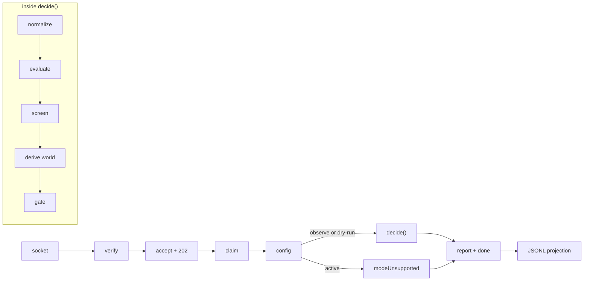

# The trace — one real delivery, start to finish

Every term in this codebase is defined somewhere, but definitions don't teach a system; a journey
does. This document follows **one real delivery** — the `issues.opened` webhook GitHub sent when
issue #164 was opened on the sandbox (captured under protocol 7.1, scrubbed, promoted to
`packages/core/test/github/fixtures/`) — from the shell's socket to the canonical report the store persists.
Every piece of output below is the pipeline's real output, not paraphrase; the same journey runs as
a test in `packages/shell/test/slice.test.ts`, so this document can drift only until the suite runs.

Vocabulary is introduced **in bold** at the moment it does something. If you read nothing else in
`design/`, read this.



## 1. The socket — bytes and three headers

A **delivery** is one HTTP POST from GitHub: a JSON body plus headers. Three headers matter:

```
x-github-delivery: 83e4273f-dd89-22f4-92bc-5da478ed1a69   ← the delivery's identity
x-github-event:   issues                                   ← what kind of payload
x-hub-signature-256: sha256=1f9a…                          ← HMAC of the exact bytes
```

The body is 6 KB of GitHub's wire format — `"action": "opened"`, an `issue` object with
`"number": 164`, `"labels": []`, an empty body, a `repository` object. Nothing downstream will ever
see most of it.

## 2. Verify, then accept, then acknowledge — in that order

The receiver (`packages/shell/src/receiver.ts`) checks the **signature** first: the HMAC of the raw bytes
against the webhook secret, constant-time (`packages/core/src/github/signatures.ts`). Fail and the answer is
`401` with nothing read, nothing stored — this is the most attacker-reachable line in the system.

Pass, and the exact bytes go into the **store** (`packages/store/src/store.ts`) as a durable row keyed by the
delivery GUID, state `pending`. Only after that row exists does GitHub get its **`202`
acknowledgement** — so a crash one millisecond later loses nothing (the ordering promise called P9).
A redelivery of the same GUID finds the row and is answered `202` again without a second row. The
store, not the shell, makes one canonical completion possible under retries.

## 3. Claim — processing on our own clock

GitHub's part is over. The processor (`packages/shell/src/processor.ts`) — possibly the same process, possibly
a restart after a crash — **claims** the pending delivery: the row moves to `processing` and the
store hands back a one-time **claim token** that proves ownership. A handled failure releases the
claim; a process crash leaves it to go stale and be taken over. The delivery is then claimed again later.
Everything after this point may fail and retry forever; GitHub never knows.

## 4. The configuration — the repository's standing answers

The shell loads the repository's `automations.yml` (root of the repo — D93) and parses it with
`parseConfigDocument` (`packages/core/src/config/document.ts`). For this trace the file says:

```yaml
schemaVersion: 1
mode: dry-run
capabilities:
  intake:
    enabled: true
    settings:
      announce: true
mappings:
  labels:
    awaitingTriage: "status: triage"
```

Three terms live here. The **revision** — `sha256:0f8ccef2e24d`, a content hash — names *which*
text was decided on and travels into every output. The **mode** — `dry-run` — is the repository's
blast-radius dial: evaluate everything, write nothing. And the **mappings** are the repository's own
words for the platform's meanings: this repo spells `awaitingTriage` as the label
`"status: triage"`. A broken file stops here, fail-closed, as a `configRejected` record — nothing
downstream ever sees a half-parsed config.

## 5. Normalize — GitHub's wire format dies at the door

Inside `decide()` (`packages/core/src/engine/decide.ts`), the first stage is the normalizer
(`packages/core/src/engine/events.ts`). Six kilobytes of wire format become this, in full — an
**observation**:

```json
{
  "kind": "issueUpdated",
  "repository": { "owner": "scrubbed-1", "repo": "scrubbed-2" },
  "item": { "kind": "issue", "number": 164 },
  "position": {
    "kind": "position",
    "state": { "meaning": null, "blocked": false, "closedBy": null },
    "ignored": []
  },
  "observedAt": "2026-08-06T23:09:54.000Z"
}
```

The interesting field is `position`: the **projection** of the issue's labels onto the platform's
vocabulary. Label strings were looked up through the mappings *in reverse* and became **meanings**;
issue #164 has no labels, so its **position** — the single own-flow meaning an item holds — is
`meaning: null`, "no position yet". Had a human put the item in *two* positions at once, the
projection would say `conflict` instead, a state capabilities must see and never repair (D35).
A delivery that carries no observation (a `ping`, a push) ends here as `ignored`; an unreadable one
ends as `malformed` with a machine code (D75). Both still produce a report.

## 6. The capability — one narrow expert, deliberately starved

A **capability** is one automation with one concern; the platform trusts none of them. Ours is
`intake` (`packages/probes/src/intake.ts`): "new issues should enter triage." Its **declaration** states, in
data, everything it may do — which observations it receives, which **resolvers** (platform-answered
questions) it may ask, which operations it may request. It receives exactly two things: the
observation above, and its **view** —

```json
{ "settings": { "announce": true }, "mappedMeanings": ["awaitingTriage"] }
```

— its own config block and *which* meanings this repository maps. Note everything absent: no label
strings, no mode, no other capability's settings, no GitHub client. What a capability cannot see is
the isolation guarantee (P3).

## 7. Intents — asking, never doing

`intake` looks at "open issue, no position" and returns two **intents** — requests for outcomes,
not API calls. The first, in full and real:

```json
{
  "capability": "intake",
  "repository": { "owner": "scrubbed-1", "repo": "scrubbed-2" },
  "item": { "kind": "issue", "number": 164 },
  "operation": "applyMappedLabel",
  "actionClass": "reversibleStateChange",
  "expected": { "meaningsPresent": [], "meaningsAbsent": ["awaitingTriage"], "closed": false },
  "desired": { "meaning": "awaitingTriage", "cause": "intakeObserved" },
  "cause": { "cause": "issueWithoutPosition", "observedAt": "2026-08-06T23:09:54.000Z" },
  "explanation": {
    "capability": "intake",
    "summary": "New issue placed in triage.",
    "detail": ["the issue carried no mapped workflow meaning"]
  },
  "idempotencyKey": "[\"intake\",\"scrubbed-1\",\"scrubbed-2\",\"issue\",\"164\",\"applyMappedLabel\",\"issueWithoutPosition\",\"2026-08-06T23:09:54.000Z\"]"
}
```

Read it as a sentence: *because* of this dated **cause** (the occasion), I want this **desired**
outcome, I *believe* the world looks like this (**expected** — a claim the platform
will check, never trust), it is this risky (**action class**), and here is my **explanation** in
human words (unskippable — a capability that cannot say why it acts should not act). The
**idempotency key** encodes *which occasion* this is, so a redelivered event re-derives the same
key and can never become a second effect (D65). The second intent asks to `postManagedComment`
(the announcement) and differs only in operation and desired payload.

## 8. Screens — is this intent even well-formed?

Each intent passes the **screens** (`packages/core/src/capability/intent.ts`): is it attributed to the
capability that returned it, was the operation declared, is the action class at or above the
platform's floor for that operation, and — for position changes — is the move an edge on the
documented workflow map (D78)? Screens repeat what the types already promise, deliberately: a
capability is ordinary code that may not have been compiled honestly. A failed screen is always a
defect, never policy. Both intents pass.

## 9. The derived world — the platform refuses to take your word for it

Now the intent's `expected` claim meets the observation it rode in on. The engine — never the
caller — derives the **world** (`packages/core/src/safety/world.ts`): what meanings the projection actually
showed (none), and whether the claim holds against it (it does: the issue is open and holds no
`awaitingTriage`). `DerivedWorld` is a branded type with no public constructor, so no shell,
including ours, *can* assert a world that contradicts the delivery (D92). A stale claim would
surface right here as `preconditionStale` — with nobody having lied on purpose.

## 10. The gates — and the verdict

The **gates** (`packages/core/src/safety/rules.ts`, in a fixed, contract-bound order) now judge each intent
against the config, the derived world, and the three facts only the shell can know (kill switch,
granted permissions, latest human change). The result per intent is a **verdict**: `apply`,
`refuse` with a coded reason, or — the one this repository's mode guarantees — **`record-only`**:

```json
{
  "severity": "notice",
  "code": "modeRecordsOnly",
  "summary": "repository mode is dry-run; the effect is recorded, not applied (rule 10)",
  "subject": { "kind": "effect", "capability": "intake",
               "item": { "kind": "issue", "number": 164 }, "operation": "applyMappedLabel" }
}
```

## 11. The report — everything becomes findings

Verdicts, explanations, screen failures, config errors: all of them are converted
(`packages/core/src/report/convert.ts`) into **findings** — flat records with a **severity** the *platform*
assigns (`info` / `notice` / `problem`; a refusal is usually the system *working*, and only a
human-must-act situation earns `problem`). The **report** is the findings plus the identity of what
produced them: revision, mode, repository. Ours holds four findings — two explanations, two
`modeRecordsOnly` verdicts — and zero problems.

## 12. The atomic completion — the durable product

The processor serializes the record below once, then calls
`completeDeliveryWithReport` (`packages/store/src/store.ts`). Under one SQLite write lock the store
rechecks this delivery's GUID, event name, payload digest, `processing` state, and claim token. It
inserts the canonical JSON and marks the delivery `done` in the same transaction. A crash before
commit leaves neither outcome; a crash after commit leaves both. A stale, released, or stolen token
cannot create the report or complete the delivery. Retrying the committing token with these exact
bytes returns `alreadyCompleted` without another row.

Only after commit does `packages/shell/src/reports.ts` append the same bytes to `decisions.jsonl` as
an operator projection. If append fails, the processor replaces the projection from
`Store.deliveryReports()` and keeps draining; if replay also fails, it reports the stale projection
without trying to release the already-completed claim. Startup runs the same deterministic replay,
so a missing, partial, duplicated, or corrupt JSONL file is rebuilt from SQLite. Abridged only by
collapsing the four findings already seen:

```json
{
  "kind": "decision",
  "deliveryId": "83e4273f-dd89-22f4-92bc-5da478ed1a69",
  "event": "issues",
  "receivedAt": "2026-08-07T10:00:00.000Z",
  "decidedAt": "2026-08-07T10:00:02.000Z",
  "configRevision": "sha256:0f8ccef2e24d",
  "report": { "revision": "sha256:0f8ccef2e24d", "mode": "dry-run",
              "repository": { "owner": "scrubbed-1", "repo": "scrubbed-2" },
              "findings": [ "…the four findings above…" ] }
}
```

The shell does not persist Core's in-memory approved-intent array because no executor consumes it.
The report is dry-run's durable product.

## 13. Epilogue — `active` is a completed rejection

Change one word in the config (`mode: active`) and the runnable shell stops after parsing it, before
`decide()`. It atomically stores a `modeUnsupported` record with delivery completion, containing no
decision report, approved intents, or applied-effect claim. The executor is not connected. Active
behavior returns only with a real GitHub effect and durable recovery path.

## The vocabulary, in the order you met it

| Station | Terms | Home |
|---|---|---|
| 1–2 | delivery, signature, acknowledgement | `packages/shell/src/receiver.ts`, `packages/core/src/github/signatures.ts` |
| 3 | claim, claim token, worker | `packages/store/src/store.ts` |
| 4 | config, revision, mode, mappings | `packages/core/src/config/schema.ts` |
| 5 | observation, projection, position, meaning | `packages/core/src/engine/events.ts`, `packages/core/src/workflow/project.ts` |
| 6 | capability, declaration, view, resolver | `packages/core/src/capability/declaration.ts`, `packages/core/src/capability/boundary.ts` |
| 7 | intent, cause, desired, expected, action class, explanation, idempotency key | `packages/core/src/capability/intent.ts` |
| 8 | screen | `packages/core/src/capability/intent.ts` |
| 9 | derived world, precondition | `packages/core/src/safety/world.ts` |
| 10 | gate, verdict, record-only | `packages/core/src/safety/rules.ts` |
| 11 | finding, severity, report | `packages/core/src/report/convert.ts` |
| 12 | decision record, atomic completion, operator projection | `packages/store/src/store.ts`, `packages/shell/src/reports.ts` |
| 13 | active-mode rejection | `packages/shell/src/processor.ts` |
