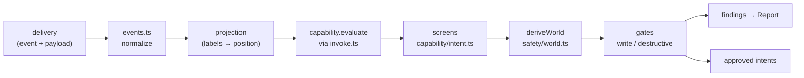

# engine/ — what the platform DOES with a delivery

Core's composition, and its only front door. A shell hands `decide()` a delivery, the parsed
configuration, the enabled capabilities, and the few facts core cannot know; it gets back a `Report`
and the intents that may act. Every other directory is something this one composes.

| File | The question it answers |
|---|---|
| [`events.ts`](events.ts) | What does this raw webhook delivery MEAN, if anything? |
| [`invoke.ts`](invoke.ts) | How does the engine call a capability whose declaration type it cannot know? |
| [`decide.ts`](decide.ts) | What does the platform do with a delivery, start to finish? |
| [`index.ts`](index.ts) | The barrel. |

This directory owns the **wiring**, not the rules. The screens live in `capability/`, the gates in
`safety/`, the record in `report/`. If a decision is being made here that is not "which step runs
next", it is in the wrong place — that was the whole point of D92.

## Nothing throws

`decide()` is total, and the shape of that guarantee is worth stating once. An unreadable payload is
a `malformed` finding. A capability asking for a resolver it never declared is an
`undeclaredResolver` finding. A refused write is a verdict. A shell that cannot get a report back
has nothing to record, and an operator surface reading a crash learns nothing.

Totality means the fallible seams are **contained**, not that they are trusted. A capability whose
`evaluate` throws is a `capabilityFailed` finding and contributes no intents; a resolver source that
rejects is a `resolverFailed` finding and answers `unavailable`, never an empty value; an ordering
lookup that rejects is a `humanOrderingLookupFailed` finding and the ordering becomes `"unknown"`,
which the rules already refuse (D51). Every one of them leaves the other capabilities in the same
run untouched.

The corollary: each of these is a **defect** in a capability or a shell, so each is a `problem`, not
a silently empty answer.

## The caller cannot lie about the world

The engine derives the safety context from the observation it was handed. It is not passed in.
`deriveWorld` produces a branded `DerivedWorld` whose constructor the barrel does not export, so a
shell asserting a precondition that contradicts its own delivery has **no type to assert it with**
(D77, D92 phase 4). This is the reason `DecideExternals` is as short as it is: everything on it is a
fact core genuinely cannot compute, and nothing on it is derivable.

## Three traps

**A sweep has no projection.** `staleItemsDue` carries no labels, so `projectionOf` returns `null`.
That cannot establish a current precondition: `deriveWorld` sets `preconditionHolds` false and the
shared preflight returns `preconditionStale`. Requested `expected` facts are never treated as
observed facts.

**Operation policy belongs to the catalogue.** `gateIntent` derives `WriteRequest.actionClass` and
`requiredPermissions` from `INTENT_OPERATIONS`. Capability intents carry neither field and every
retained intent goes through `evaluateWrite`.

**`toEngine` is a cast, and the argument for it lives in one place.** The engine holds a
heterogeneous list of capabilities and so has no single declaration type; `invoke.ts` carries the
soundness argument once, and the three `never`s in `decide()` are that erasure showing through.

## What keeps it honest

[`test/slice.test.ts`](../../test/slice.test.ts) is the parity specification: a real captured
delivery travels payload → report through the hand-wired pipeline, and `decide()` must reproduce it
finding-for-finding. Any divergence is a stop-work finding, not a test to update. The directory also
holds a ≥90% mutation threshold, which protects these authority and precedence branches.
