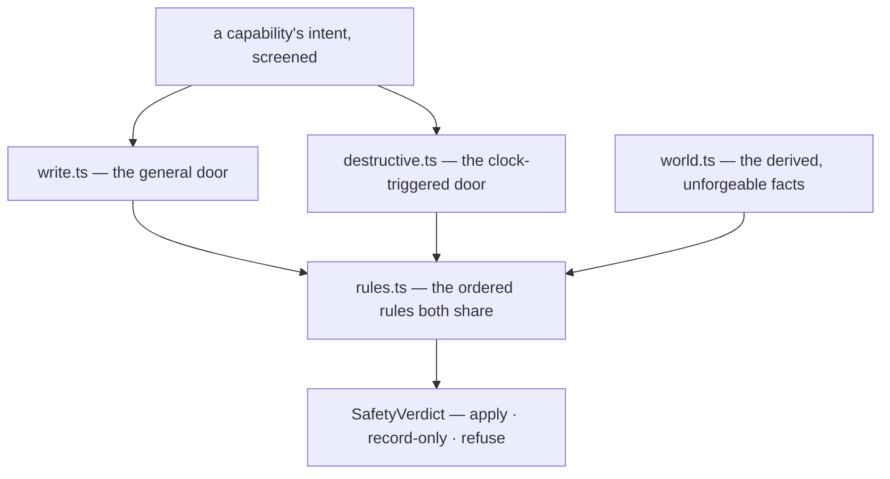

# safety/ — may this write happen?

**If you are asking why a write was refused, this is the directory**, and
[`rules.ts`](rules.ts) is the file.

Every write request arrives at one of two doors, passes that door's own policy, and then meets the
rules both doors share. The answer is always a verdict — applied, recorded, or refused with a
machine-readable code — never an exception.

## The files

| File | The question it answers |
|---|---|
| [`types.ts`](types.ts) | What vocabulary is a decision expressed in? The request, the context, the verdict, and every refusal code. |
| [`world.ts`](world.ts) | What was actually observed, and does the capability's claim hold? Derived, never asserted. |
| [`rules.ts`](rules.ts) | Which rules does every write pass, and in what order? |
| [`write.ts`](write.ts) | May this ordinary write happen? |
| [`destructive.ts`](destructive.ts) | Has the warning, the grace period and the cancellation window been honoured? |
| [`index.ts`](index.ts) | The barrel — and it deliberately exports less than the files contain. |

## Two doors, on purpose

`write.ts` is short and `destructive.ts` is long, and **that asymmetry is information**: the general
path has almost no special policy, while the clock-triggered one is almost entirely special policy.
Do not merge them.

They are also not interchangeable. Handing a `clockTriggeredDestructive` request to `evaluateWrite`
is **refused**, not quietly allowed — because the module's headline claim, that a destructive action
cannot fire without a recorded warning and an elapsed grace period, was once only true if the caller
happened to pick the right function. Making the wrong door a verdict turned a calling convention
into a property (D52).

## What cannot be faked

`DerivedWorld` has no public constructor. Its brand symbol is not exported from the barrel, and
core's `exports` map blocks the deep path, so **outside this package there is exactly one way to
obtain a world: derive it from the observation you were given** (D92). Missing or conflicted
projection data sets `preconditionHolds` false; only a clean projection can verify requested facts.
A shell or capability has no type with which to assert otherwise.

The world carries `closure` for the same reason. A capability may claim `expected.closed: false`,
but that claim is optional and defaults to no claim, so before the `itemClosed` rule a closed item
was protected only by the capabilities that remembered to make it. The pause was platform-enforced
and closure was not; now both are.

`DestructiveWarning` works the same way: only `createDestructiveWarning` mints one, and it carries
an immutable snapshot of the request it authorises, so a warning cannot be reused across a different
capability, item, change or cause (D60).

Both are the same idea. Where a claim would otherwise be taken on trust, make the trusted value
impossible to construct.

## Order is contract

`evaluatePreflight` checks the kill switch, then authoritative precondition availability, before
either write door applies its own policy. `GENERAL_RULES` is the remaining ordered list, and tests
assert both layers directly: kill switch → authoritative precondition → observation → consent →
permission → closure → pause → human conflict → mode. Precedence decides which code a maintainer
sees and is therefore policy rather than style.

Each rule also carries its **scope**: `standing` rules read only the repository's file and the
installation, `itemState` rules read the derived world, the ordering evidence or the cause's
timestamp. `evaluateStandingRules` runs the kill switch plus the `standing` subset, in the same
order, for a caller that holds no item — the write path's resume gate, which re-checks the brakes
between deciding and applying and would otherwise restate five rules of its own. The barrel exports
it for that one caller; the argument for running a subset there belongs at the call site, and lives
in `shell/src/apply.ts`.

The write-path rules in [`design/guides/effects.md`](../../../../design/guides/effects.md) are absent here on purpose — postcondition verification, unclear-outcome
reconciliation, tested rollback and staged rollout cannot be decided from a single request. They
belong to a future write path and to process.
