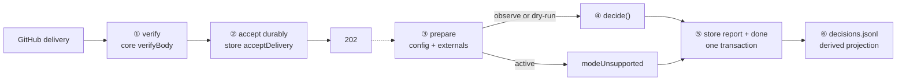

# shell/ — transport, not decisions

The seventh package (D93). A webhook delivery goes in; a persisted report comes out; every decision
in between belongs to core's one verb. The shell's entire contribution is **order**:

> verify before accept, accept before ack, decide before act, commit before project.



## The six stations, and who owns each

| Step | File | Owned by |
|---|---|---|
| ① Verify the signature before anything else | [`src/receiver.ts`](src/receiver.ts) | core's `verifyBody` — the receiver never parses what it has not verified |
| ② Persist durably, only then `202` | [`src/receiver.ts`](src/receiver.ts) → [`src/shell.ts`](src/shell.ts) | the store's `acceptDelivery` (P9): a crash after the ack loses nothing |
| ③ Prepare: config text → `parseConfigDocument`, externals assembled | [`src/processor.ts`](src/processor.ts), [`src/config.ts`](src/config.ts), [`src/externals.ts`](src/externals.ts) | core's config layer; a broken config becomes `configRejected`, while `active` becomes `modeUnsupported` before `decide()` |
| ④ Decide with one verb | [`src/processor.ts`](src/processor.ts) | core's `decide()`; the shell cannot assert a world — `DerivedWorld` has no public constructor |
| ⑤ Commit report plus completion | [`src/processor.ts`](src/processor.ts) → store's `completeDeliveryWithReport` | store verifies delivery identity and claim ownership, then creates one canonical report and marks the delivery done in one transaction |
| ⑥ Project for operators | [`src/reports.ts`](src/reports.ts) | JSONL receives the exact already-committed JSON; append failure triggers a full replay from canonical SQLite rows, and startup rebuilds the projection before accepting work |

The configuration file lives at **`automations.yml` in the repository root** (D93): it configures the
automation platform, not GitHub, and everywhere else in the design GitHub is an adapter detail — a
`.github/` home would say otherwise at the most user-visible spot.

## Every stub is a named hole the read-only adapter fills

The first slice runs with stubs that have the shape of the truth ([`src/externals.ts`](src/externals.ts)).
The read-only adapter work packet replaces each behind its existing seam — the shell does not change:

| Stub today | Becomes | Seam |
|---|---|---|
| `fileConfigSource` (operator's local copy) | fetch `automations.yml` at the default branch | `ConfigSource` |
| `installationGrants: ["issues:write"]` | the installation's live grant list | `DecideExternals` |
| `latestHumanChangeAt: () => null` | timeline evidence per item | `DecideExternals` |
| no `resolve` | `linkedIssues` / `isAutomationActor` lookups | `DecideExternals.resolve` |
| — | read-back for recovery | executor's `EffectPort.readBack` |

`() => null` and not `() => "unknown"` deliberately: `"unknown"` is a safe conflict and would refuse
every write, burying dry-run's real findings under a uniform refusal. Until the adapter lands,
dry-run reports **overstate** what would apply.

## Running against the sandbox

```
WEBHOOK_SECRET=…            # the sandbox App's webhook secret
REPO_OWNER=owner-sandbox    # the repository this endpoint serves
REPO_NAME=automation-sandbox
PORT=8790                   # optional
CONFIG_FILE=…               # optional; default data/automations.yml (copy of the repo's file)
REPORTS_FILE=…              # optional derived projection; default data/decisions.jsonl
STORE_PATH=…                # optional; default data/shell.sqlite
KILL_SWITCH=1               # optional; refuse everything, loudly
```

```bash
pnpm --filter @hiero-hackers/automation-shell start
```

Point the existing smee channel at it and open an issue on the sandbox: within a second,
`data/decisions.jsonl` gains a line saying what the platform would have done and why. It is the
operator-facing interview artifact, derived from the canonical report committed in `shell.sqlite`.
If file append fails, the processor rebuilds the entire file from
`Store.deliveryReports()` and continues draining. If both append and rebuild
fail, the shell logs that the projection remains stale but still continues:
canonical completion has already committed and is never sent through the
pre-commit claim-release path. Every shell start rebuilds JSONL from SQLite
before accepting work, so deleting or corrupting the projection is recoverable.

`data/` is never tracked (see the root `.gitignore`), the same rule as `lab/evidence/`.

## Deliberately out of the first slice

- **The scheduler** — `staleItemsDue` is queried, not delivered; it arrives as a second caller of
  `decide()`, not a second pipeline.
- **Config hot-fetch** — the seam exists (`ConfigSource`); the fetch is the read adapter's.
- **Active mode** — the runnable shell supports observe and dry-run and rejects active configuration.
  The executor is not connected. Active behavior returns only with a real GitHub effect and durable
  recovery path.
- **Multi-repository routing** — one endpoint, one configured repository, matching the sandbox.

The capture receiver in `packages/lab/src/capture.ts` was this package's embryo: same verify-first line,
same 202 — it just wrote a file where the shell continues the sentence to its verb.
