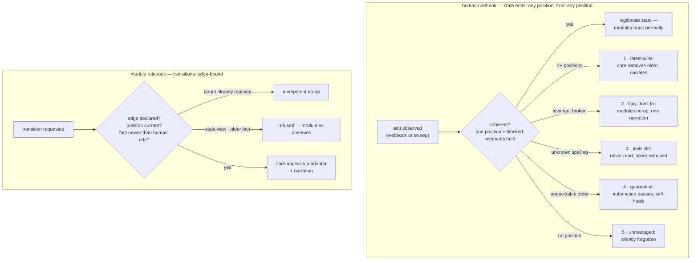

# Manual-Edit Semantics: What Happens When a Human Touches a Status Label

> **Drafted for ratification.** The core is the single app-side writer of `status:`, yet a hand-applied
> label "is ingested as a legitimate transition" (`solution.md` §4.1) — so what happens when a human
> applies a label the state machine has no edge for? The answer follows from two commitments already
> made: **no surprise actions** (`goals.md`) and **every state has a non-module way in**
> (`opt-in-modules.md` §1). Positions are marked **proposed**. This gates the taxonomy ratification,
> the toggle matrix, and the safety engine.

## 1. Two rulebooks

"Illegal manual transition" is a category error: humans and modules do not play by the same rules.

- **Modules request transitions** — `(position → position)`, legal only if the state machine has that
  edge and the module declared it (`solution.md` §5). The taxonomy diagram's edges are the *module*
  rulebook, nothing else.
- **Humans edit state** — any single coherent position they set is legitimate by definition; for
  humans every position is reachable from every position. Anyone who can apply a label is already
  maintainer-trusted (`config-draft.md` §3), and restricting hand edits to the machine's edges would
  re-couple every module to its upstream — the toggle matrix *requires* free manual entry (a repo
  running only inactivity needs `in progress` placed by hand).

A hand edit is ordinary state: modules react to it exactly as to any observed state (`solution.md`
§7). The only manual problems left are **incoherent states**, and those are enumerable (§3).

## 2. The prime rule: the app never reverts a human

**Proposed.** The app never removes or overwrites the most recent human-applied position — a bot that
reverts a maintainer's gesture teaches maintainers to fight the bot. Consequences:

- **Validators advise, never veto.** Intake seeing hand-placed `ready for dev` with no `skill:` label
  comments; the state stands. Intake off = nothing comments; that is what off means.
- **Off-edge edits are ordinary.** `awaiting triage` straight to `in progress` means exactly what it
  says; downstream modules behave normally.
- **The one exception is completion, not reversal:** with two positions present, the core removes the
  *older* — GitHub's UI never made status labels exclusive, so the machine supplies the exclusivity
  the human assumed. It never touches the label just applied.

**Overturned by:** ratifiers wanting a hard gate on some position (e.g. `ready to merge`) — that would
be a named, narrated policy veto; the default is none exists.

## 3. Coherence: five observation classes

The app reacts to state observed, not events assumed (`solution.md` §2) — so semantics are defined
over **observations**. Coherent = exactly one canonical position, optionally the `blocked` overlay,
invariants holding. Otherwise:

| # | Observation | Semantics | App writes |
|---|---|---|---|
| 1 | two+ position labels | latest human-applied wins; core removes the older | stale label removal + narration |
| 2 | invariant broken (`in progress`, no assignee) | state honoured; modules whose precondition fails no-op | narration only |
| 3 | unknown `status:` spelling | invisible — never read, never removed | nothing |
| 4 | class 1 with no ordering signal | quarantine until a human resolves it | narration only |
| 5 | no position | unmanaged — the app forgets the item | nothing |

- **Class 1:** the webhook names the added label; on a sweep, the core reads the item's timeline to
  order them (the one extra API read here, on a rare path); unorderable → class 4. The narration says
  what was kept and offers the one-line fix.
- **Class 2:** repair would mean inventing a fact (an assignee, a PR), so the core flags instead. The
  toggle matrix already forces modules to tolerate states without their usual precursors — this is
  that case. Per-position invariants are fixed at taxonomy ratification. A module *may* declare a
  repair as its job (e.g. assignment consuming native-assign events to heal the A3 pair) — that is
  its contract's business.
- **Class 3:** the core owns the **canonical set, not the `status:` prefix**. Maintainer-invented
  labels are margin-notes; the app has no prefix operations at all — this retires the A1 strip loss
  by construction.
- **Class 4:** quarantine is *derived*, not stored (`solution.md` §8): with no unique position, no
  module's precondition holds, so automation pauses naturally; one position restored resumes it.
- **Class 5:** removal = **forget** (silent — the gesture is explicit, and nagging an opt-out is the
  noise bots get uninstalled over); `blocked` = **remember but pause**. Two gestures, two meanings.

**`blocked` is absolute:** it pauses everything (`config-draft.md` §3) *including* class-1 repairs and
all narration. Repairs run when the overlay lifts. Hand add/remove of `blocked` is always legal, never
narrated.

## 4. The module rulebook, and the newer-fact rule

- **Undeclared edge** — inexpressible: compile error via the typed core handle.
- **Target already reached** — idempotent no-op, reported as success (absorbs races and redelivery).
- **Wrong current position** — stale observation: refused; the module re-observes. Refusal is a normal
  outcome; persistent refusal loops surface in telemetry, never as repo comments.

And because humans are senior:

> **Proposed — the newer-fact rule.** A module may move an item off a human-set position only on the
> strength of a fact newer than the human's edit.

Without it the stateless design oscillates: pr-quality re-derives "checks green" each sweep and
politely re-asserts `needs review` against a maintainer's hand-set `needs revision`, forever. The core
enforces it by comparing the triggering fact's timestamp against the position's `labeled` timestamp
(the second timeline read, confined to recently-hand-touched items). **Overturned by:** that read
proving too costly at sweep scale — the rule then moves into module contracts ("sweep-derived
transitions must cite a dated fact"), weaker and policed by the toggle matrix.

## 5. Narration

Every repair or flag above is one **narration comment** — a projection (`solution.md` §4): marker-
keyed, single-writer, updated in place (never re-posted), cleared when the incoherence resolves, never
read back. It always carries: what was observed, what was done or is awaited, and the one-line remedy.
This is the fail-loud cure (`principles-review-cpp.md` §9) aimed at the one audience that can act.

## 6. Tests

New invariants for `test-architecture.md` (first one corrects its current wording, which
`blocked`-as-overlay violates):

- **I-single-position:** never two canonical *position* labels after the app's next action.
- **I-never-revert:** no run shows the app removing the most recent human-applied position.
- **I-no-prefix:** every app removal names a specific canonical string.
- **I-narrated:** every app write on an incoherent item co-occurs with a narration update.
- **I-blocked-absolute:** zero app writes on a blocked item.

The toggle matrix gains an **incoherence-injection axis**: each class × each module combination,
asserting the class's exact semantics — no revert, correct repair or flag, modules act or no-op,
nothing crashes.

## 7. Migration warning

This rulebook grants seniority to **any actor that is not this app** — during coexistence, that
includes the old C++/Python bots, whose prefix strips would read as silent class-5 opt-outs. Hard
ordering constraint for the migration protocol: **an old bot's status writers are disabled before any
module sharing their labels is enabled.** `isBot` can refuse known old-bot actors seniority as
belt-and-braces; the ordering is the fix.

## 8. Open

- Per-position invariant list (class 2) — fixed at taxonomy ratification.
- Any policy veto on manual entry (§2's overturn) — default no.
- Whether assignment's contract includes the native-assignment repair (§3, class 2).
- The timeline-read budget at sweep scale (§4's overturn; measured at ring 0, `operations.md`).
