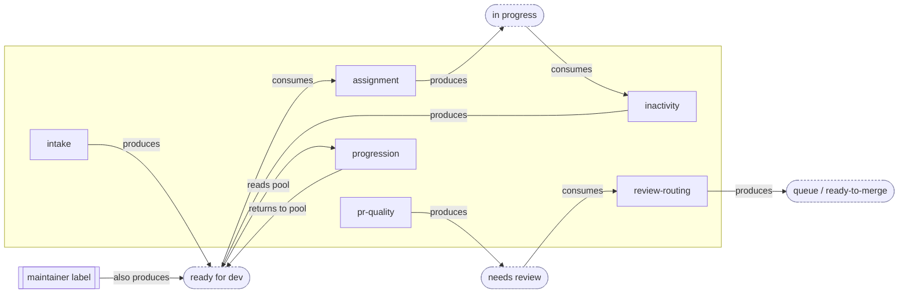

# Opt-In Modules: the Catalogue and the Interaction Graph

> DRAFT — the module-level companion to `planning/solution.md`, which designs the system these run
> on. No decision yet on which modules ship: the catalogue is a worked split of the audited
> capabilities (`docs/services.md`), with placeholder state names pending `taxonomy-draft.md`.

## 1. The decoupling rule

**A module never depends on another module — only on the core.** Three parts make it hold, all
designed in `solution.md` (§4 core, §5 contract, §7 toggle):

1. The core owns every state and every shared computation — the state machine and the resolvers
   exist even if only one module is on.
2. A module declares its full contract and never names, calls, or imports a sibling.
3. **Every state has a non-module way in** — a hand-applied label, a config default, a command — so
   an upstream module *automates* an entry point, never *is* the entry point (exact semantics:
   `manual-edits.md`).

Consequence: any single module alone is a functional-but-manual capability; adding its upstream
automates its inputs; removing it drops back to manual. Nothing breaks, nothing starves — that is
"dial a feature up or down" from `goals.md`.

## 2. The module catalogue

Each row is one independently togglable unit (never bundled behind a shared trigger — lessons D1).

| Module | What it does | Consumes (state in) | Produces (state out) | Standalone when its upstream is off |
|---|---|---|---|---|
| **intake** | moderate/lock new issues, `/finalize` validate + promote | issue opened | `awaiting triage` → `ready for dev` | n/a — it is the producer; maintainers can also set `ready for dev` by hand |
| **assignment** | `/assign`, `/unassign`, skill gates, limits | `ready for dev` | `in progress` ↔ `ready for dev` | works whenever `ready for dev` is set — by intake **or** by a maintainer label |
| **inactivity** | warn → close/unassign stalled work, `/working` reset | `in progress` (assigned) | `ready for dev` (or closed) | acts on any assigned in-progress item, regardless of who assigned it |
| **pr-quality** | DCO/GPG/conflict/link checks + dashboard | PR opened | `needs review` / `needs revision` | fully self-contained on the PR side |
| **review-routing** | review → status, queue state machine | `needs review` | `queue:*` / `ready-to-merge` | works whenever `needs review` is set — by pr-quality **or** by hand |
| **progression** | post-merge recommend, level-up, milestone | PR merged + the `ready for dev` pool | recommendations; strips `status:*` | reads whatever `ready for dev` issues exist; recommends nothing if the pool is empty |
| **notifications** | alerts, reminders, CI-failure feedback, AI hooks | events only | comments only — **no state** | fully standalone; touches no shared label |
| **admin** | spam-list, mentor rotation | assignment events | `notes:*` bookkeeping | standalone; degrades to no-op without the events it watches |

The pattern: every "standalone when upstream is off" cell resolves to *"the state it needs can also
be set manually"* — that column is the decoupling rule made concrete.

## 3. The interaction graph

Modules interact only **through the core**, on the three channels `solution.md` §4 defines: shared
state (the state machine), shared resolvers (`eligibleLevel`, `linkedIssues`, `isBot` — one mechanism
per question, lessons B2), and declared cross-entity reads (lessons C1). The dependency graph has
**no module-to-module edges** — every arrow goes module → state → module:

Read it as: intake and assignment never reference each other — both reference `ready for dev`, and
so does the manual entry point. Cut intake out and the node keeps an inbound edge
(`maintainer label`), so assignment keeps working. The missing module-to-module edge **is** the
decoupling.

## 4. Worked example: dialling assignment up and down

- **assignment only.** A maintainer labels an issue `ready for dev`; a contributor runs `/assign`;
  the core moves it to `in progress`. Fully functional — maintainers produce and reclaim the pool by
  hand.
- **+ intake.** `/finalize` now fills the pool automatically. Assignment is unchanged — it consumes
  the state and neither knows nor cares who produced it.
- **+ inactivity + progression.** Stalled items return to the pool; merges recommend the next issue.
  Assignment's code is still untouched.

At no level does enabling or disabling a neighbour require editing assignment — the test from
`goals.md`: "turning a feature off is one config edit and has no side effects on the others."
