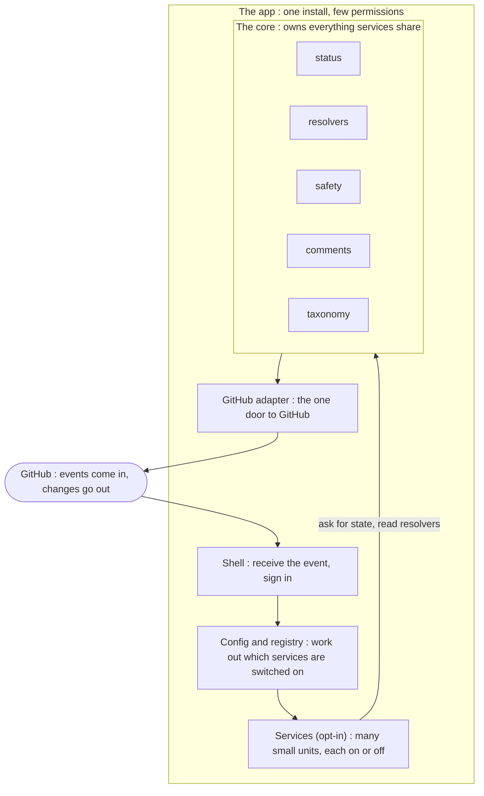

# Solution: Architecture Hypothesis (draft, co-authored)

> This is a draft, meant to be developed together with the maintainer. It is not a finished specification.
> Where a decision still has to be made, the text says so instead of pretending it is settled. This is the
> central design document that three shorter notes already point toward, and it pulls them together: the
> solution overview (`planning/solution-overview.md`), the opt-in modules note (`planning/opt-in-modules.md`),
> and the test architecture note (`planning/test-architecture.md`). The vision and the hard limits come from
> `planning/goals.md`. The coupling this design is trying to avoid is set out in `planning/lessons-learned.md`
> and `audit/deep-dive-cpp.md`. What this document leaves for later, on purpose, is which services get built,
> what the config file looks like, and the order the work happens in. Those come after. This document is about
> the system that holds the services, not the services themselves.

## 1. The problem in one paragraph

Today, in the C++ SDK, the automation services are tangled together. The clearest single example is one
label, `status: ready for dev`. One service produces it, another picks it up, a third resets it, and so on,
each one handing the label to the next like a baton in a relay. Because of that, you cannot switch one
service off on its own: turn off the service that produces the label and the next one has nothing to do, and
turn off the one that consumes it and work piles up with no one to move it along. The audit was clear that
this is not caused by messy code, because the code is clean. The problem is that the services share things,
and the label is only the most visible of four different kinds of sharing.

## 2. The four ways the services are tangled today

The label baton is the first and deepest of the four, and the design has to answer all four, so it is worth
naming them plainly before proposing a fix. They are drawn from the deep dive (`audit/deep-dive-cpp.md` §3).

The first is shared status labels that act as moving state no single service owns. Status is passed from one
service to the next, so whether an item is available to be worked on is a fact that lives in a label rather
than in any one feature.

The second is that services follow the link between an issue and its pull request and write to the far side.
This would be fine if they all followed the link the same way, but today two of them resolve it differently,
one with a precise query and one by scanning the text of the issue body, and the two ways can disagree about
what is linked to what. So the issue side and the pull request side of the lifecycle cannot be moved
independently.

The third is that some services talk to each other through rendered text and exact names rather than through
a real interface. One service decides what to do by searching another service's comment for an exact phrase,
and a second pair of workflows hand work between themselves only because they share an exact name string.
Both of these break silently: change the wording or rename the workflow and nothing reports an error, the
behaviour just quietly stops.

The fourth is that unrelated features are bundled into the same deployment unit. One workflow file holds
three separate commands behind one block of permissions, another holds two unrelated jobs, and three
separate files share a single queue so that runs which look independent actually line up behind one another.
Because of this, turning one feature off is a code or configuration-file edit rather than a setting.

## 3. The question this document answers

Can one system host many services in a way where each one can be turned on or off by itself? The test is
simple. Enabling a service should be a config change. Disabling it should be a config change too, and it
should not break or change any other service. No service should depend on another service. And adding a new
capability should not add another baton that the next capability has to wait for.

This document proposes the shape of such a system as a hypothesis. It does not pick the services. It designs
what sits under them, so that whatever services are chosen later are independent because of how the system is
built, not because each contributor happened to follow a convention.

## 4. The idea: a shared core in the middle

The answer is to stop letting services reach into each other, and instead give them one shared thing in the
middle that they all talk to. That shared thing is the core. The core owns everything the services would
otherwise pass between themselves, and it is the only part of the system allowed to talk to GitHub.

Read the picture top to bottom. An event comes in from GitHub, the app checks the config to see which
services are switched on, those services run, and when they need to read or change anything they ask the core.
Only the core writes back to GitHub.

The core is drawn as five parts plus that one door, and each part is still to be worked out in detail.

Status is the most important of these. The core owns the work item's status, so "is this issue free to pick
up" becomes a question the core answers, not a label one service leaves lying around for another to find.
This is what removes the baton. The resolvers are the shared answers that two services must agree on, such as
a contributor's skill level, which issue a pull request is linked to, and whether an actor is a bot. Because
both services ask the core the same question, they cannot disagree, and the issue-to-pull-request link in
particular is followed one way for everyone instead of the two conflicting ways used today.

The safety part is the one place any risky action passes through. It generalises the approach the inactivity
service already uses, which today warns after five days of silence and only acts after seven, so that every
destructive action, such as automatically closing a pull request or unassigning an issue, warns first, waits
out a grace period, and can be undone. Building this once means every service inherits it rather than
reimplementing it. The comments part keeps a structured record that services read as data, instead of one
service reading another's rendered wording and hoping it never changes. The taxonomy is listed for
completeness but is held back until there is a clear goal for what labels are for, so for now it is only a
placeholder.

The GitHub adapter is the single door. Because the core is the only part that writes back, the whole app can
run on three narrow permissions: it may write to issues, write to pull requests, and read repository
contents, and it never takes write access to the code itself (`contents:write`). Keeping every write behind
one door is what makes that small, legible permission set believable, and it means the rules for talking to
GitHub are written down and tested in one place instead of assumed in many. How each part of the core is
shaped is the real design work ahead; this section only sets the frame.

## 5. How the app decides what is switched on

The layer between the incoming event and the services is what actually makes "turn a service on or off" work,
so it deserves more than a box in the diagram. When an event arrives, the shell receives it and signs in as
the app. The config step then reads the repository's own `.github/hiero-automation.json`, fills in any
organisation-wide defaults it inherits through `_extends`, and works out the resulting set of choices. If a
repository has installed the app but written no config at all, it runs on safe defaults rather than nothing.
The registry then switches on only the services the repository actually declared, and hands each service only
the permissions and settings it declared it needs. Everything downstream depends on this step being the one
place that answers "which services are on here, and what is each allowed to do." The exact keys in that config
file are deferred (see section 9); what matters for the architecture is that this enabling step exists and is
the only thing that performs the toggle.

## 6. What counts as a service

A service is one small unit that can be switched on or off, talks only to the core, and never to another
service. What keeps it honest is a short contract it has to declare, and that contract has four parts, one to
answer each of the four tangles in section 2.

First, it declares the small slice of config it reads. This matters more than it sounds, because today every
service can read the whole configuration file even though each one really uses only a little of it: the status
labels and the team names are read almost everywhere, while the skill ladder, the assignment limits, and the
priority order are each read by only one or two services. A service that asks for only the keys it needs no
longer shares the entire file with every other service. Second, it declares which statuses it reads and which
it sets, and it does this only through the core, never by taking a label straight from a named neighbour.
Third, it declares any read it makes across the issue-to-pull-request link, and performs that read through the
one shared resolver, so no two services follow the link in ways that disagree. Fourth, it is its own
deployment unit, with its own trigger and its own permissions, sharing no file and no queue with anything
unrelated.

Those four declarations line up one for one with the four tangles: the config slice answers the shared file,
status-through-the-core answers the label baton, the declared cross-entity read answers the problem of two
services following the same link in two ways, and the standalone deployment unit answers the bundled files
and shared queues.
Working out the exact form this contract takes is the most important open question in this document, and the
first thing to settle with the maintainer, because everything else depends on it.

## 7. How turning a service on and off works

The trick that lets a service stand on its own is this: every status a service reads can also be set some
other way, by a maintainer by hand, by a config default, or by a command. So a service that normally sets a
status for another service is only ever a shortcut. It is never the only way to get there.

Think of it like a light with both a switch and a motion sensor. The sensor is a convenience. Take it away
and you can still turn the light on by hand. In the same way, enabling one service on its own gives you a
working feature that you feed by hand. Add the service upstream of it and the feeding becomes automatic.
Remove that upstream service and you are back to doing it by hand, with nothing broken and no work left
stranded. Turning a service off dials the automation down. It does not tear a dependency out. Writing this
idea down as an exact, testable rule is one of the pieces still open.

## 8. Why we keep labels to a minimum

The deep dive showed the status labels are the deepest tangle, with `ready for dev` passed between five
services in turn. The maintainer's point follows from that: every new label is another baton, another thing
one service must produce before another can act. So a label is added only when nothing else will carry the
state. A few positions follow, all still open to confirm. The core, not any service, owns the status labels
and knows the full set, so no service can invent one or wipe the whole group the way two services do today. A
proposed new label has to earn its place against the simpler option of the core just holding that state
without a label. And the bigger question of a full label scheme waits for its own maintainer led goal, so this
document proposes none and uses placeholders.

## 9. How we would test it

Because the core owns the status, services can be tested against a stand in core that we control, rather than
against GitHub. This is worth doing because a suite built only on mocks of GitHub drifts out of step with the
real thing silently, whereas a core we own can be trusted and the one real boundary to GitHub is modelled
once in the adapter. Owning the core also makes two useful kinds of test possible that mocks alone cannot
reach. The first is a toggle test: try every combination of services switched on and off, and check the
system still behaves, with nothing starved and no switched off service getting in the way. The second is a
set of invariants, the rules that must hold no matter which services are on. For example, every status a
service reads has another way to be set, no service writes a status label the core does not own, and no risky
action skips the safety part. Listing those rules exactly, deciding where the stand in core ends and the real
GitHub adapter begins, and deciding how much to test against a real sandbox repository, are left to the design
work ahead.

## 10. What we are leaving for later

Some decisions are being held back on purpose, so this document stays about the system and not the services
that run on it. They are written down so that holding them back does not turn into forgetting them. Which
services actually ship is for later, and the list in the opt-in modules note is only an example of how
services could be split, not a promise to build those ones. The real config file, its settings and how the
org defaults fill in, is for later, though section 5 fixes that the enabling step itself exists. The order the
work is built in is for later, and that build order is a separate thing from the goal that a repository can
adopt the app in phases and dial it up over time, which is a property of the design in section 7 rather than a
schedule. The full label scheme waits for its own goal, as section 8 says. And the existing C++ and Python
bots will need reworking, and probably simplifying, to fit a world where a service is a switchable unit on a
shared core. That is build phase work, noted here only so the cost is on the record.

## 11. What to decide together

A few things need the maintainer before the design settles, and they are the natural next conversation. The
first is whether the core, as the owner of status, the resolvers, the safety engine, the shared comment
records, and the single door to GitHub, is the right line to draw between the shared system and a service.
The taxonomy is meant to sit in the core too, but it stays deferred behind its own goal, as section 8
explains. The second is what a service's contract in section 6 must be required to declare so that no service
can ever come to lean on another. The third is whether status is better kept as labels the core manages, or
as state the core owns that a label only reflects, since the answer decides how far the label discipline of
section 8 can go. The fourth is which of the test rules in section 9 are worth building the first test harness
around. These are written as questions on purpose. At this stage the document is worth more for framing them
clearly than for answering them early.
