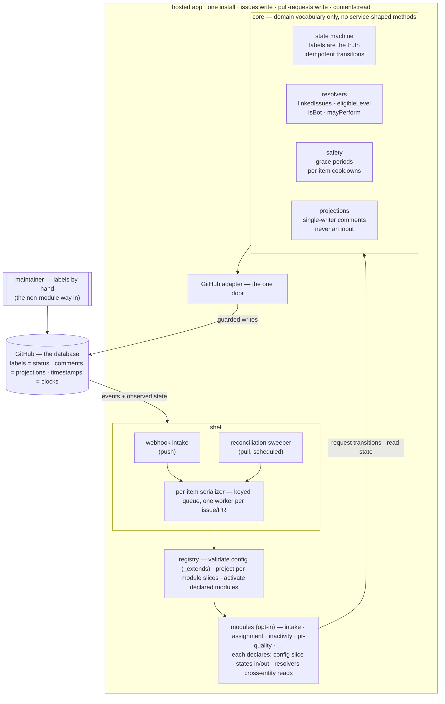
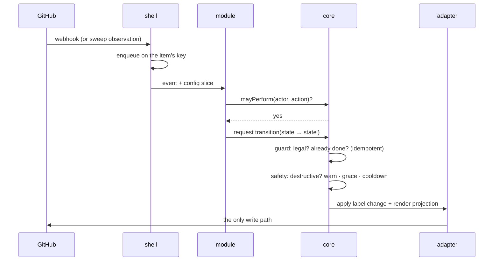
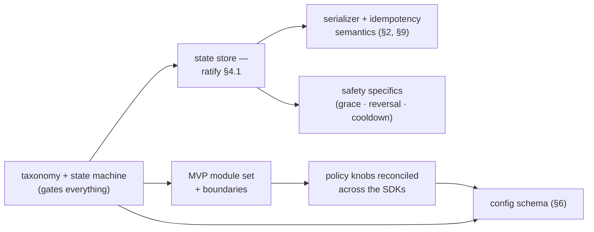

# Solution: Architecture Hypothesis (draft, co-authored)

> A draft, meant to be developed further — not a finished specification. Where a decision is still open,
> the text says so (§10), and where the design takes a position early it is marked **proposed**, with the
> reasoning and with what would overturn it. This is the central design document the three shorter notes
> point toward: `planning/solution-overview.md` (the map), `planning/opt-in-modules.md` (the modules),
> `planning/test-architecture.md` (the tests). Vision and hard limits: `planning/goals.md`. The coupling
> this design avoids: `planning/lessons-learned.md` (classes A–E) and `audit/deep-dive-cpp.md` §3. Left
> for later, on purpose: which services get built, the full config schema, the label taxonomy, and the
> build order. This document is about the system that holds the services, not the services themselves.

## 1. The problem, and the idea in one picture

Today the automation services are tangled together — not because the code is messy, but because the
services *share* things. The audit found four distinct kinds of sharing (`audit/deep-dive-cpp.md` §3):

- **Status labels as a baton.** `status: ready for dev` is produced by one service, consumed by another,
  reset by a third — moving state that no single service owns, so none can be switched off alone.
- **The issue↔PR link followed two different ways** (a precise query vs body-text scanning), which can
  disagree about what is linked to what.
- **Rendered text and exact names as interfaces.** One service searches another's comment for an exact
  phrase; two workflows connect only through a name string. Change the wording or the name and nothing
  reports an error — the behaviour just quietly stops.
- **Unrelated features bundled** into one workflow file, one permissions block, one hidden queue — so
  turning one off is a code edit, not a setting.

The answer is one shared thing in the middle: a **core** that owns everything services would otherwise
pass between themselves, behind one door to GitHub — plus one sentence that holds the design together:

> **The app is a stateless reducer over GitHub's state:** `(GitHub state, event, config) → transitions`.
> The app itself stores nothing.



Each tangle is answered structurally below: the baton by §4's single-writer state machine, the two-way
link by §4's resolvers, the text-and-names interfaces by §4's projections, and the bundling by §5's
deployment identity.

## 2. The shell

Work arrives two ways and is serialised once:

- **Webhook intake** — GitHub pushes an event; the shell authenticates the installation.
- **Reconciliation sweeper** — scheduled reads of current state, fed through the same path as events.
  Webhooks are not guaranteed delivered, and §7's rule means states can be entered with no event at all —
  so modules react to **state observed, not events assumed**, and a missed webhook heals on the next
  sweep. (The inactivity service already works this way; the pattern is promoted from one service's trick
  to a first-class delivery mechanism.)
- **Per-item serializer** — one worker per issue or PR. The audit removed the accidental mutex (the shared
  concurrency groups, lessons D2); this is its deliberate replacement. GitHub's API has no
  compare-and-swap on labels, so races are prevented here and absorbed by idempotent transitions (§4).

## 3. Config and registry

The registry resolves `.github/hiero-automation.json` (+ `_extends` org defaults), validates it **at
runtime** (the file comes from repositories we do not control), and activates only the declared modules. A
repository with no config runs on safe defaults — nothing destructive on. Each module receives a
**projection** of the config: only its declared keys, *cannot see* the rest. That closes the shared-file
coupling (lessons E1) at runtime, while the contract types (§5) close it at compile time.

## 4. The core

One rule governs all four parts: **the core speaks domain vocabulary, never service vocabulary.**
Acceptance test: every public core operation must be describable without naming any module. The moment the
core grows a `markReadyForAssignment()`, the coupling this design removes has moved inside the core and
been sanctioned there.

One event's life through the core:



| Part | Owns | The rule that keeps it safe |
|---|---|---|
| **state machine** | states + legal transitions, defined independently of installed modules | single `status:` writer; idempotent guarded transitions; coupled facts (assignee + status) move in one transition (lessons A1, A3) |
| **resolvers** | `linkedIssues(pr)` · `eligibleLevel(user)` · `isBot(actor)` · `mayPerform(actor, action)` | one mechanism per question (B2) — authorization included, or two modules will answer it differently |
| **safety** | grace periods, reversibility, **per-item cooldowns** | generalises the inactivity service's proven warn-then-act pattern; timers *derived* from GitHub timestamps in sweeps, never owned |
| **projections** | every comment the app writes | rendered *from* state, **never read as input** (A2); any comment-borne metadata is core-private and schema-versioned |

### 4.1 Where state lives *(proposed)*

**GitHub is the database.** Labels are the status store — the core is the app-side exclusive writer, and a
hand-applied label is ingested as a legitimate transition, which is §7's rule working natively with no
synchronisation machinery. Comments are projections. Timestamps are the safety engine's clocks. The app is
stateless per event: trivial hosting, crash-safe, state auditable in GitHub's own UI, and the test fake
for the core is an in-memory label set. The honest costs: label writes are not transactional (mitigated by
§2's serializer plus idempotency), and any datum that fits no label rides in core-private comment metadata
or derives from timestamps. **Overturned by:** a concrete invariant that provably needs an owned store —
which would then live *behind* the core's interface, changing no module.

This answers the draft's open question "labels the core manages, or state a label only reflects": that
question was really *does the app have a database*, and the proposal is no.

## 5. What counts as a module

One unit, on or off, talks only to the core. Its contract declares four things — one per tangle in §1:

| Declares | Answers | Enforced by |
|---|---|---|
| the config slice it reads | shared config (E) | contract types (compile time) + registry projection (runtime) |
| states consumed / transitions requested | the label baton (A) | the core is the only `status:` writer |
| cross-entity reads | the two-way link, baked-in writes (B, C) | one core resolver per question |
| its own trigger, permissions, queue | bundling (D) | deployment identity; only the shell's *item*-scoped queue is shared |

In TypeScript the contract is a value the type system enforces: the registry hands each module a core
handle *typed by its declaration* — an undeclared transition is a compile error — and the runtime
projection (§3) backs the same rule at the boundary. The contract's exact form is the first open item in
§10; it is what every test layer in `test-architecture.md` mocks against.

## 6. The config file, sketched

Shape now, keys later (§10):

```jsonc
// .github/hiero-automation.json — illustrative shape only
{
  "_extends": "org-repo",           // org defaults, repo overrides win
  "modules": {
    "assignment": { "limits": { "concurrent": 2 } },   // presence = enabled
    "inactivity": { "warnAfterDays": 5, "actAfterDays": 7 }
    // absent module = off · no file at all = safe defaults
  }
}
```

A module's block is the whole config that module can see (§3), and safe defaults switch on nothing
destructive.

## 7. Turning a module on and off

**Every state a module consumes can also be set another way** — a hand-applied label, a config default, a
command. An upstream module is only ever a shortcut, never the only way in: the light has both a switch
and a motion sensor, and removing the sensor leaves the switch working. (The state graph with the manual
entry point drawn is `opt-in-modules.md` §4.1.) Two corollaries, made explicit:

- Because states enter out-of-band, modules react to **state observed, not events assumed** — the sweeper
  (§2) is architecture, not optimisation.
- The rule is a CI gate, not philosophy: for every state in any module's contract, the toggle matrix must
  contain a passing case where that state is produced *manually* and the consuming module still functions.

## 8. Why labels stay minimal

Every label is a potential baton — and under §4.1, also a row in the database. The core owns the full set;
no module invents one; bulk `status:*` prefix-strips are impossible by construction (A1); and a proposed
new label must beat the alternative of the core *deriving* the fact from assignees, timestamps, or links
without storing it at all. The taxonomy itself waits for its own decision (§10).

## 9. How it is tested

The design in `planning/test-architecture.md` stands, with three additions this architecture makes cheap
or necessary: the **fake core is an in-memory label set** plus the transition table (§4.1); two invariants
become near-tautological and are asserted anyway — *no state outside GitHub*, *no write outside the
adapter*; and one is new and load-bearing — **concurrent conflicting transitions resolve to exactly one
winner**, the executable form of §2 plus §4's idempotency, and the regression test for removing the
accidental mutex.

## 10. What we still need to decide



- We need the label taxonomy and the state machine first — nothing downstream starts before it.
- We need to ratify (or refute) §4.1: is GitHub the database? If we can name an invariant that provably
  needs an owned store, the store enters behind the core's interface and no module changes.
- We need the exact form of the module contract (§5) — it is what every test layer mocks against.
- We need the serializer and idempotency semantics written down as the one-winner invariant (§2, §9).
- We need the MVP module set, then the policy knobs reconciled across the SDK bots, then the schema keys.
- We need the safety specifics per destructive action: grace period, reversal path, trigger class.
- And we note early, so it is not discovered late: a hosted app serves many installations against
  per-installation rate limits — the sweeper's cadence is a small per-repo budget.

Reworking the existing C++ and Python bots into modules on this core is build-phase work, recorded here so
the cost stays on the record.
