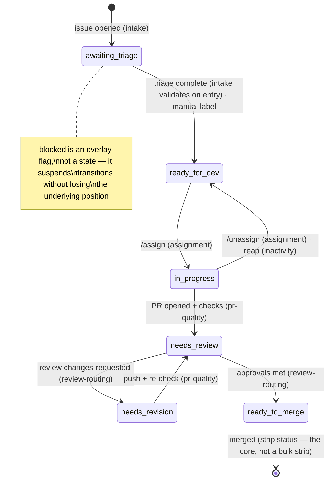

# Taxonomy Draft: Labels and the Status State Machine

> **Drafted for ratification — the foundational decision everything else waits on.** Grounded in the
> normalized cross-SDK table (`docs/services.md` §4), the drift sets (`audit/labels-python.md`), and the
> C++ zero-drift set (`audit/labels-cpp.md`). The discipline applied throughout is `solution.md` §8: every
> label must earn its place against the simpler option of the core deriving the fact without storing it.
> Maintainers ratify; nothing below is settled until they do.

## 1. The four open questions, answered as proposals

**Which classifications leave labels for GitHub-native fields?** `priority:` goes native — it already has
a native home, it drives no automation in either SDK beyond display, and removing it deletes drift set B
outright. `effort` follows the same path if it is ever wanted. `skill:` stays a label: it gates automation
(the ladder) *and* is how contributors browse for work — both jobs need label visibility.

**Is the intake gate (`lifecycle:`) part of `status:`?** Yes — fold it in. Python's
`lifecycle: pending-review → approved` is the same fact as `status: awaiting triage → ready for dev` seen
from the other side. Two namespaces for one lifecycle is a second baton. One namespace, one state machine.

**Do `notes:` and `meta:` merge?** Yes, into `meta:` — reduced to a single label in §3: pause-the-automation is `status: blocked`'s job, not a second flag's.

**What is each label for?** One job per namespace, and the write-direction is the definition:

| Namespace | Written by | Read by | Job |
|---|---|---|---|
| `status:` | **the core only** (manual application = a legitimate transition the core ingests) | humans + modules via the core | the state machine — drives automation |
| `skill:` | maintainers (triage) | the `eligibleLevel` resolver + browsing contributors | the ladder — gates and signals |
| `meta:` | **humans only** — automation never writes one | modules via declared contract | human overrides the automation must respect |
| native fields (priority, type, effort…) | maintainers, in GitHub's own UI | modules via core resolvers | facts with a native home — never duplicated into labels |

That split is the A2/A1 cure stated as policy: machine-written state flows one way, human signals flow the
other, and no label is both.

## 2. The canonical `status:` set and its state machine

One spelling rule kills three of the four drift sets: **lowercase, `namespace: value`, spaces not
hyphens** — the C++ convention, which produced zero drift. Python's `ready-to-merge` is adopted into the
set with canonical spelling.

- **Seven states**: `status: awaiting triage` · `ready for dev` · `in progress` · `needs review` ·
  `needs revision` · `ready to merge`, plus `status: blocked` as an **overlay** — an item keeps its
  position and gains/loses `blocked`, rather than a state that forgets where the item was.
- Every transition is requested by the module named on the edge — or made by hand; the manual entry point
  exists at every state (`solution.md` §7).
- Assignee and status move in the same transition (lessons A3).
- The states encode **whose turn it is**: `in progress` and `needs revision` are the contributor's ball
  (the inactivity clock may run); `needs review` and `ready to merge` are the maintainers' (it never
  does). The old bots inferred this from review timestamps; here it is simply what the state means.
- **Provisional, decided with the review-routing module**: Python's `queue:` namespace
  (`junior-committer` / `committers` / `maintainers`). It smells §8-derivable from reviewer config plus
  `needs review`; it stays out of the canonical set until that module's design proves it needs storage.

## 3. The full label set

Twelve labels in three namespaces, one spelling each, one writer each. This is the complete set: a label
not listed here does not exist in the new system.

| Label | Written by | Meaning |
|---|---|---|
| `status: awaiting triage` | core | new item, not yet triaged |
| `status: ready for dev` | core | triaged, free to pick up |
| `status: in progress` | core | assigned and being worked |
| `status: needs review` | core | PR open, checks passed, awaiting review |
| `status: needs revision` | core | changes requested |
| `status: ready to merge` | core | approvals met |
| `status: blocked` | core | overlay — pauses ALL automation (transitions and the inactivity clock) without losing the item's position; apply by hand to say "leave this alone" |
| `skill: good first issue` | maintainers | ladder rung 0 |
| `skill: beginner` | maintainers | ladder rung 1 (after 2 good first issues) |
| `skill: intermediate` | maintainers | ladder rung 2 (after 3 beginner) |
| `skill: advanced` | maintainers | ladder rung 3 (after 3 intermediate) |
| `meta: open to community review` | humans | invitation: community review welcome |

Priority moves to GitHub's native field (§1). The ladder thresholds live in config
(`core.skillLadder`, config-draft.md), not in the label names. `queue:` remains provisional per §2.

## 4. Native fields: priority, effort, and whatever comes next

Native facts are handled by one rule: **read through a core resolver, written only by humans, never
duplicated into a label.** A module that needs priority calls `priorityOf(item)`; where the fact actually
lives — a Projects field, a native issue field, or a legacy label during migration — is the resolver's
implementation detail, swappable without any module changing. The value ordering the old
`priorityHierarchy` config carried becomes resolver config, not label spellings. `effortOf(item)` follows
the same pattern the day effort is wanted, at the cost of zero new namespaces.

One consequence to decide with eyes open: if the authoritative home is a Projects field, the core needs a
config key naming the project, and the app needs one additional read-only permission (`projects: read`).
If the fact lives on the issue itself, nothing changes. The resolver quarantines that choice.
